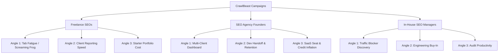

# 🚀 CrawlBeast B2B Cold Email Playbook

This outbound outreach playbook is designed to generate early trials and high-quality replies for **CrawlBeast**. It implements the core copywriting principles from the `@cold-email` skill: peer-to-peer positioning, extreme brevity (<75 words), lowercase subject lines, and low-friction, interest-based calls-to-action (CTAs).

---

## 🎯 Playbook Architecture

We target three core buyer personas, with three distinct outcome-based campaign sequences for each.

---

## 📧 Campaign 1: The Freelance SEO

### Sequence 1.1: The "Tab Fatigue" (Screaming Frog) Angle
*Focuses on replacing Screaming Frog's clunky 90s UI and messy spreadsheets with a prioritized checklist.*

#### Email 1: The Hook (Day 0)
* **Subject line:** screaming frog tabs
> Ever get lost in Screaming Frog's tabs trying to find what's actually blocking a client's rankings?
> 
> Most freelance SEOs spend hours digging through technical spreadsheets just to find a handful of critical issues.
> 
> We built CrawlBeast. It automatically prioritises the highest-impact issues so you can fix them first. Up to 5 projects and 1,000 pages are completely free.
> 
> Worth a free trial?

#### Email 2: The Proof (Day 3)
* **Subject line:** diagnostic time
> We found that 80% of client rank drops are caused by just a few high-priority issues (like broken canonicals or redirect loops).
> 
> CrawlBeast pulls those to the top of your dashboard instantly, so you don't waste time scrolling through irrelevant spreadsheet rows.
> 
> Open to checking it out?

#### Email 3: The Breakup (Day 8)
* **Subject line:** audit workflow
> Since I haven't heard back, I'll assume your auditing workflow is set. 
> 
> If you ever want to prioritise technical fixes faster, you can audit up to 5 sites free at crawlbeast.com. 
> 
> All the best.

---

### Sequence 1.2: The "Client Reporting Speed" Angle
*Focuses on saving hours spent translating technical crawl data into client roadmaps.*

#### Email 1: The Hook (Day 0)
* **Subject line:** client audit roadmap
> How many hours do you spend translating technical crawl data into clean roadmaps for clients?
> 
> Most freelancers waste a full day per client formatting spreadsheets into recommendations.
> 
> CrawlBeast turns crawls into prioritised, client-ready action lists automatically.
> 
> Would this be useful for your next client onboarding?

#### Email 2: The Proof (Day 3)
* **Subject line:** audit translation
> Following up on this — most clients just want to know what's broken and how to fix it, not look at 10,000 rows of raw data.
> 
> CrawlBeast highlights only the highest-priority issues so you can hand over an actionable roadmap in minutes.
> 
> Open to testing the free version?

#### Email 3: The Breakup (Day 8)
* **Subject line:** client audits
> Assuming client reporting isn't a bottleneck right now.
> 
> If you ever want to save a few hours on your next client audit, feel free to reply here. Otherwise, no hard feelings.

---

### Sequence 1.3: The "Starter Portfolio Cost" (Free Tier) Angle
*Focuses on cost efficiency for freelancers managing early client portfolios.*

#### Email 1: The Hook (Day 0)
* **Subject line:** audit credit limits
> Are you hitting monthly credit limits on Semrush or Ahrefs just to run basic technical audits?
> 
> Buying extra monthly SaaS credits gets expensive fast when you're managing multiple freelance clients.
> 
> We built CrawlBeast to run locally. You can manage up to 5 projects and crawl 1,000 pages completely free.
> 
> Open to trying it?

#### Email 2: The Proof (Day 3)
* **Subject line:** audit tool cost
> Most freelancers we talk to need a reliable crawler but don't want to pay $100+/mo for SaaS credit tiers they don't fully use.
> 
> CrawlBeast gives you a modern, prioritised audit dashboard for free across your first 5 domains.
> 
> Worth a look?

#### Email 3: The Breakup (Day 8)
* **Subject line:** free audit tool
> Since I haven't heard back, I'll assume your tool budget is set.
> 
> If you ever want to audit up to 5 sites and 1,000 pages for free, you can download CrawlBeast at crawlbeast.com.
> 
> Good luck with the clients.

---

## 📧 Campaign 2: The SEO Agency Founder

### Sequence 2.1: The "Multi-Client Health Dashboard" Angle
*Focuses on managing multiple clients in one central place to protect client retention.*

#### Email 1: The Hook (Day 0)
* **Subject line:** client health tracking
> When managing 10+ client sites, keeping track of technical health usually means jumping between clunky spreadsheets.
> 
> It's easy to miss critical errors that drop rankings before your team or client notices.
> 
> We built CrawlBeast to manage multiple client sites in one clean dashboard, prioritising high-impact issues first.
> 
> Worth exploring?

#### Email 2: The Proof (Day 3)
* **Subject line:** client site monitoring
> We found that agencies lose clients when technical errors go unnoticed for weeks.
> 
> CrawlBeast acts as a multi-project hub, giving your account managers a clear, prioritized health score for all clients in one view.
> 
> Open to a quick preview?

#### Email 3: The Breakup (Day 8)
* **Subject line:** agency site health
> Since I haven't heard back, I'll assume your team has client tracking handled.
> 
> If you ever want a simpler way to track multiple site audits in one dashboard, reply with a number:
> 
> 1 — Send the free access link
> 2 — Not now, check back in Q3
> 3 — Please stop emailing
> 
> All the best.

---

### Sequence 2.2: The "Dev-Ready Hand-off" Angle
*Focuses on making it easy to share audits with client developers to get things fixed faster.*

#### Email 1: The Hook (Day 0)
* **Subject line:** audit roadmaps
> How much time does your team spend explaining spreadsheet audits to client developers?
> 
> When developers get a raw Screaming Frog export, they usually push back because it's hard to read.
> 
> CrawlBeast turns crawl data into a prioritised list of dev-ready tasks, so you get fixes live faster and protect client retention.
> 
> Worth a quick look?

#### Email 2: The Proof (Day 3)
* **Subject line:** developer handoff
> Following up on this — faster implementation of technical fixes is the easiest way to show agency value early.
> 
> CrawlBeast highlights exactly what is broken and why it matters in plain language, so dev teams can execute without back-and-forth.
> 
> Open to testing the free version?

#### Email 3: The Breakup (Day 8)
* **Subject line:** client dev handoff
> Assuming dev handoff isn't a bottleneck right now.
> 
> If you ever want to turn raw crawl data into prioritized dev tasks faster, we're at crawlbeast.com.
> 
> Good luck with agency scaling.

---

### Sequence 2.3: The "SaaS Seat & Credit Inflation" Angle
*Focuses on protecting margins by replacing variable credit billing with a flat desktop app cost.*

#### Email 1: The Hook (Day 0)
* **Subject line:** agency tool costs
> Are seat licenses and monthly crawl credits eating into your agency's margins?
> 
> Paying SaaS markups per client or per crawled page gets expensive as your client base scales.
> 
> We built CrawlBeast as a desktop application with flat pricing. Up to 5 projects and 1,000 pages are completely free.
> 
> Open to checking it out?

#### Email 2: The Proof (Day 3)
* **Subject line:** client audit limits
> Most agency founders we talk to want to run comprehensive audits without worrying about running out of monthly SaaS credits.
> 
> CrawlBeast lets you manage up to 5 projects and 1,000 pages for free, with flat pricing to scale.
> 
> Worth a quick look?

#### Email 3: The Breakup (Day 8)
* **Subject line:** agency audit tool
> Since I haven't heard back, I'll assume your software budget is locked.
> 
> If you ever want to lower your agency's software costs, reply with a number:
> 
> 1 — Send the free access link
> 2 — Check back in 3 months
> 3 — Please stop emailing
> 
> All the best.

---

## 📧 Campaign 3: The In-House SEO / Manager

### Sequence 3.1: The "Traffic Blocker Discovery" Angle
*Focuses on quickly diagnosing traffic drops without getting bogged down in database spreadsheets.*

#### Email 1: The Hook (Day 0)
* **Subject line:** search traffic drops
> Ever spent hours digging through Screaming Frog tabs trying to find why a subdirectory's traffic dropped?
> 
> Running technical audits shouldn't feel like navigating a 90s database.
> 
> We built CrawlBeast. It automatically highlights the highest-priority issues first, so you can fix what's actually hurting your traffic.
> 
> Open to trying it?

#### Email 2: The Proof (Day 3)
* **Subject line:** traffic blockers
> Following up on this — we focus strictly on high-impact SEO issues (like redirect loops or duplicate canonicals) that directly impact rankings.
> 
> CrawlBeast pulls these to the top of your dashboard instantly, saving your team hours of filtering.
> 
> Worth checking out?

#### Email 3: The Breakup (Day 8)
* **Subject line:** audit workflow
> I haven't heard back, so I'll assume your team is set.
> 
> If you ever want to find traffic blockers faster without spreadsheet clutter, we're at crawlbeast.com.
> 
> All the best.

---

### Sequence 3.2: The "Engineering Buy-in / Prioritisation" Angle
*Focuses on isolating top issues to secure engineering resources for fixes.*

#### Email 1: The Hook (Day 0)
* **Subject line:** prioritizing fixes
> Usually, the bottleneck isn't finding SEO issues — it's getting engineering to implement them.
> 
> When developers get a spreadsheet with 10,000 rows, it gets pushed to the bottom of the backlog.
> 
> CrawlBeast isolates the highest-priority issues into a clean action plan, making it easy to get dev buy-in.
> 
> Open to trying it?

#### Email 2: The Proof (Day 3)
* **Subject line:** engineering buy-in
> Following up on this — we translate raw crawl data into prioritized, dev-friendly tasks.
> 
> This makes it clear to your developers exactly what needs to be fixed first to improve site health. Up to 5 projects are free.
> 
> Worth a look?

#### Email 3: The Breakup (Day 8)
* **Subject line:** dev implementation
> Assuming dev buy-in isn't an issue right now.
> 
> If you ever need to turn crawls into prioritised dev roadmaps faster, check us out at crawlbeast.com.
> 
> Good luck with your growth goals.

---

### Sequence 3.3: The "Audit Productivity" Angle
*Focuses on saving hours spent manually sorting and cleaning technical crawls.*

#### Email 1: The Hook (Day 0)
* **Subject line:** audit time
> How many hours does your team spend translating technical crawls into action plans?
> 
> Most in-house teams spend 3-4 hours per audit just sorting through noise.
> 
> CrawlBeast automates that translation, surfacing top-priority issues instantly in a clean dashboard.
> 
> Worth a look?

#### Email 2: The Proof (Day 3)
* **Subject line:** audit efficiency
> Following up — we designed CrawlBeast to replace slow manual sorting.
> 
> You get a prioritized action checklist the moment the crawl finishes. Up to 5 projects and 1,000 pages are completely free.
> 
> Open to trying it?

#### Email 3: The Breakup (Day 8)
* **Subject line:** seo workflow
> Since I haven't heard back, I'll assume your workflow is running smoothly.
> 
> If you ever need to crawl up to 5 sites and 1,000 pages free, you can download it at crawlbeast.com.
> 
> All the best.
