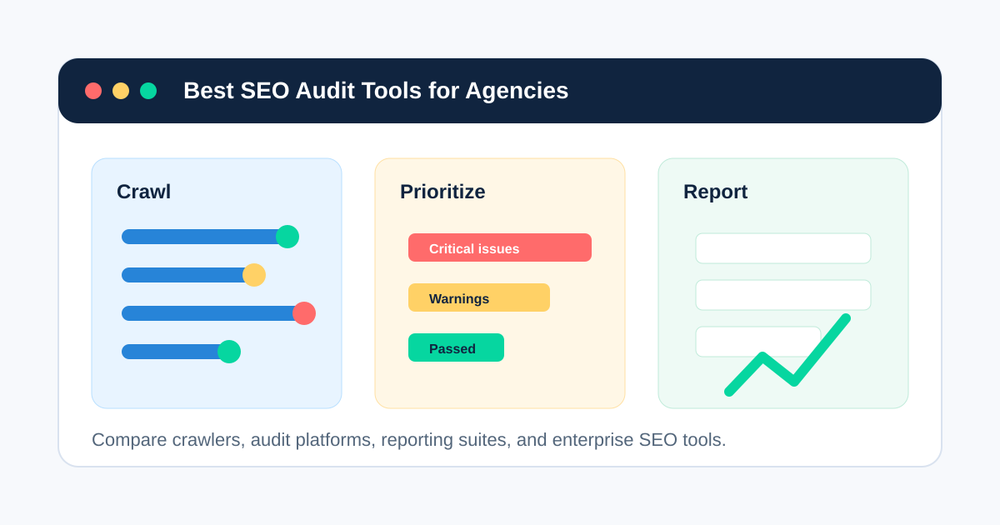
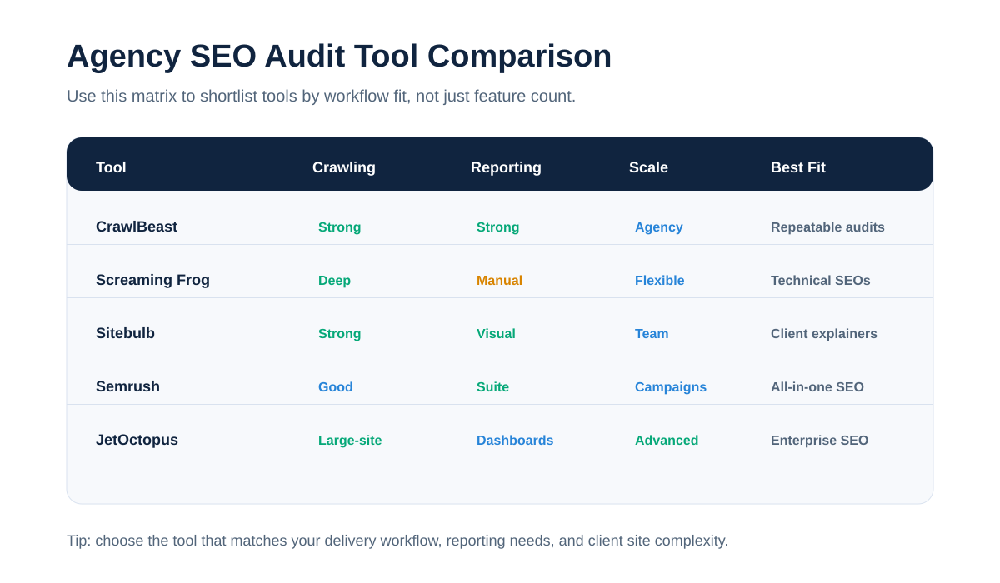
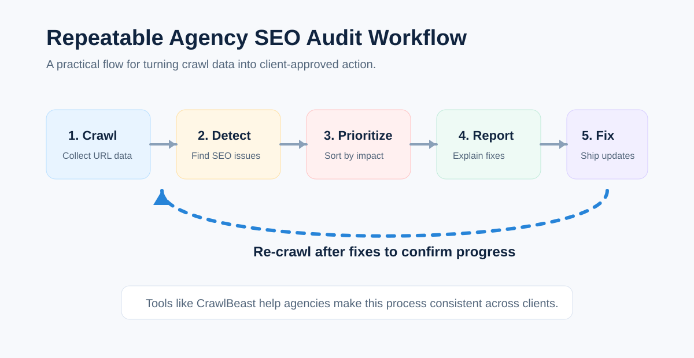

# 10 Best SEO Audit Tools for Agencies in 2026

The search intent for "best SEO audit tool for agencies" is commercial investigation. Searchers are not looking for a basic definition of SEO audits. They are comparing tools, narrowing a shortlist, and trying to understand which platform fits an agency workflow.

For that reason, this article is structured as a listicle. It compares SEO audit tools based on what agencies usually care about: crawling depth, technical SEO coverage, reporting, prioritization, team workflow, scalability, and client communication.

If you want the broader category breakdown first, start with our guide to choosing an [SEO audit tool for agencies](/seo-audit-tool-for-agencies/). If you already know you need software for client delivery, compare this list with our deeper guide to [SEO audit software for agencies](/seo-audit-software-for-agencies/).

## Quick Comparison

| Tool | Best For | Agency Fit |
|---|---|---|
| CrawlBeast | Repeatable technical SEO audits and agency reporting | Best for agencies that want focused crawling, issue detection, and client-ready audit workflows |
| Screaming Frog SEO Spider | Deep desktop crawling and technical SEO exports | Best for technical SEOs who want flexible crawl control |
| Sitebulb | Visual technical audits and stakeholder-friendly reports | Best for agencies that need clear explanations and crawl visualizations |
| Semrush Site Audit | All-in-one SEO platform with site audit features | Best for agencies already using Semrush for SEO campaigns |
| Ahrefs Site Audit | Scheduled audits inside a broader SEO toolset | Best for agencies that want audits connected to backlink and keyword data |
| JetOctopus | Large-site crawling, log analysis, and GSC data | Best for technical SEO agencies managing large or complex websites |
| Lumar | Enterprise website intelligence and monitoring | Best for enterprise agencies and large digital teams |
| SE Ranking Website Audit | Affordable audits with rank tracking and reporting | Best for smaller agencies that want an all-in-one SEO suite |
| Moz Pro Site Crawl | Accessible site crawl monitoring | Best for agencies that prefer simpler SEO workflows |
| Google Search Console | Free search performance and index coverage data | Best as a supporting diagnostic tool, not a full audit platform |

## 1. CrawlBeast

CrawlBeast is a technical SEO audit and website crawling tool built for agencies that need a repeatable way to audit client websites.

It fits agencies that want to move beyond scattered manual checks and create a consistent [SEO audit workflow](/seo-audit-workflow/) across accounts. Teams can use CrawlBeast to crawl client sites, detect technical SEO issues, review site structure, and prepare clearer findings for client reports.

Use CrawlBeast for:

- Technical SEO audits for client websites
- Broken link and status code checks
- Metadata, heading, crawlability, and indexability reviews
- Website crawling for monthly or quarterly audits
- Agency reporting workflows
- Repeatable audit processes across multiple clients

CrawlBeast is a strong fit when the goal is not just finding issues, but turning crawl data into practical recommendations clients can understand.

**Best for:** Agencies that want a focused SEO audit tool for technical checks, crawling, and client-ready reporting.

For a more focused breakdown of crawler-specific use cases, see our guide to choosing a [website crawler for agencies](/website-crawler-for-agencies/).

## 2. Screaming Frog SEO Spider

Screaming Frog SEO Spider is one of the most widely used desktop crawlers in technical SEO. It is popular with agencies because it gives experienced SEOs a lot of control over how they crawl, filter, export, and analyze websites.

It can help agencies find broken links, redirects, metadata problems, duplicate pages, canonicals, hreflang issues, structured data issues, and many other technical SEO problems. The free version supports crawling up to 500 URLs, while the paid version unlocks larger crawls and advanced features.

Use Screaming Frog for:

- Deep technical SEO crawls
- Custom extraction
- JavaScript rendering
- Crawl comparison
- XML sitemap generation
- Detailed exports for technical analysis

The main tradeoff is that Screaming Frog is powerful but technical. It is excellent for SEO specialists, but account managers may need help turning the output into client-friendly reporting.

**Best for:** Technical SEO teams that want a flexible desktop crawler with deep configuration options.

## 3. Sitebulb

Sitebulb is a website crawler built around technical SEO auditing, prioritization, and visual reporting. It is especially useful for agencies that need to explain technical issues to clients, developers, or non-technical stakeholders.

Sitebulb provides audit scores, prioritized hints, crawl visualizations, URL reports, bulk exports, and customizable PDF reports. It offers both desktop and cloud options, which makes it flexible for consultants, agencies, and larger SEO teams.

Use Sitebulb for:

- Technical SEO audits with visual explanations
- Crawl maps and site architecture analysis
- Prioritized issue hints
- Client-friendly PDF reports
- JavaScript crawling
- Desktop or cloud crawling workflows

Sitebulb is strong when communication matters as much as raw crawl data. Its visuals and explanations can make technical recommendations easier to present.

**Best for:** Agencies that need technical depth plus clearer client and stakeholder communication.

## 4. Semrush Site Audit

Semrush Site Audit is part of the broader Semrush SEO platform. It checks websites for technical and on-page SEO issues, groups problems by priority, tracks site health over time, and supports scheduled audits.

For agencies already using Semrush for keyword research, competitor analysis, rank tracking, or reporting, Site Audit can be convenient because it lives inside the same platform.

Use Semrush Site Audit for:

- Scheduled site audits
- Technical and on-page issue checks
- Site health tracking
- Prioritized task lists
- Progress monitoring
- Broader SEO campaign reporting

Semrush is not only an audit tool, so it can feel broader than necessary if your agency only needs technical crawling. But for agencies that want an all-in-one SEO platform, it is a practical option.

**Best for:** Agencies that want site audits inside a broader SEO, content, keyword, and competitor research suite.

## 5. Ahrefs Site Audit

Ahrefs Site Audit helps agencies monitor technical and on-page SEO issues as part of the larger Ahrefs platform. Ahrefs is best known for backlink and keyword data, but its site audit tool is useful for scheduled crawls and ongoing website health checks.

Ahrefs has also expanded audit monitoring with always-on crawling, which is useful when agencies want faster detection of new technical issues instead of waiting for a weekly or monthly crawl.

Use Ahrefs Site Audit for:

- Scheduled technical audits
- Ongoing site health monitoring
- Technical and on-page issue checks
- Audit history and progress tracking
- Connecting audit work with backlink and keyword research

Ahrefs is a good fit if your agency already relies on it for SEO research. If you need highly customized technical crawling, you may still pair it with a dedicated crawler.

**Best for:** Agencies that want technical audit data connected to backlink, keyword, and ranking analysis.

## 6. JetOctopus

JetOctopus is a technical SEO platform built for large websites, log analysis, crawl data, Google Search Console data, and agency workflows.

It is especially relevant for agencies managing complex websites where crawl budget, indexation, bot behavior, internal linking, and technical prioritization matter. JetOctopus emphasizes large-scale crawling, log analysis, unlimited projects/users in agency contexts, and technical SEO dashboards.

Use JetOctopus for:

- Large-scale website crawling
- Log file analysis
- Google Search Console data analysis
- Internal linking analysis
- Technical SEO dashboards
- Multi-client agency workflows

JetOctopus may be more than a small agency needs, but it can be very useful for technical SEO teams working with ecommerce, marketplaces, publishers, or enterprise sites.

**Best for:** Agencies managing large websites, log analysis, crawl budget, and advanced technical SEO.

## 7. Lumar

Lumar is an enterprise website optimization platform that includes technical SEO crawling, monitoring, accessibility, site speed, and reporting capabilities.

It is designed for scale. Lumar is a better fit for enterprise agencies, in-house enterprise SEO teams, and digital teams that need advanced monitoring, custom reporting, and large-site crawling.

Use Lumar for:

- Enterprise technical SEO audits
- Large website crawling
- Website monitoring
- SEO, accessibility, and site speed insights
- Custom reports and dashboards
- Developer and stakeholder workflows

Lumar is likely too heavy for smaller agencies that only need standard SEO audits. For enterprise work, though, it brings strong crawling and website intelligence features.

**Best for:** Enterprise agencies and large digital teams that need scalable website optimization workflows.

## 8. SE Ranking Website Audit

SE Ranking Website Audit is part of the SE Ranking SEO platform. It checks websites for technical issues, gives fix suggestions, and supports recurring audits.

It can be a good option for small to mid-sized agencies that want rank tracking, website audits, backlink checks, on-page analysis, and reporting in one platform without going straight to enterprise pricing.

Use SE Ranking Website Audit for:

- Website audit scans
- Technical SEO issue checks
- Severity-based recommendations
- Recurring audits
- Rank tracking and client reporting
- Smaller agency SEO workflows

SE Ranking may not have the same technical crawl depth as dedicated crawlers, but it is useful for agencies that want an affordable all-in-one SEO toolkit.

**Best for:** Small and mid-sized agencies that want website audits inside a broader SEO platform.

## 9. Moz Pro Site Crawl

Moz Pro Site Crawl helps agencies find and monitor common technical SEO issues, including crawl errors, missing tags, duplicate content problems, redirects, and other site health issues.

Moz is generally easier to approach than some technical crawlers, which can make it useful for agencies with lighter SEO workflows or teams that do not need very advanced crawl customization.

Use Moz Pro Site Crawl for:

- Common technical SEO checks
- Ongoing site crawl monitoring
- Basic issue prioritization
- SEO campaign tracking
- Simpler reporting workflows

Moz Pro is not usually the deepest technical SEO crawler, but it can be helpful for agencies that want straightforward site monitoring inside a familiar SEO suite.

**Best for:** Agencies that want a simpler site crawl tool inside an accessible SEO platform.

## 10. Google Search Console

Google Search Console is not a full SEO audit tool, but every agency should use it alongside one.

It gives direct data from Google about indexing, search performance, page experience, sitemaps, crawl errors, and manual actions. That makes it essential for validating whether technical SEO issues are actually affecting visibility in Google Search.

Use Google Search Console for:

- Index coverage checks
- Sitemap monitoring
- Search performance data
- Page experience signals
- Manual action alerts
- Validating crawl and indexing issues

The limitation is that Google Search Console does not replace a crawler. It shows important Google-side signals, but it will not give the same full-site technical audit view as tools like CrawlBeast, Screaming Frog, Sitebulb, JetOctopus, or Lumar.

**Best for:** Supporting SEO audits with direct Google indexing and performance data.

## How to Choose the Best SEO Audit Tool for Your Agency

The best SEO audit tool for agencies depends on your client mix, team skill level, reporting needs, and crawl complexity.

Choose **CrawlBeast** if you want a focused [technical SEO audit tool for agencies](/technical-seo-audit-tool-for-agencies/), with crawling and reporting built around repeatable client delivery.

Choose **Screaming Frog** if your team wants maximum crawl control and is comfortable working with exports and technical data.

Choose **Sitebulb** if you need strong technical auditing plus visuals and explanations that make client communication easier.

Choose **Semrush** or **Ahrefs** if your agency wants site audits connected to a broader SEO platform.

Choose **JetOctopus** or **Lumar** if you manage large websites, enterprise clients, or advanced technical SEO programs.

Choose **SE Ranking** or **Moz Pro** if you want a lighter all-in-one SEO platform for smaller agency workflows.

Use **Google Search Console** with any tool you choose, because it gives direct search performance and indexing data from Google.

If reporting is the main bottleneck in your process, review our guide to [SEO audit reporting](/seo-audit-reporting/) before choosing a tool. The best crawler for your team still needs to produce findings your clients can understand and approve.

## Agency Evaluation Checklist

Before choosing a tool, compare each option against the jobs your team needs to perform every month.

| Evaluation Area | What to Check |
|---|---|
| Crawling | Can it crawl full client websites reliably? |
| Technical SEO | Does it detect indexability, canonical, metadata, status code, sitemap, robots.txt, and internal linking issues? |
| Prioritization | Does it help separate critical issues from low-impact warnings? |
| Reporting | Can the findings be turned into clear client reports? |
| Workflow | Does it support repeatable audits across clients? |
| Scalability | Can it handle large sites, multiple projects, and recurring audits? |
| Collaboration | Can strategists, account managers, technical SEOs, and developers use the output? |
| Monitoring | Can you re-audit, compare progress, and catch new issues over time? |

This checklist works best when paired with a documented [SEO audit workflow](/seo-audit-workflow/), so every account gets the same baseline review before custom analysis begins.

## Final Recommendation

If you are searching for the best SEO audit tool for agencies, you probably need more than a quick SEO checker. You need a tool that supports repeatable audits, clear prioritization, and client-ready reporting.

CrawlBeast is a strong choice for agencies that want a focused way to crawl client websites, identify technical SEO issues, and create a more consistent audit workflow. For the full product category, compare it with other [SEO audit tools for agencies](/seo-audit-tool-for-agencies/) and related [agency SEO software](/seo-audit-software-for-agencies/). Tools like Screaming Frog, Sitebulb, Semrush, Ahrefs, JetOctopus, Lumar, SE Ranking, Moz Pro, and Google Search Console can also fit depending on your agency size and technical needs.

For most agencies, the right answer is not one universal tool. It is the tool that helps your team audit faster, explain findings clearly, and turn technical SEO problems into client-approved action.
