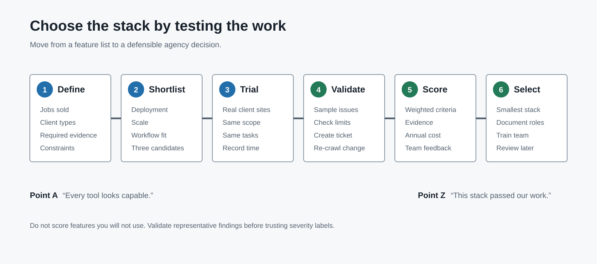

# 10 Best SEO Audit Tools for Agencies in 2026

The best SEO audit tool for an agency is the one that fits the work the agency sells. Technical specialists may need granular crawl configuration and custom extraction. Account-led teams may value prioritization and client-ready explanations. Enterprise clients may require distributed crawling, log analysis, permissions, APIs, and continuous monitoring.

This guide helps you move from a crowded tool market to a defensible shortlist, a representative trial, and a final stack. It compares ten tools by use case rather than pretending one platform is universally best.

If you want the broader category breakdown first, start with our guide to choosing an [SEO audit tool for agencies](/seo-audit-tool-for-agencies/). If you already know you need software for client delivery, compare this list with our deeper guide to [SEO audit software for agencies](/seo-audit-software-for-agencies/).

> **Editorial disclosure:** CrawlBeast is our product and is currently pre-launch. We include it because this article is published for CrawlBeast's agency audience. We do not claim independent testing or customer results that do not yet exist. Vendor capabilities, limits, and prices should be verified before purchase.

## How We Compared These SEO Audit Tools

An agency comparison is useful only when it asks more than “which tool has the longest feature list?” The better question is “which tool fits the agency's recurring audit job?” We compare each platform against:

- Crawl control, scale, rendering, and scheduling
- Technical issue coverage and evidence quality
- Prioritization and ability to separate signal from noise
- Exports, dashboards, white-label reporting, and collaboration
- Support for re-crawls, change monitoring, and client delivery
- Team skill level, implementation complexity, and likely workflow fit

This is a use-case comparison, not a controlled benchmark. We did not run every tool against the same domains or score detection accuracy. Product descriptions use public vendor information reviewed on July 31, 2026. Confirm current limits, integrations, availability, and pricing before purchasing.

Patrick Stox's [free SEO tools collection](https://patrickstox.com/tools/) uses a useful selection principle:

> “Start with the job.”

That is the right way to read this list. Define the work, evidence, output, and operating constraints first. Choose software second.

### Common question: What is the best SEO audit tool for an agency?

There is no universal winner. CrawlBeast is designed for a focused local crawl-to-action workflow and should be trialed as a pre-launch product; Screaming Frog suits specialists who need granular desktop control; Sitebulb suits teams that value visual explanations; Semrush and Ahrefs suit agencies using their wider platforms; JetOctopus and Lumar suit larger technical programs.

## Quick Comparison

| Tool | Deployment / role | Best fit | Main trade-off to test |
|---|---|---|---|
| CrawlBeast | Local desktop crawler | Focused issue prioritization and multi-project client workflows | Pre-launch product; confirm feature availability and fit |
| Screaming Frog SEO Spider | Desktop crawler | Granular configuration, extraction, and exports | Learning curve and manual interpretation |
| Sitebulb | Desktop and cloud crawler | Prioritized hints and visual stakeholder communication | Audit limits, resource use, and plan fit |
| Semrush Site Audit | SaaS suite module | Agencies already using Semrush campaigns and reports | Suite cost and crawl/project allowances |
| Ahrefs Site Audit | SaaS suite module | Audits connected with search, link, and monitoring data | Plan allowances and custom-crawl depth |
| JetOctopus | Cloud technical SEO platform | Large-site crawl, log, and Search Console analysis | Complexity and enterprise-oriented workflow |
| Lumar | Enterprise website intelligence | Monitoring, governance, and integrations at scale | Procurement, setup, and total cost |
| SE Ranking Website Audit | SaaS suite module | Smaller all-in-one agency stacks | Technical depth versus dedicated crawlers |
| Moz Pro Site Crawl | SaaS suite module | Accessible campaign-level issue monitoring | Less granular crawl control |
| Google Search Console | First-party Google evidence | Every agency, as a companion data source | Not a complete website crawler |

## 1. CrawlBeast: Best for a Focused Local Agency Workflow

CrawlBeast is a pre-launch technical SEO audit desktop application for agencies, marketers, and developers. It runs locally on Mac and Windows and is being designed around multi-project crawling, issue prioritization, and clearer handoffs.

It fits agencies that want to move beyond scattered manual checks and create a consistent [SEO audit workflow](/seo-audit-workflow/) across accounts. Teams can use CrawlBeast to crawl client sites, detect technical SEO issues, review site structure, and prepare clearer findings for client reports.

Use CrawlBeast for:

- Technical SEO audits for client websites
- Broken link and status code checks
- Metadata, heading, crawlability, and indexability reviews
- Website crawling for monthly or quarterly audits
- Agency reporting workflows
- Repeatable audit processes across multiple clients

CrawlBeast should make an agency shortlist when local processing, privacy, predictable crawling, a modern dashboard, and prioritized technical findings matter. It should not be positioned as the right choice for distributed, multi-million-page enterprise crawling before those requirements are proven.

**Best for:** Small and mid-sized agencies that want a focused desktop crawl-to-action workflow.

**Test before choosing:** Crawl coverage on representative client sites, resource use, export and report workflow, and whether the current release supports every required check.

For a more focused breakdown of crawler-specific use cases, see our guide to choosing a [website crawler for agencies](/website-crawler-for-agencies/).

## 2. [Screaming Frog SEO Spider](https://www.screamingfrog.co.uk/seo-spider/): Best for Granular Crawl Control

Screaming Frog SEO Spider is one of the most widely used desktop crawlers in technical SEO. It is popular with agencies because it gives experienced SEOs a lot of control over how they crawl, filter, export, and analyze websites.

It can help agencies find broken links, redirects, metadata problems, duplicate pages, canonicals, hreflang issues, structured data issues, and many other technical SEO problems. The free version supports crawling up to 500 URLs, while the paid version unlocks larger crawls and advanced features.

Use Screaming Frog for:

- Deep technical SEO crawls
- Custom extraction
- JavaScript rendering
- Crawl comparison
- XML sitemap generation
- Detailed exports for technical analysis

The main tradeoff is that Screaming Frog is powerful but technical. It is excellent for SEO specialists, but account managers may need help turning the output into client-friendly reporting.

**Best for:** Technical SEO teams that want a flexible desktop crawler with deep configuration options.

**Test before choosing:** Saved configurations, JavaScript rendering, integrations, crawl comparison, exports, and the time required to turn raw results into tickets.

## 3. [Sitebulb](https://sitebulb.com/): Best for Visual Technical Audits

Sitebulb is a website crawler built around technical SEO auditing, prioritization, and visual reporting. It is especially useful for agencies that need to explain technical issues to clients, developers, or non-technical stakeholders.

Sitebulb provides audit scores, prioritized hints, crawl visualizations, URL reports, bulk exports, and customizable PDF reports. It offers both desktop and cloud options, which makes it flexible for consultants, agencies, and larger SEO teams.

Use Sitebulb for:

- Technical SEO audits with visual explanations
- Crawl maps and site architecture analysis
- Prioritized issue hints
- Client-friendly PDF reports
- JavaScript crawling
- Desktop or cloud crawling workflows

Sitebulb is strong when communication matters as much as raw crawl data. Its visuals and explanations can make technical recommendations easier to present.

**Best for:** Agencies that need technical depth plus clearer client and stakeholder communication.

**Test before choosing:** Desktop versus cloud fit, audit size, collaboration, report customization, and whether Hint priorities match your agency's judgment.

## 4. [Semrush Site Audit](https://www.semrush.com/features/site-audit/): Best for Semrush-Based Campaigns

Semrush Site Audit is part of the broader Semrush SEO platform. It checks websites for technical and on-page SEO issues, groups problems by priority, tracks site health over time, and supports scheduled audits.

For agencies already using Semrush for keyword research, competitor analysis, rank tracking, or reporting, Site Audit can be convenient because it lives inside the same platform.

Use Semrush Site Audit for:

- Scheduled site audits
- Technical and on-page issue checks
- Site health tracking
- Prioritized task lists
- Progress monitoring
- Broader SEO campaign reporting

Semrush is not only an audit tool, so it can feel broader than necessary if your agency only needs technical crawling. But for agencies that want an all-in-one SEO platform, it is a practical option.

**Best for:** Agencies that want site audits inside a broader SEO, content, keyword, and competitor research suite.

**Test before choosing:** Project and crawl allowances, white-label requirements, reporting automation, and whether the suite replaces or duplicates existing tools.

## 5. [Ahrefs Site Audit](https://ahrefs.com/site-audit): Best for Connected Search and Link Research

Ahrefs Site Audit helps agencies monitor technical and on-page SEO issues as part of the larger Ahrefs platform. Ahrefs is best known for backlink and keyword data, but its site audit tool is useful for scheduled crawls and ongoing website health checks.

Ahrefs has also expanded audit monitoring with always-on crawling, which is useful when agencies want faster detection of new technical issues instead of waiting for a weekly or monthly crawl.

Use Ahrefs Site Audit for:

- Scheduled technical audits
- Ongoing site health monitoring
- Technical and on-page issue checks
- Audit history and progress tracking
- Connecting audit work with backlink and keyword research

Ahrefs is a good fit if your agency already relies on it for SEO research. If you need highly customized technical crawling, you may still pair it with a dedicated crawler.

**Best for:** Agencies that want technical audit data connected to backlink, keyword, and ranking analysis.

**Test before choosing:** Crawl allowances, [always-on audit](https://help.ahrefs.com/en/articles/10957674-how-always-on-audit-works), issue customization, exports, and the depth required for technical investigations.

## 6. [JetOctopus](https://jetoctopus.com/): Best for Crawl and Log Analysis at Scale

JetOctopus is a technical SEO platform built for large websites, log analysis, crawl data, Google Search Console data, and agency workflows.

It is especially relevant for agencies managing complex websites where crawl budget, indexation, bot behavior, internal linking, and technical prioritization matter. JetOctopus emphasizes large-scale crawling, log analysis, unlimited projects/users in agency contexts, and technical SEO dashboards.

Use JetOctopus for:

- Large-scale website crawling
- Log file analysis
- Google Search Console data analysis
- Internal linking analysis
- Technical SEO dashboards
- Multi-client agency workflows

JetOctopus may be more than a small agency needs, but it can be very useful for technical SEO teams working with ecommerce, marketplaces, publishers, or enterprise sites.

**Best for:** Agencies managing large websites, log analysis, crawl budget, and advanced technical SEO.

**Test before choosing:** Log ingestion, Search Console joins, segmentation, access controls, crawl speed, and onboarding effort.

## 7. [Lumar](https://www.lumar.io/): Best for Enterprise Website Intelligence

Lumar is an enterprise website optimization platform that includes technical SEO crawling, monitoring, accessibility, site speed, and reporting capabilities.

It is designed for scale. Lumar is a better fit for enterprise agencies, in-house enterprise SEO teams, and digital teams that need advanced monitoring, custom reporting, and large-site crawling.

Use Lumar for:

- Enterprise technical SEO audits
- Large website crawling
- Website monitoring
- SEO, accessibility, and site speed insights
- Custom reports and dashboards
- Developer and stakeholder workflows

Lumar is likely too heavy for smaller agencies that only need standard SEO audits. For enterprise work, though, it brings strong crawling and website intelligence features.

**Best for:** Enterprise agencies and large digital teams that need scalable website optimization workflows.

**Test before choosing:** Governance, APIs, alerting, developer integrations, support, data retention, and total implementation cost.

## 8. [SE Ranking Website Audit](https://seranking.com/website-audit.html): Best for Smaller All-in-One Agency Stacks

SE Ranking Website Audit is part of the SE Ranking SEO platform. It checks websites for technical issues, gives fix suggestions, and supports recurring audits.

It can be a good option for small to mid-sized agencies that want rank tracking, website audits, backlink checks, on-page analysis, and reporting in one platform without going straight to enterprise pricing.

Use SE Ranking Website Audit for:

- Website audit scans
- Technical SEO issue checks
- Severity-based recommendations
- Recurring audits
- Rank tracking and client reporting
- Smaller agency SEO workflows

SE Ranking may not have the same technical crawl depth as dedicated crawlers, but it is useful for agencies that want an affordable all-in-one SEO toolkit.

**Best for:** Small and mid-sized agencies that want website audits inside a broader SEO platform.

**Test before choosing:** Agency reporting add-ons, project allowances, technical depth, permissions, and how much of the wider suite your team will use.

## 9. [Moz Pro Site Crawl](https://moz.com/products/pro/site-crawl): Best for Accessible Campaign Monitoring

Moz Pro Site Crawl helps agencies find and monitor common technical SEO issues, including crawl errors, missing tags, duplicate content problems, redirects, and other site health issues.

Moz is generally easier to approach than some technical crawlers, which can make it useful for agencies with lighter SEO workflows or teams that do not need very advanced crawl customization.

Use Moz Pro Site Crawl for:

- Common technical SEO checks
- Ongoing site crawl monitoring
- Basic issue prioritization
- SEO campaign tracking
- Simpler reporting workflows

Moz Pro is not usually the deepest technical SEO crawler, but it can be helpful for agencies that want straightforward site monitoring inside a familiar SEO suite.

**Best for:** Agencies that want a simpler site crawl tool inside an accessible SEO platform.

**Test before choosing:** Issue coverage, crawl cadence, exports, campaign limits, and whether experienced technical SEOs need more control.

## 10. [Google Search Console](https://search.google.com/search-console/about): Essential Companion Evidence

Google Search Console is not a full SEO audit tool, but every agency should use it alongside one.

It gives direct data from Google about indexing, search performance, page experience, sitemaps, crawl errors, and manual actions. That makes it essential for validating whether technical SEO issues are actually affecting visibility in Google Search.

Use Google Search Console for:

- Index coverage checks
- Sitemap monitoring
- Search performance data
- Page experience signals
- Manual action alerts
- Validating crawl and indexing issues

The limitation is that Google Search Console does not replace a crawler. It shows important Google-side signals, but it will not give the same full-site technical audit view as tools like CrawlBeast, Screaming Frog, Sitebulb, JetOctopus, or Lumar.

**Best for:** Supporting SEO audits with direct Google indexing and performance data.

## Move From Ten Tools to a Three-Tool Shortlist

The best SEO audit tool for agencies depends on your client mix, team skill level, reporting needs, and crawl complexity.

Choose **CrawlBeast** if you want a focused [technical SEO audit tool for agencies](/technical-seo-audit-tool-for-agencies/), with crawling and reporting built around repeatable client delivery.

Choose **Screaming Frog** if your team wants maximum crawl control and is comfortable working with exports and technical data.

Choose **Sitebulb** if you need strong technical auditing plus visuals and explanations that make client communication easier.

Choose **Semrush** or **Ahrefs** if your agency wants site audits connected to a broader SEO platform.

Choose **JetOctopus** or **Lumar** if you manage large websites, enterprise clients, or advanced technical SEO programs.

Choose **SE Ranking** or **Moz Pro** if you want a lighter all-in-one SEO platform for smaller agency workflows.

Use **Google Search Console** with any tool you choose, because it gives direct search performance and indexing data from Google.

If reporting is the main bottleneck in your process, review our guide to [SEO audit reporting](/seo-audit-reporting/) before choosing a tool. The best crawler for your team still needs to produce findings your clients can understand and approve.

## Agency Evaluation Checklist

Before choosing a tool, compare each option against the jobs your team needs to perform every month.

| Evaluation Area | What to Check |
|---|---|
| Crawling | Can it crawl full client websites reliably? |
| Technical SEO | Does it detect indexability, canonical, metadata, status code, sitemap, robots.txt, and internal linking issues? |
| Prioritization | Does it help separate critical issues from low-impact warnings? |
| Reporting | Can the findings be turned into clear client reports? |
| Workflow | Does it support repeatable audits across clients? |
| Scalability | Can it handle large sites, multiple projects, and recurring audits? |
| Collaboration | Can strategists, account managers, technical SEOs, and developers use the output? |
| Monitoring | Can you re-audit, compare progress, and catch new issues over time? |

This checklist works best when paired with a documented [SEO audit workflow](/seo-audit-workflow/), so every account gets the same baseline review before custom analysis begins.

## Build a Weighted Trial Scorecard

Turn the evaluation checklist into a score before starting trials. Weight requirements by the work your agency sells rather than giving every feature equal importance.

| Criterion | Suggested weight | Trial question |
|---|---:|---|
| Crawl reliability and configuration | 20% | Did the crawl complete with the intended scope and rendering? |
| Evidence and issue accuracy | 20% | Could the reviewer validate sampled findings and understand limitations? |
| Prioritization and workflow | 15% | Did the output help the team identify what deserved attention first? |
| Reporting and handoff | 15% | How quickly could one finding become a client explanation and developer ticket? |
| Scale and multi-client operations | 10% | Can the team manage representative sites, projects, histories, and permissions? |
| Integrations and exports | 10% | Does it connect to required evidence and downstream systems? |
| Cost and predictability | 10% | What is the realistic annual cost at current client volume? |

Score each shortlisted tool from 1 to 5, multiply by the weight, and record evidence for the score. Change the weights when your service model demands it.

### Representative trial protocol

1. Choose one small client site and one technically demanding site.
2. Write the required crawl scope and acceptance criteria before opening a tool.
3. Run each shortlisted platform with comparable settings.
4. Validate a sample of critical, high, and low-severity findings manually.
5. Create one client explanation and one developer ticket from each tool.
6. Re-crawl after a controlled change and compare the workflow.
7. Record time, resource use, gaps, and total cost.
8. Select the smallest stack that covers the required jobs reliably.

## Recommended Stacks by Agency Type

| Agency type | Practical starting stack | Why |
|---|---|---|
| Freelancer or small agency | CrawlBeast or a dedicated crawler + Search Console + analytics | Focused collection with first-party search and business evidence |
| Technical SEO consultancy | Screaming Frog or Sitebulb + Search Console + performance and backlink tools | Deeper configuration, validation, and specialist analysis |
| Full-service SEO agency | Semrush, Ahrefs, or SE Ranking + dedicated crawler when needed | Campaign data plus technical depth for selected accounts |
| Enterprise technical program | JetOctopus or Lumar + Search Console + logs + analytics/data warehouse | Scale, governance, monitoring, and cross-source analysis |

These are starting architectures, not mandatory bundles. Avoid paying twice for the same job unless the second tool gives you needed validation or a materially better workflow.

## Related Video: See a Dedicated Crawler in Practice

The official Screaming Frog demo shows the kind of raw crawl interface and technical workflow an agency should test when comparing a dedicated desktop crawler with a guided or all-in-one platform.

<iframe
  width="560"
  height="315"
  src="https://www.youtube.com/embed/tkil3pKSFDA"
  title="Screaming Frog SEO Spider official demo"
  frameborder="0"
  allow="accelerometer; autoplay; clipboard-write; encrypted-media; gyroscope; picture-in-picture; web-share"
  allowfullscreen>
</iframe>

[Watch the Screaming Frog SEO Spider demo on YouTube](https://www.youtube.com/watch?v=tkil3pKSFDA).

The interface has evolved since the video was published, so use it to understand the workflow category and verify current features in the vendor documentation.

## Questions to Ask Before You Buy

### Do agencies need more than one SEO audit tool?

Often, yes. A crawler may provide URL-level evidence while Search Console provides Google search and indexing data. Large or specialized programs may also need log-file analysis, performance data, or backlink research. Start with the minimum reliable stack, document what each tool proves, and avoid paying for overlapping dashboards.

### Is Google Search Console enough for an SEO audit?

No. Search Console is essential supporting evidence, but it does not replace a full-site crawler. It cannot provide the same comprehensive view of internal links, metadata patterns, response codes, crawl depth, or template-level URL relationships.

### Should an agency choose an all-in-one platform or a dedicated crawler?

Choose an all-in-one platform when the team benefits from connected keyword, rank, backlink, reporting, and audit data. Choose a dedicated crawler when technical depth, flexible crawl configuration, repeatability, or large URL analysis is the primary requirement. A hybrid stack is sensible when both needs are material.

### What should an agency test during a trial?

Use a representative client site, not a tiny demo domain. Test crawl completion, JavaScript handling, issue validation, exports, report branding, permissions, scheduling, re-crawling, and the time required to turn one finding into a client-ready recommendation. Ask whether the tool can preserve evidence and compare changes over time.

For visual learning, the [Google Search Central YouTube channel](https://www.youtube.com/@GoogleSearchCentral) is a relevant official resource for crawling, indexing, Search Console, and search appearance topics. Embed a specific current video only when it directly explains a workflow covered in this article.

## Sources and Editorial Notes

- [Google Search Essentials](https://developers.google.com/search/docs/essentials)
- [Creating helpful, reliable, people-first content](https://developers.google.com/search/docs/fundamentals/creating-helpful-content)
- [Google's guidance on generative AI content](https://developers.google.com/search/docs/fundamentals/using-gen-ai-content)
- [Google Search visual elements gallery](https://developers.google.com/search/docs/appearance/visual-elements-gallery)

Tool descriptions should be rechecked before publication. Do not present vendor claims, pricing, limits, or feature availability as permanent facts.

## Final Recommendation

The best agency SEO audit tool is the one that reliably completes your agency's recurring job at an acceptable operational cost. Define requirements, shortlist by use case, test representative client sites, validate findings, and score the complete crawl-to-handoff workflow.

CrawlBeast belongs on the shortlist for agencies seeking a local, privacy-first desktop workflow with multi-project management and prioritized technical findings. Because it is pre-launch, test the current release against the same acceptance criteria as every established alternative.

For the full category, compare the surrounding [SEO audit tools for agencies](/seo-audit-tool-for-agencies/) and [agency SEO software](/seo-audit-software-for-agencies/). Choose the smallest stack that helps your team gather reliable evidence, explain findings clearly, and turn technical problems into client-approved action.
