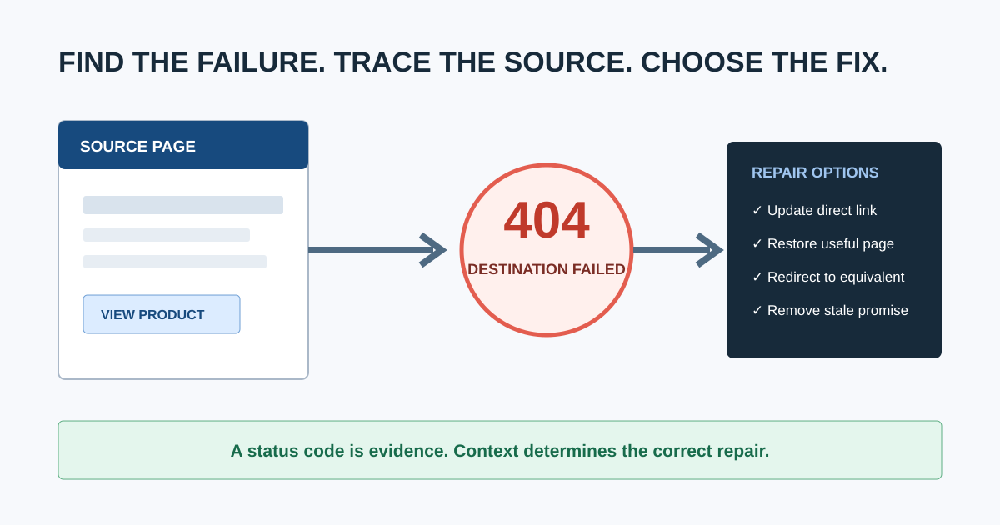
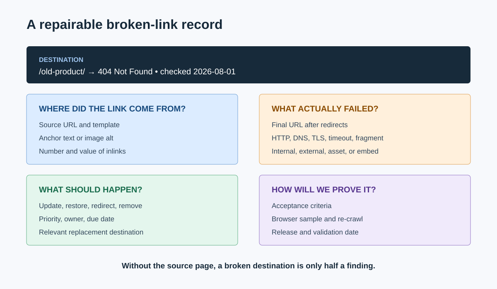
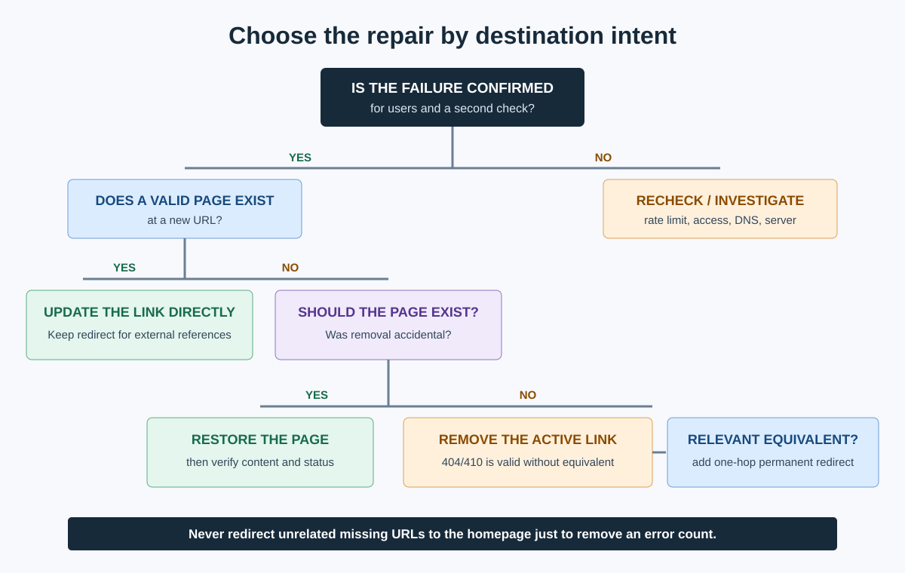

# Broken Link Checker: Find, Prioritize, and Fix Dead Links

A broken link checker crawls a website, follows its links, and reports destinations that fail or lead somewhere unexpected. A useful result includes the broken destination, HTTP status, every source page linking to it, link text, whether the link is internal or external, and enough context to choose the correct repair.

Finding the `404` is only the first step. The real job is to decide whether to update the link, restore the page, redirect it, remove it, or leave the missing URL alone. This guide takes you through that complete process.

Broken links are one part of the broader [technical SEO issues](/technical-seo-issues/) cluster. When the check belongs to a larger client engagement, place it inside a documented [SEO audit workflow](/seo-audit-workflow/) so scope, ownership, and validation remain connected.

## What Counts as a Broken Link?

A broken link is a hyperlink whose destination does not deliver the resource the user was promised. Common cases include:

- `404 Not Found` or `410 Gone` destinations
- `5xx` server failures
- DNS, connection, TLS, or timeout failures
- Redirect loops or redirects ending at an error
- Links to private, blocked, or login-only resources
- Broken page fragments such as `/guide/#missing-section`
- External pages that were removed, moved, or changed ownership
- Soft 404 pages that return `200 OK` but display an error or empty result

A URL returning `404` is not automatically a problem. It becomes a broken-link problem when a current page, navigation element, sitemap, canonical, redirect, or other user path still points to it.

### Do 404 pages hurt SEO?

An isolated missing URL is normal and does not need to be redirected merely because it exists. Google Search Central puts the distinction clearly:

> “If some URLs on your site 404, this fact alone does not hurt you or count against you in Google's search results.”

The quote comes from Google's explainer, [Do 404s hurt my site?](https://developers.google.com/search/blog/2011/05/do-404s-hurt-my-site). The practical distinction is important: do not “fix” every 404, but do repair active internal links and other signals that send users or crawlers to the missing URL.

Google's current [HTTP status code documentation](https://developers.google.com/crawling/docs/troubleshooting/http-status-codes) says content returned with `4xx` responses is not used for indexing, while persistent `5xx` errors can slow crawling and eventually lead to URLs being dropped. That is why classification comes before action.

## What Should a Broken Link Checker Report?

At minimum, capture:

| Field | Why it matters |
|---|---|
| Source URL | Tells the editor or developer where the link must be changed |
| Destination URL | Identifies the failed resource |
| Final URL | Reveals redirects before the failure |
| HTTP status or failure type | Separates missing pages from server, DNS, and access problems |
| Internal or external | Changes ownership and available fixes |
| Link text or image alt | Helps locate and assess the promise made to the user |
| Follow/nofollow | Adds link context, though user impact still matters |
| Crawl date and user agent | Makes transient or bot-specific failures reproducible |
| Number and value of source pages | Supports prioritization |

A destination-only export forces someone to search the site manually for every occurrence. Prefer a checker that exposes inlinks or source pages directly. A complete [website crawler for agencies](/website-crawler-for-agencies/) can usually combine broken-link checking with redirects, canonicals, metadata, and architecture analysis.

## How to Check an Entire Website for Broken Links

### 1. Define the crawl boundary

Decide whether the check includes:

- The production host only or all subdomains
- HTML pages, images, PDFs, scripts, stylesheets, and video embeds
- External links as well as internal links
- JavaScript-rendered links
- Staging, password-protected, or authenticated areas
- URL parameters and pagination
- Fragment identifiers or jump links

Save these settings with the crawl date. Two checkers can return different totals simply because one rendered JavaScript or checked external resources and the other did not.

### 2. Run a site-wide crawl

Start from the canonical homepage or an agreed seed list and let the checker follow internal links. Watch for crawl traps such as infinite calendars, faceted combinations, session URLs, and repeated parameters. Use sensible speed limits on fragile servers.

CrawlBeast is a pre-launch desktop SEO audit application that runs locally on Mac and Windows. It is designed to help agencies and marketers identify broken links, status-code errors, redirects, metadata problems, and other technical issues across projects. Use it when a privacy-first local crawl and prioritized issue view fit the job, and validate the available release against your site's rendering and scale requirements.

Other options include [Screaming Frog SEO Spider](https://www.screamingfrog.co.uk/seo-spider/tutorials/broken-link-checker/), [Ahrefs Site Audit](https://ahrefs.com/site-audit), [Semrush Site Audit](https://www.semrush.com/features/site-audit/), and CMS-specific plugins. Whatever tool you choose, the repair method below stays the same.

### 3. Filter failures without collapsing them into “broken”

| Result | What it usually means | First check |
|---|---|---|
| `404` | Resource was not found | Was it removed, moved, misspelled, or never valid? |
| `410` | Resource was intentionally removed | Does any current page still promise it? |
| `401/403` | Authentication or permission required | Should the linked user have access? |
| `429` | Too many requests | Did the checker trigger rate limiting? |
| `500/502/503/504` | Server or upstream failure | Is it persistent for users and other monitoring? |
| Timeout/DNS/TLS | Connection failed | Is the host available from another network and browser? |
| Redirect loop | Redirects never reach a final resource | Which rule or URL variant repeats? |
| Soft 404 | Error-like content returned with `200` | Should the server return a real `404/410` or valid content? |

Recheck failures after the crawl. External sites can rate-limit automated tools, and temporary `5xx` responses can disappear. Record confirmed failures separately from “needs verification.”

### 4. Find every source page

For each failed destination, list all pages that link to it. Include links in navigation, footers, templates, body content, images, canonical tags, hreflang, structured data, XML sitemaps, and redirects where your tools support them.

Fixing one article does not solve a broken link repeated in a site-wide template. Conversely, a single editorial link on an archived post may be low priority.

## How Do You Choose the Correct Fix?

Use destination intent, not status code alone.

| Situation | Correct action | Avoid |
|---|---|---|
| Destination has a clear replacement | Update the source link directly | Leaving an unnecessary redirect hop |
| URL moved permanently and old links/backlinks remain | Add a `301` or `308` to the closest equivalent and update controllable internal links | Redirecting everything to the homepage |
| Valuable page was removed accidentally | Restore the page at the expected URL | Redirecting before confirming removal was intentional |
| Content is intentionally gone with no equivalent | Remove the internal link and return `404` or `410` | Inventing an irrelevant redirect |
| External source moved | Link to the publisher's new authoritative URL | Linking to an unverified copy |
| External claim no longer has a trustworthy source | Rewrite or remove the claim and link | Keeping a dead citation for appearance |
| Server error is temporary | Resolve infrastructure issue and monitor | Treating it as a permanent content move |
| URL is misspelled or malformed | Correct it at the source | Adding redirects for every typo when the source is controllable |
| Fragment identifier is missing | Restore the target ID or update the fragment | Looking only at HTTP status, which remains `200` |

### Should every broken URL redirect to the homepage?

No. A redirect should take the user to the closest meaningful replacement. Redirecting unrelated removed URLs to the homepage creates a confusing experience and may be interpreted as a soft 404. If no equivalent exists, remove active internal links and let the old URL return an honest `404` or `410`.

### Is it better to update an internal link or rely on a redirect?

Update the internal link when you control the source. The direct link gives users and crawlers the final destination without an extra request. Keep the redirect when old bookmarks, backlinks, printed URLs, or uncontrollable references may still use the previous address.

## Prioritize Broken Links by Impact

Do not sort only by the number of errors. Prioritize using four factors:

1. **User importance:** Is the link part of navigation, checkout, account access, support, or a key conversion path?
2. **Source value:** Does it appear on a high-traffic, high-converting, or strongly linked page?
3. **Scale:** Is the link repeated across a template or many pages?
4. **Failure severity:** Is it an internal `404`, persistent `5xx`, redirect loop, or temporary external timeout?

| Priority | Example | Response |
|---|---|---|
| Critical | Checkout or primary navigation link fails | Fix and validate immediately |
| High | Internal link from major category pages leads to a removed product family | Resolve in the next release |
| Medium | Repeated external citation is dead but the claim can be resourced | Assign editorial update |
| Low | One broken external link on an old, low-traffic page | Batch with content maintenance |
| Verify | One timeout from a rate-limited external host | Recheck before assigning a fix |

For client delivery, place confirmed items into a [website audit report](/website-audit-report/) with source evidence, owner, recommendation, and acceptance criteria. Avoid presenting a raw export as the final report.

## Video: Find Broken Links and Their Source Pages

This Screaming Frog tutorial shows the core workflow: crawl a site, filter `4xx` responses, inspect inlinks to find source pages, and export the affected links. The interface is tool-specific, but the diagnostic sequence applies to any complete checker.

<iframe width="560" height="315" src="https://www.youtube.com/embed/RxhpC0ryeP4" title="How to find broken links using the SEO Spider" loading="lazy" frameborder="0" allow="accelerometer; autoplay; clipboard-write; encrypted-media; gyroscope; picture-in-picture; web-share" allowfullscreen></iframe>

[Watch the broken-link checker tutorial on YouTube](https://www.youtube.com/watch?v=RxhpC0ryeP4).

## How to Verify Broken-Link Fixes

The work is complete only when the production result matches the intended action.

1. Re-crawl the affected source URLs and destinations.
2. Confirm updated links point directly to a valid final URL.
3. Confirm redirects use the intended permanent or temporary status and do not chain.
4. Test representative links in a browser, including mobile navigation and JavaScript interactions.
5. Check that restored pages return meaningful content, not an empty `200` response.
6. Recheck Search Console and monitoring over time for important URLs.
7. Record the release date, validated examples, and remaining exceptions.

A strong acceptance criterion is specific: “All product-grid links formerly pointing to `/old-range/` now point directly to `/new-range/`; the old URL returns one `301` hop to the new category; no internal crawl source links to the old URL.”

## Prevent Broken Links From Returning

- Run a link check before publishing or deploying major changes.
- Keep a redirect map for migrations and URL changes.
- Add automated checks for navigation, templates, sitemaps, and critical journeys.
- Re-crawl after releases that change routes, products, or content systems.
- Assign ownership for external-citation maintenance.
- Compare crawls so new errors are separated from the existing backlog.
- Monitor frequently changing [ecommerce sites](/seo-audit-for-ecommerce/) more often than stable brochure sites.

## Broken Link Repair Checklist

- Crawl scope and settings are documented.
- Internal, external, asset, and fragment links are classified.
- Transient failures have been rechecked.
- Every confirmed destination includes its source pages.
- High-value user paths and site-wide templates are prioritized.
- Each item has the right action: update, restore, redirect, remove, or investigate.
- Redirects lead to relevant equivalents and avoid chains.
- Repairs have owners and acceptance criteria.
- Production has been re-crawled and manually sampled.
- The next monitoring trigger or date is recorded.

A broken link checker creates the evidence. The value comes from preserving the user's intended journey, choosing a context-appropriate repair, and verifying that the path works after release. CrawlBeast can support that local crawl-and-prioritize workflow, while a disciplined repair decision tree keeps the team from replacing one technical problem with another.
