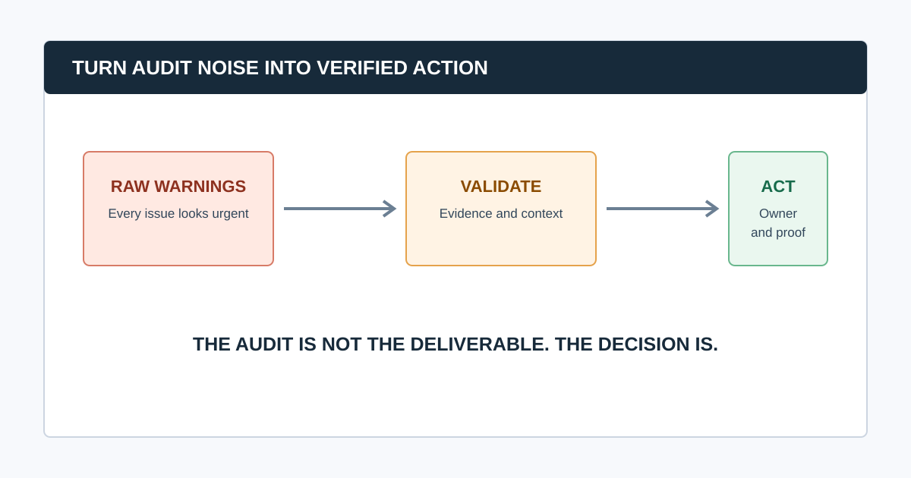

# 15 Common SEO Audit Mistakes and How to Avoid Them

The most damaging SEO audit mistake is treating a crawler's warning list as the audit. A useful audit combines a defined business question, reproducible technical evidence, first-party search data, human diagnosis, a prioritized implementation plan, and post-release verification.

That distinction matters because a hundred low-value warnings can distract a team from one `noindex` directive on a revenue-critical template. The fixes below turn common audit failure modes into a process that a marketer, developer, and stakeholder can use.

## The Audit Mistakes That Matter Most

| Mistake | What it causes | Better practice |
|---|---|---|
| Starting without a scope | A large, unfocused issue list | Define the decision, priority pages, and exclusions first |
| Treating every warning equally | Busywork and missed blockers | Score impact, scale, confidence, effort, and urgency |
| Trusting one data source | False claims about indexation or business impact | Combine crawl, Search Console, analytics, and live-page checks |
| Reporting symptoms, not patterns | Thousands of repetitive tickets | Diagnose the affected template, folder, or system owner |
| Skipping re-crawls | “Fixed” issues that remain live | Define acceptance criteria and validate in production |

## 1. Starting the Audit Without a Business Question

“Audit the site” is not a brief. A migration review, traffic-drop investigation, new-business audit, and quarterly health check need different data and different definitions of success.

Write a one-sentence scope before opening a crawler: “Identify crawlability and template issues affecting commercial category pages after the new navigation release.” Record priority URLs, conversions, countries, recent changes, access, exclusions, and who will implement the work. Our guide to [how agencies perform SEO audits](/how-agencies-perform-seo-audits/) includes a practical audit brief.

## 2. Treating a Crawl as Proof of Google Indexing

A crawler can report what it reached under its configuration. It cannot prove that Google crawled, indexed, or ranked the same URL. Google explicitly notes that satisfying its technical requirements and best practices does not guarantee crawling, indexing, or serving in Search.

Compare crawl findings with Search Console, URL Inspection, sitemaps, and live-page behavior before making an indexation claim. Use Google’s [Search Essentials](https://developers.google.com/search/docs/essentials) as a baseline and state what the evidence cannot prove.

## 3. Letting Crawl Settings Go Undocumented

An unrecorded crawl cannot be reproduced. Wrong hostnames, stale cookies, a low URL cap, blocked resources, wrong rendering mode, or overly aggressive exclusions can all produce misleading findings.

Keep the user agent, rendering mode, speed, authentication, URL sources, scope, exclusions, crawl date, and termination reason with the output. When you re-crawl after a fix, use the same configuration unless the test itself changed.

## 4. Prioritizing by Warning Count

The number of URLs affected is only one factor. A minor description warning on thousands of unimportant filtered URLs may be less urgent than a single canonical or robots problem on a key template.

Prioritize with five questions:

1. Does it block discovery, indexation, conversion, or a priority search journey?
2. How many important URLs or templates are affected?
3. Is the behavior confirmed by independent evidence?
4. What does the fix cost, and what could regress?
5. Is there a migration, launch, outage, or deadline that changes urgency?

## 5. Filing One Ticket Per URL Instead of Fixing the Pattern

If 800 product pages share a bad canonical, the problem is not 800 independent pages. It is a template, rule, theme, CMS field, or deployment behavior. Report a representative URL, the scope of the pattern, the probable owner, and the desired output.

This turns a crawl export into an engineering problem that can be solved once and validated at scale. It also prevents an audit report from becoming a spreadsheet nobody can act on.

## 6. Ignoring the Difference Between Crawlability and Indexability

Robots rules, status codes, `noindex`, canonicals, internal links, sitemaps, rendering, and Search Console signals answer different questions. For example, robots.txt manages crawling; it is not a canonicalization method. Google’s [canonical guidance](https://developers.google.com/search/docs/crawling-indexing/consolidate-duplicate-urls) recommends aligning redirects, canonical elements, sitemap entries, and internal links around the preferred URL.

Audit these layers in order, rather than adding a generic “indexing” label to every URL.

## 7. Skipping Rendered-Page Checks on JavaScript Sites

Source HTML can differ from what users and search engines receive after JavaScript runs. On important templates, compare raw and rendered content, links, canonical tags, metadata, and structured data. Use URL Inspection or a rendered crawler view when you need to confirm what Google can see.

Do not infer that structured data is absent solely because it is missing from a static fetch; many implementations inject JSON-LD in the browser. Validate eligible markup with Google’s Rich Results Test.

## 8. Treating Every 404 as a Defect

A 404 can be the correct response for content that is permanently gone. The audit question is whether the dead URL has meaningful internal links, traffic, links from other sites, a clear successor, or a customer journey that now fails. Prioritize broken internal links and important redirected or removed URLs; do not blanket-redirect every missing page to the homepage.

Use the [broken link checker](/broken-link-checker/) guide to record source page, target URL, user impact, and the correct repair.

## 9. Treating Titles, H1s, or Alt Text as Universal Emergencies

On-page signals matter, but they are rarely the first fix when priority pages are blocked, redirecting, duplicated, or invisible in internal architecture. Audit template quality after access, indexation, and architecture. Then use user-facing language in titles, headings, alternative text, and links rather than adding repeated keyword variants.

## 10. Forgetting the Product, Content, and Conversion Context

An audit can find technically clean pages that have no search demand, no useful offer, or no path to conversion. Pair technical data with the pages, templates, products, services, and user journeys that matter to the business. Analytics helps identify what a technically correct change is worth protecting.

## 11. Writing Recommendations Without Evidence

“Improve site speed” and “fix duplicate content” are not developer-ready recommendations. Each finding needs the observed behavior, affected URLs, representative examples, scope, impact, proposed change, owner, acceptance criteria, and validation method.

Our [website audit report](/website-audit-report/) guide shows how to turn an observation into a decision that survives the handoff.

## 12. Forgetting That Sitemaps Are a Signal, Not a Guarantee

A sitemap tells Google which canonical URLs you consider important; it does not force indexing. Keep it clean: include absolute, canonical, indexable URLs and remove obvious redirects, errors, and unwanted duplicates. Then compare sitemap coverage with the crawl and Search Console rather than calling every submitted URL “indexed.”

Read Google’s current [sitemap guidance](https://developers.google.com/search/docs/crawling-indexing/sitemaps/build-sitemap) before changing generation rules.

## 13. Auditing Performance with One Synthetic Score

Lab diagnostics are useful for diagnosing a page, but field data describes user experience over time. Review Core Web Vitals by key template and device where data exists, then investigate the actual causes: server response, image delivery, fonts, JavaScript, third parties, or layout movement. Do not promise a ranking change from one score improvement.

## 14. Failing to Assign an Owner and a Definition of Done

An SEO team may identify the issue, but a CMS owner, developer, content team, platform vendor, or infrastructure team may need to fix it. Each item needs an owner, approval route, implementation window, acceptance criteria, and rollback consideration. “Developer to fix” is not an owner.

## 15. Closing the Audit Before Validation

The audit ends only when important changes are verified. Test the live URL, inspect headers and rendered output where needed, re-crawl the affected area, and watch Search Console over an appropriate period. Record whether the issue is fixed, changed, deferred, or still unverified.

### Common question: How can I make an SEO audit more useful?

Make the audit a decision system: begin with a business question, validate crawler output with first-party data, group defects by pattern, prioritize by impact and confidence, assign owners, and re-crawl after release. A shorter, evidence-backed roadmap is more useful than an exhaustive export.

## Video: Preserve the Parts of the Workflow That Matter

This audit walkthrough shows the useful sequence: collect evidence, investigate a pattern, document the recommendation, and monitor the result. The tool is only the collection layer.

<iframe width="560" height="315" src="https://www.youtube.com/embed/9-mOukMWtFQ" title="Ahrefs SEO audit template walkthrough" loading="lazy" frameborder="0" allow="accelerometer; autoplay; clipboard-write; encrypted-media; gyroscope; picture-in-picture; web-share" allowfullscreen></iframe>

[Watch the SEO audit walkthrough on YouTube](https://www.youtube.com/watch?v=9-mOukMWtFQ).

## A Better Audit QA

- [ ] The audit brief names the business decision and priority pages.
- [ ] Crawl configuration and data dates are documented.
- [ ] High-impact claims use live-page and first-party evidence where possible.
- [ ] Findings are grouped by template or system owner.
- [ ] Every recommendation names an owner, acceptance criteria, and validation method.
- [ ] Re-crawl or release verification is scheduled before the audit is closed.

Use CrawlBeast to collect local crawl evidence and surface priority patterns, then apply this QA to keep the report grounded in decisions instead of warnings.

## Sources and Further Reading

- Google Search Central: [Google Search Essentials](https://developers.google.com/search/docs/essentials)
- Google Search Central: [Crawling and indexing overview](https://developers.google.com/search/docs/crawling-indexing)
- Google Search Central: [Canonical URL guidance](https://developers.google.com/search/docs/crawling-indexing/consolidate-duplicate-urls)
