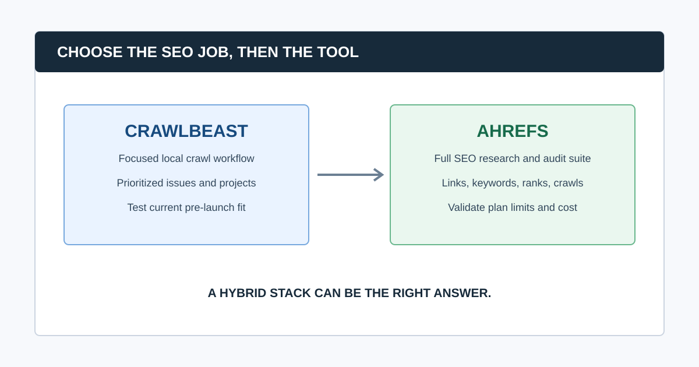

# CrawlBeast vs Ahrefs: Which SEO Workflow Fits Your Team?

CrawlBeast and Ahrefs solve different layers of SEO work. Ahrefs is a mature, cloud-based SEO platform that combines Site Audit with keyword, backlink, ranking, competitive, and reporting tools. CrawlBeast is a pre-launch local desktop crawler being designed around priority technical findings and a multi-project workflow for agencies, marketers, and developers.

Choose Ahrefs when you need a broad research suite connected to ongoing site audits and are comfortable with its plan, user, and crawl-credit model. Trial CrawlBeast when your immediate problem is turning local crawl data into a clearer prioritized action list, with the important caveat that it is pre-launch and must be tested against the current release.

> **Editorial disclosure:** CrawlBeast is our product and is pre-launch. This is not an independent benchmark or a claim of feature parity with Ahrefs. Ahrefs plans, limits, and product features change; verify them directly and run a representative same-site trial before making a purchase or migration decision.

## CrawlBeast vs Ahrefs at a Glance

| Decision area | CrawlBeast | Ahrefs | What to validate |
|---|---|---|---|
| Primary role | Focused local technical crawl and prioritization workflow | Broad SEO research suite with Site Audit | Whether your bottleneck is crawl interpretation or broader SEO research |
| Availability | Pre-launch desktop application for Mac and Windows | Established web platform | Current release, onboarding, support, and required integrations |
| Audit workflow | Local evidence grouped for prioritized review | Crawl-based Site Audit within wider SEO data | Issue coverage, filtering, exports, evidence, and time to handoff |
| Research context | Technical crawl focus | Keywords, links, rankings, competitors, and reports | Whether research context must live in the same platform |
| Cost model | Local desktop model; verify current product terms | Subscription plans and crawl allowances | Realistic users, projects, crawls, and usage limits |
| Best initial fit | Teams seeking a clean local crawl-to-action workflow | Teams that need an all-in-one SEO suite | A real client or controlled staging trial |

## What Is the Core Difference?

The core difference is scope. Ahrefs helps a team research demand, competitors, links, rankings, content, and technical health from one platform. CrawlBeast is being built to make a local technical crawl easier to review and prioritize across projects. Neither is automatically the “better SEO tool” because the jobs can be complementary.

An agency might use Ahrefs to understand a client’s search landscape and track performance, then use a local crawler for a focused technical investigation. Another team may prefer one platform when a shared cloud workspace and research data matter more than local control.

## Choose Ahrefs When the SEO Suite Is the Job

Ahrefs is the stronger choice when technical site audits need to sit alongside keyword research, link analysis, competitive analysis, rank tracking, historical data, and report building. That context can reduce context switching for a team that already uses Ahrefs to plan and measure SEO.

Choose Ahrefs when you need to:

- Investigate search demand and competitors alongside technical findings
- Connect technical issues with ranks, links, and other SEO research
- Run audits in a shared web platform with broader campaign tooling
- Use plan-based crawl capacity and reporting in an established vendor ecosystem
- Support a team whose central SEO workspace is already Ahrefs

Ahrefs publishes plan-based Site Audit crawl credits and project limits, and its help center explains that only internal HTML URLs returning `200` consume Site Audit crawl credits. Those limits are meaningful only in the context of your sites, users, crawl frequency, and reporting needs. See current [Ahrefs pricing](https://ahrefs.com/pricing/) and its [crawl-credit explanation](https://help.ahrefs.com/en/articles/3119402-how-are-crawl-credits-in-site-audit-spent) before using any example as a purchasing rule.

## Choose CrawlBeast When Local Crawl-to-Action Is the Job

CrawlBeast is a pre-launch technical SEO desktop application for Mac and Windows. It is being designed to identify technical patterns such as broken links, status-code errors, missing metadata, duplicate content, orphan pages, and canonical mismatches, then keep prioritized issues visible across client projects.

It belongs on a shortlist when the current friction is manual sorting and translation of crawl results. A local, focused workflow may help an agency or consultant move from technical evidence to an owner and acceptance criteria without treating every crawl warning as equally important.

**Test before choosing:** representative crawl coverage, JavaScript behavior, exports, current feature availability, resource use, and the ability to make a developer-ready handoff. CrawlBeast is not positioned as a distributed solution for multi-million-page enterprise crawling.

## Compare the Workflow in Four Questions

### 1. What evidence must the audit produce?

Define the URLs, templates, status codes, internal links, metadata, canonicals, directives, rendered elements, and crawl configuration you need. A tool cannot be judged by a dashboard alone; it must preserve enough evidence for a reviewer to reproduce a finding.

### 2. What context must sit beside the crawl?

If keyword, backlink, rank, competitor, and search-history context are part of every decision, Ahrefs may reduce friction. If the task is a focused technical investigation that requires local control and clearer prioritization, a dedicated local workflow may be more useful. Write down the decision each audit needs to support before comparing screens.

### 3. Who turns the output into work?

Ask the same person to create a short [website audit report](/website-audit-report/) and two developer tickets from each tool’s output. Time the work, but also judge whether the evidence, pattern, owner, and acceptance criteria are clear.

### 4. What will the full operating cost be?

Cost is not only a monthly price. Include users, projects, crawl volume, reporting, data requirements, current subscriptions, local hardware, training time, and the cost of manual analysis. Verify the current commercial terms instead of relying on comparisons that age quickly.

### Common question: Can CrawlBeast replace Ahrefs?

CrawlBeast may replace part of a focused local crawl workflow if the current release meets the technical checks and handoff needs of your team. It should not be assumed to replace Ahrefs’ broad keyword, backlink, rank-tracking, competitive, and research capabilities. A hybrid stack can be the sensible answer.

### Common question: Is Ahrefs Site Audit enough for technical SEO?

Ahrefs Site Audit can be an effective audit layer, especially when it is connected to the platform’s wider research data. Whether it is enough depends on crawl configuration, evidence needs, rendering, scale, reporting, integrations, and the skill required to diagnose the results. Validate critical findings with live-page checks and Search Console.

## A Fair Same-Site Trial

1. Write the audit question and non-negotiable requirements.
2. Pick a representative site or staging sample, not a homepage demo.
3. Use equivalent scope, rendering, URL sources, exclusions, crawl speed, and caps where each product supports them.
4. Seed known conditions, such as a broken link, redirect, canonical conflict, or JavaScript-dependent page.
5. Compare coverage, evidence quality, false positives, project workflow, and time to a developer-ready recommendation.
6. Check the true operating cost for a year of real clients, users, and crawl frequency.
7. Keep written disqualifiers beside any score. A tool that cannot support a critical workflow requirement cannot win on a weighted average.

For the crawl side of the evaluation, see our [website crawler for agencies](/website-crawler-for-agencies/) guide. For a comparison with a mature guided crawler, see [CrawlBeast vs Sitebulb](/crawlbeast-vs-sitebulb/).

## Video: A Technical Audit Workflow in Context

This walkthrough demonstrates the core audit sequence: collect crawl evidence, investigate patterns, write recommendations, and monitor the result. Use the same standard when assessing a local crawler or a suite audit module.

<iframe width="560" height="315" src="https://www.youtube.com/embed/9-mOukMWtFQ" title="Ahrefs SEO audit template walkthrough" loading="lazy" frameborder="0" allow="accelerometer; autoplay; clipboard-write; encrypted-media; gyroscope; picture-in-picture; web-share" allowfullscreen></iframe>

[Watch the SEO audit walkthrough on YouTube](https://www.youtube.com/watch?v=9-mOukMWtFQ).

## The Bottom Line

Ahrefs is best for teams that want a complete SEO research and audit suite in one established platform. CrawlBeast is worth evaluating for teams that want a focused local technical audit workflow built around issue prioritization and multiple client projects, with a transparent pre-launch caveat.

Pick the tool or stack that makes your most frequent SEO decision easier to support with evidence. Then protect the workflow with a defined scope, Search Console validation, owner-based tickets, and a post-fix re-crawl.

## Sources and Further Reading

- Ahrefs: [Plans and pricing](https://ahrefs.com/pricing/)
- Ahrefs Help Center: [How Site Audit crawl credits are spent](https://help.ahrefs.com/en/articles/3119402-how-are-crawl-credits-in-site-audit-spent)
- Google Search Central: [Google Search Essentials](https://developers.google.com/search/docs/essentials)
