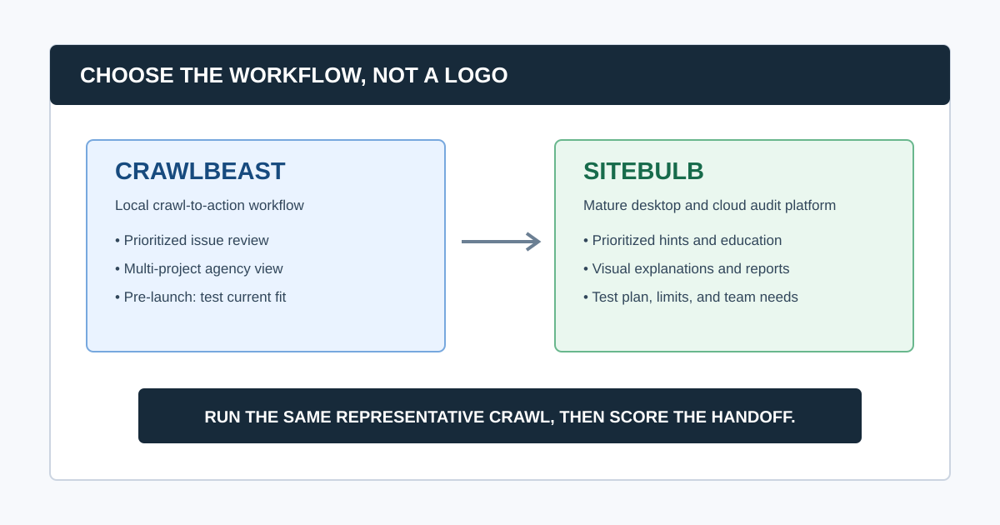
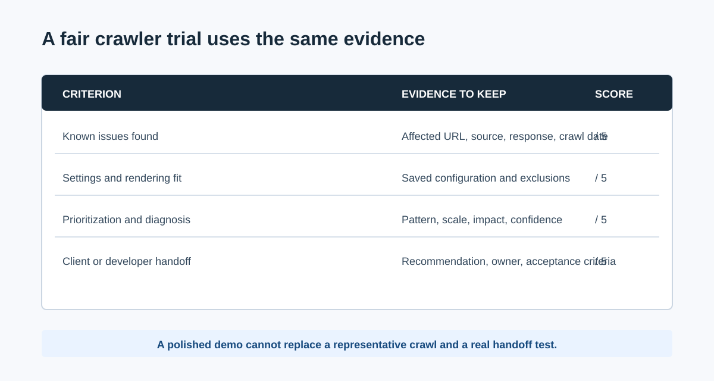

# CrawlBeast vs Sitebulb: Which SEO Crawler Fits Your Workflow?

CrawlBeast and Sitebulb both aim to make technical SEO work more actionable than a raw URL export. The practical difference is product maturity and workflow emphasis: Sitebulb is an established desktop and cloud crawler with guided Hints, education, visualizations, and reporting; CrawlBeast is a pre-launch local desktop crawler being built around prioritized findings and a multi-project agency workflow.

Choose Sitebulb when you need a proven, feature-rich audit environment with visual explanations today. Put CrawlBeast on a shortlist when a local, focused crawl-to-action experience and a clean project view are more important than a mature platform's full breadth, then validate its current release against your required checks.

> **Editorial disclosure:** CrawlBeast is our product and is pre-launch. This is not an independent benchmark or a claim that it replaces every Sitebulb workflow. Vendor features, limits, pricing, and release availability change, so confirm them with the vendor and run the same trial before committing.

If you are still building the shortlist, start with our guide to the [best SEO audit tools for agencies](/best-seo-audit-tool-for-agencies/). If the question is broader than these two products, see how to choose a [website crawler for agencies](/website-crawler-for-agencies/).

## CrawlBeast vs Sitebulb at a Glance

| Decision area | CrawlBeast | Sitebulb | What to test |
|---|---|---|---|
| Product status | Pre-launch desktop app for Mac and Windows | Established desktop and cloud crawler | The exact release, support, and must-have checks available now |
| Primary workflow | Crawl findings organized for prioritization and multi-project review | Guided audits with prioritized Hints, explanations, visualizations, and reports | How quickly a reviewer can move from issue to defensible recommendation |
| Deployment | Local desktop processing | Local desktop or cloud crawling | Data location, team access, machine capacity, and unattended work |
| Stakeholder communication | Intended to simplify issue review and handoff | Mature visual audit outputs and customizable reports | The report or ticket a client and developer actually receive |
| Scale fit | Designed for focused local audit workflows | Sitebulb documents desktop and cloud options for larger audit needs | Representative URL count, rendering, resource use, and project requirements |
| Best starting fit | Agencies and marketers who want a modern, local, prioritized workflow | Teams that need robust technical depth plus visual audit guidance | The job your team repeats every week or month |

Sitebulb says its product offers desktop and cloud crawling, prioritized Hints, built-in education, data visualizations, and report outputs. Its current product pages also describe different crawl ceilings by deployment, so do not assume desktop and cloud have the same operating limits. Review the [Sitebulb product information](https://sitebulb.com/) and your proposed plan before treating a size claim as a requirement match.

## What Is the Main Difference Between CrawlBeast and Sitebulb?

The main difference is not whether either product can identify technical issues. It is how the team uses the evidence afterward. Sitebulb is a mature audit product that explains and visualizes many crawl findings. CrawlBeast is being developed as a local desktop experience that focuses the reviewer on priority issues across client projects. A team should choose based on its handoff problem, not on a longer feature list.

That distinction matters because a crawler is only one part of an audit. A complete [agency SEO audit process](/how-agencies-perform-seo-audits/) also needs scope, Search Console and analytics evidence, prioritization, ownership, implementation, and a re-crawl.

## Choose Sitebulb When You Need a Mature Guided Audit Environment

Sitebulb is the stronger starting choice when your immediate need is a mature crawler with established audit guidance, visual explanations, configurable reports, and either desktop or cloud operating models. It can be especially useful when the person reviewing the crawl must make technical evidence understandable to clients or non-specialist stakeholders.

Choose Sitebulb first when you need to validate:

- A wide set of established audit reports and technical checks
- Visual crawl and site-structure explanations for stakeholders
- Customizable reporting as part of the audit deliverable
- Cloud collaboration or crawl capacity beyond a local workstation
- A product with a documented support and training library

Its Hints are prompts for investigation, not automatic verdicts. Keep the reviewer in the loop: inspect representative URLs, check source and rendered output where needed, and compare important findings with Search Console. Google's [Search Essentials](https://developers.google.com/search/docs/essentials) is clear that meeting technical requirements does not guarantee a URL will be crawled, indexed, or shown.

## Choose CrawlBeast When a Focused Local Workflow Is the Priority

CrawlBeast is being built for agencies, marketers, and developers who want local desktop crawling, clearer issue prioritization, and a multi-project view of client work. It is intended to identify issues including broken links, status-code errors, missing metadata, duplicate content, orphan pages, and canonical mismatches.

Consider CrawlBeast when your current friction is not lack of crawl data, but the time required to sort it into an action list. It may fit teams that want to:

- Review multiple client websites without working through a dense spreadsheet-like interface
- Start from high-impact technical patterns rather than every warning
- Keep crawl data on a local machine for an on-demand audit workflow
- Build a consistent route from finding to owner and acceptance criteria

CrawlBeast is not positioned as a substitute for distributed, multi-million-page enterprise crawling, and it should not be presented as one before that capability is proven. Because it is pre-launch, test current coverage, exports, rendering needs, and resource use against a real client site before changing a production workflow.

For a focused example of one check in that process, see our [broken link checker](/broken-link-checker/) guide.

## Compare the Workflow, Not Just the Features

Use the same three questions for both tools.

### 1. Can the crawl collect the right evidence?

Define the host, paths, sitemap URLs, authentication, rendering mode, crawl speed, exclusions, user agent, and maximum URL count before pressing start. Then seed the trial with a known broken internal link, a redirect, a canonical inconsistency, and a JavaScript-dependent page if those conditions matter to your work.

The result should contain the affected URL, the source or link path, the observed value, and the crawl date. Without that evidence, a reviewer cannot reproduce the finding or explain it in a client report.

### 2. Can a human reach the right diagnosis quickly?

Review whether each tool helps a specialist separate a site-wide pattern from a one-off warning. The essential question is not “how many issues did it list?” but “can we tell what to fix, why it matters, how many priority pages it affects, and what would prove the repair?”

That is where tool philosophy matters. Sitebulb emphasizes guided Hints and visual audit explanations. CrawlBeast is designed to keep prioritized issues visible in a modern local project workflow. Score both against the same evidence and the same reviewer, not against marketing language.

### 3. Can the result become client or developer work?

Ask a teammate to turn three findings into a short [website audit report](/website-audit-report/) or tickets. Each should contain the issue, evidence, impact, recommendation, owner, acceptance criteria, and validation method. A polished dashboard is helpful only if it removes work from this final translation.

## A Same-Site Trial Plan

Run the trial on a controlled sample or a representative site where you have permission to crawl. Do not create defects on a live client property for the sake of a test.

1. Pick three sites: a small brochure site, a JavaScript-heavy or ecommerce site, and a site with known redirects or migration history.
2. Write the same crawl specification for both tools, including scope, rendering, exclusions, speed, and expected URL count.
3. Record known conditions before running the crawls.
4. Compare coverage, false positives, crawl completion, machine or cloud resource use, and evidence quality.
5. Have the same reviewer create a client-facing summary and two developer tickets from each result.
6. Score the tools from 1 to 5 for coverage, diagnosis, handoff, project management, and commercial fit.
7. Keep disqualifiers outside the score. A tool that cannot support a required authenticated crawl does not win because it looks better in a table.

### Common question: Can CrawlBeast replace Sitebulb?

It may replace part of a focused local audit workflow if the current CrawlBeast release covers the checks, evidence, exports, and scale your team needs. It should not be assumed to replace Sitebulb's mature visual reporting, cloud capabilities, or every advanced audit feature without a same-site trial. Many teams will keep more than one tool for different jobs.

### Common question: Should an agency use both tools?

Possibly. A team might use Sitebulb for a technically deep or presentation-heavy audit and CrawlBeast for routine local review and prioritization across client projects. Keep a shared audit brief and evidence standard so two tools do not create duplicate, contradictory work.

## Video: See a Technical Crawler Workflow in Practice

This walkthrough uses Screaming Frog rather than either product, but it is useful for seeing the underlying crawl task: configure a crawl, inspect URL-level evidence, filter a pattern, and turn the result into an audit decision. Use that same sequence when testing CrawlBeast and Sitebulb.

<iframe width="560" height="315" src="https://www.youtube.com/embed/F14DTimTUDI" title="How to crawl a site with Screaming Frog SEO Spider" loading="lazy" frameborder="0" allow="accelerometer; autoplay; clipboard-write; encrypted-media; gyroscope; picture-in-picture; web-share" allowfullscreen></iframe>

[Watch the crawler walkthrough on YouTube](https://www.youtube.com/watch?v=F14DTimTUDI).

## What to Check Before You Buy or Switch

- Confirm current plan limits, renewals, user access, and support directly with each vendor.
- Test a representative JavaScript, authentication, and sitemap requirement rather than relying on a homepage demo.
- Check whether data needs to stay on a workstation, be shared in the cloud, or both.
- Review the time from completed crawl to a developer-ready ticket.
- Keep Google Search Console, analytics, and manual page inspection in the workflow; no crawler alone proves business impact or indexation.
- Re-crawl after a fix and record what changed, using the same configuration.

## The Bottom Line

Sitebulb is the better fit when you need a mature audit platform with visual explanations, extensive guided reporting, and desktop or cloud choices. CrawlBeast is worth trialing when your agency wants a local, focused workflow that prioritizes technical issues across projects, with the clear caveat that it is pre-launch and must be tested against current requirements.

Whichever tool you choose, the durable advantage is a repeatable workflow: define the audit question, collect reproducible evidence, prioritize by impact and confidence, assign an owner, and validate the production fix. Use our [technical SEO audit checklist](/technical-seo-audit-checklist/) to make that process consistent.

## Sources and Further Reading

- Sitebulb: [Website crawler for better SEO audits](https://sitebulb.com/)
- Sitebulb Support: [Getting started with Sitebulb](https://support.sitebulb.com/en/articles/12478082-getting-started-with-sitebulb)
- Google Search Central: [Google Search Essentials](https://developers.google.com/search/docs/essentials)
- Google Search Central: [Canonicalization guidance](https://developers.google.com/search/docs/crawling-indexing/consolidate-duplicate-urls)
