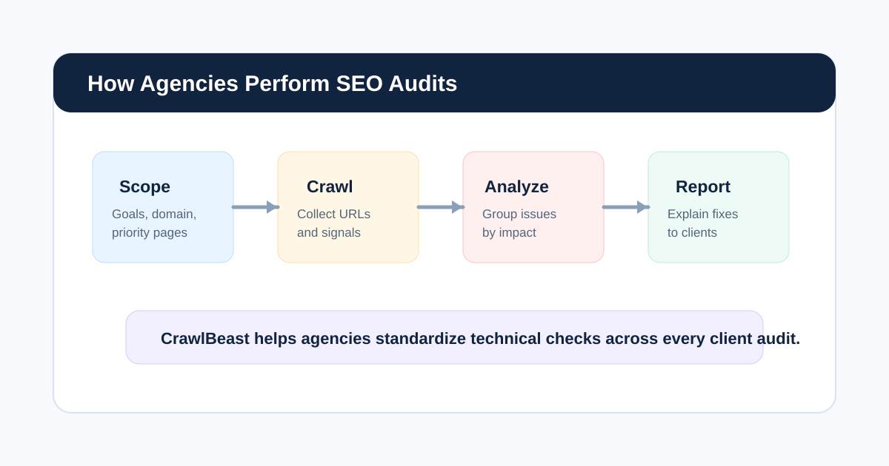
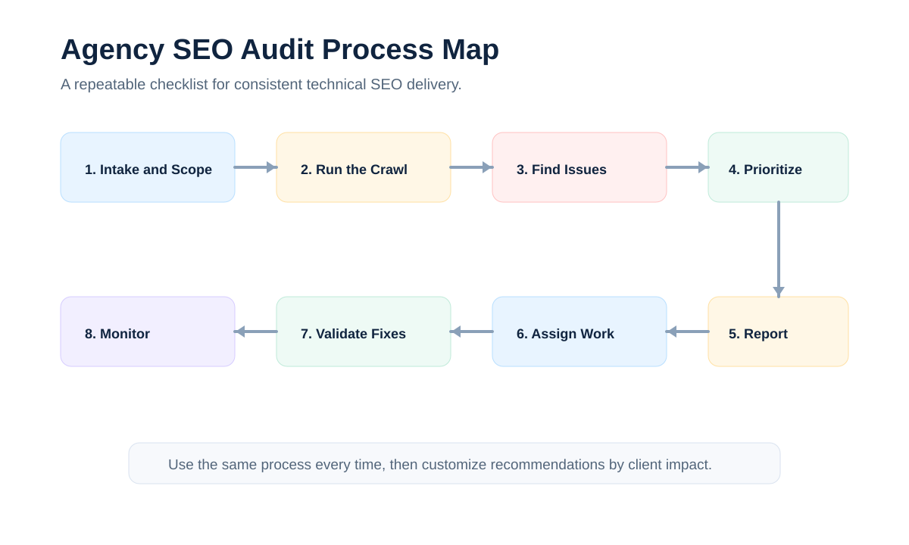

# How Agencies Perform SEO Audits: A Repeatable Workflow

Agencies perform SEO audits by following a repeatable workflow: define the scope, crawl the website, review technical SEO issues, prioritize the findings, create a client-ready report, assign fixes, and monitor progress after implementation.

That process sounds straightforward, but agency audits have more moving parts than one-off website reviews. Teams need to manage client expectations, compare issues across large sites, explain technical problems clearly, and make sure every account gets the same baseline level of quality.

This guide explains how agencies perform SEO audits in a practical, repeatable way. If you want the broader hub for this cluster, start with the [SEO audit workflow](/seo-audit-workflow/) page. If you are still choosing software, compare options in our guide to the best [SEO audit tool for agencies](/seo-audit-tool-for-agencies/).

## Agency SEO Audit Process at a Glance

| Step | What the Agency Does | Main Output |
|---|---|---|
| 1. Scope the audit | Confirm goals, website areas, access, and business priorities | Audit brief |
| 2. Crawl the website | Use a crawler to collect technical SEO data | Crawl dataset |
| 3. Review technical issues | Check indexability, status codes, metadata, canonicals, links, and sitemaps | Issue list |
| 4. Prioritize findings | Sort problems by severity, affected URLs, and business impact | Priority backlog |
| 5. Create the report | Translate findings into client-friendly recommendations | Website audit report |
| 6. Assign fixes | Route tasks to content, developers, SEO, or client teams | Action plan |
| 7. Validate changes | Re-crawl and confirm fixes worked | Fix validation |
| 8. Monitor over time | Repeat audits monthly or quarterly | Ongoing SEO health view |

## 1. Start With Scope and Client Goals

Before opening a crawler, agencies need to understand why the audit is happening.

An SEO audit for a new client is different from a quarterly checkup. A migration audit is different from an ecommerce cleanup. A lead generation website has different priorities than a large publisher or marketplace.

At the start, agencies usually define:

- The domain, subdomains, and staging environments to review
- Priority templates, categories, or landing pages
- Known issues from the client or previous SEO work
- CMS, platform, and development constraints
- Target markets and languages
- Reporting expectations
- Timeline for recommendations and fixes

This prevents the audit from turning into a generic list of technical issues. A good agency audit connects SEO findings to the client’s goals.

## 2. Crawl the Website

The crawl is the foundation of most technical SEO audits.

Agencies use a [website crawler for agencies](/website-crawler-for-agencies/) to collect data across URLs, links, status codes, metadata, headings, canonicals, directives, and site structure. Tools like CrawlBeast help agencies crawl client websites consistently, so the same checks are applied across accounts.

During the crawl, agencies usually look for:

- 3xx, 4xx, and 5xx status codes
- Broken internal links
- Redirect chains and loops
- Missing, duplicate, or weak title tags
- Missing or duplicate meta descriptions
- Missing H1 tags or multiple H1 tags
- Canonical tag problems
- Noindex and robots.txt conflicts
- XML sitemap issues
- Crawl depth and internal linking problems
- Orphan pages

For deeper technical checks, agencies may also use a dedicated [technical SEO audit tool for agencies](/technical-seo-audit-tool-for-agencies/) alongside Google Search Console and analytics data.

## 3. Review Crawlability and Indexability First

Crawlability and indexability issues usually come before cosmetic on-page improvements.

If important pages cannot be crawled, are blocked by robots.txt, return the wrong status code, or carry the wrong indexation directive, other SEO work may not matter. Agencies typically review these issues early because they affect whether search engines can access and include pages in search results.

High-priority checks include:

- Important pages blocked by robots.txt
- Important pages marked noindex
- Canonical tags pointing to the wrong URL
- Redirects that prevent search engines from reaching key pages
- Internal links pointing to broken or redirected URLs
- XML sitemaps containing non-indexable or broken URLs
- Important pages missing from the crawl

This stage often reveals the issues that need developer attention first.

## 4. Analyze On-Page and Template-Level Issues

Once crawlability and indexability are reviewed, agencies move into on-page and template-level problems.

This includes metadata, headings, duplicate patterns, content structure, and internal linking. The goal is not to rewrite every page manually. The goal is to find patterns that can be fixed at scale.

For example, an agency might find:

- All product pages use duplicate title tags
- Blog posts are missing meta descriptions
- Category pages have multiple H1 tags
- Pagination uses inconsistent canonical tags
- Important landing pages sit too deep in the site architecture
- Internal links point to old redirected URLs

These findings are easier to fix when they are grouped by template, CMS field, or website section.

## 5. Prioritize Issues by Impact

Clients do not need every issue at once. They need to know what matters most.

Agencies prioritize SEO audit findings by combining technical severity with business impact. A broken internal link on a low-value archive page is not the same as a canonical problem across all money pages.

Useful prioritization criteria include:

- Whether affected pages are important to revenue or lead generation
- Number of affected URLs
- Whether pages are indexable
- Whether pages receive traffic or conversions
- Whether the issue is template-level or one-off
- Whether the fix requires development, content, or SEO ownership
- Whether the issue blocks future SEO work

This is where CrawlBeast can help agencies move from raw crawl findings to a cleaner technical audit workflow. Instead of handing clients a long export, teams can group issues into clear priorities.

## 6. Create a Client-Ready Website Audit Report

The report is where the agency turns technical SEO data into decisions.

A strong [website audit report](/website-audit-report/) should explain what was found, why it matters, and what should happen next. It should not feel like a spreadsheet pasted into a document.

Most agency reports include:

- Executive summary
- Website health overview
- Critical technical issues
- On-page SEO findings
- Crawlability and indexability review
- Internal linking and site structure notes
- Recommended fixes
- Priority level for each issue
- Owners and next steps

If reporting is a recurring pain point, build a repeatable [SEO audit reporting](/seo-audit-reporting/) format so every client gets the same structure.

## 7. Assign Fixes to the Right Owners

SEO audits only create value when the recommendations become action.

Agencies usually split fixes by owner:

- Developers handle templates, redirects, canonicals, status codes, schema, and crawlability fixes.
- Content teams handle titles, descriptions, headings, duplicate copy, and thin pages.
- SEO teams handle prioritization, QA, internal linking, sitemap review, and validation.
- Client teams approve priorities, update CMS fields, or coordinate internal resources.

Clear ownership keeps audits from stalling after delivery.

## 8. Re-Crawl and Monitor Progress

After fixes are made, agencies should re-crawl the website to confirm the changes worked.

This step catches common problems such as partial fixes, new redirects, staging changes that did not reach production, or template updates that created new issues. It also gives account managers proof that technical SEO work is moving forward.

For ongoing retainers, agencies often run audits monthly or quarterly. A recurring workflow helps the team catch new [technical SEO issues](/technical-seo-issues/) before they become ranking, crawlability, or reporting problems.

## Common Mistakes Agencies Make During SEO Audits

### Starting With a Tool Instead of a Scope

Tools are useful, but they do not decide what matters to the client. Agencies should define goals before running the crawl.

### Sending Raw Exports to Clients

Clients need recommendations, not just data. A raw crawl export can overwhelm the client and slow approval.

### Treating Every Issue as Equal

An audit should prioritize. When every issue is marked urgent, nothing feels urgent.

### Forgetting to Validate Fixes

The audit process does not end when the report is sent. Agencies should re-crawl and confirm implementation.

### Missing Internal Linking Opportunities

Technical audits often focus on errors, but internal linking can be one of the easiest ways to improve crawl paths and page authority distribution.

## Final Recommendation

Agencies perform SEO audits best when they follow a consistent workflow: scope the audit, crawl the website, review technical issues, prioritize findings, create a client-ready report, assign fixes, and monitor progress.

CrawlBeast helps agencies make that process more repeatable by supporting technical website crawling, issue detection, and agency reporting workflows. Pair it with a clear [SEO audit template](/seo-audit-template/) and a consistent reporting structure, and your team can deliver audits that are easier to explain, approve, and act on.

