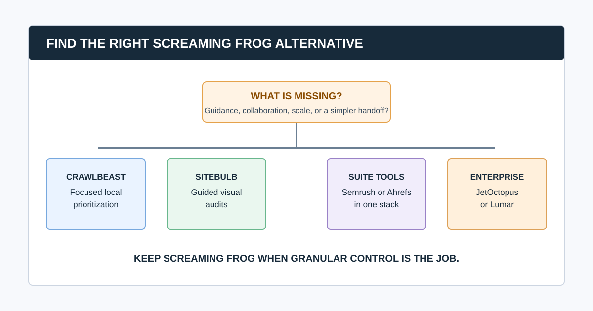
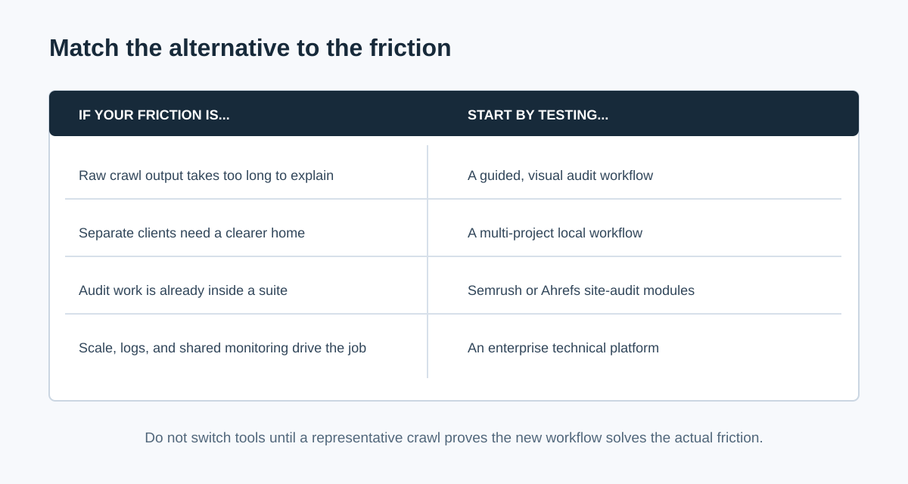

# 6 Screaming Frog Alternatives for Different SEO Audit Workflows

The best Screaming Frog alternative depends on why you are looking. Screaming Frog is still a strong choice for technical SEOs who need granular configuration, custom extraction, JavaScript rendering, and detailed exports. The right alternative is usually one that changes the workflow around the crawl: clearer guidance, easier stakeholder communication, shared cloud access, a wider SEO suite, or enterprise-scale analysis.

For a visual, guided technical audit, consider Sitebulb. For a focused local agency workflow built around prioritized findings, trial CrawlBeast. For teams already invested in a broader SEO suite, evaluate Semrush or Ahrefs. For large-scale crawling, log data, monitoring, and complex collaboration, evaluate JetOctopus or Lumar.

> **Editorial disclosure:** CrawlBeast is our pre-launch product. We include it because it is relevant to the local, prioritized agency workflow discussed here. We do not claim independent benchmarks, customer results, or feature parity with established products. Confirm current vendor capabilities, limits, and pricing before purchase.

Screaming Frog's free version is limited to 500 URLs per crawl. Its paid product removes that limit and enables configuration, saved crawls, and advanced features. That makes it a good tool to keep when deep desktop control is the job, rather than a product to replace simply because its interface takes practice. See the current [Screaming Frog SEO Spider documentation](https://www.screamingfrog.co.uk/seo-spider/) before comparing licensing or limits.

## Quick Comparison: Which Alternative Fits Which Job?

| Alternative | Best for | Why teams consider it | Keep Screaming Frog instead when |
|---|---|---|---|
| CrawlBeast | Focused local agency review | Prioritized technical findings and multi-project workflow | You need established advanced controls that the current release has not proven |
| Sitebulb | Guided, visual technical audits | Prioritized Hints, explanations, visualizations, and reports | You prefer highly granular desktop configuration and custom analysis |
| Semrush Site Audit | A single campaign and reporting suite | Audit work alongside rank tracking, research, and client reporting | You need dedicated crawler depth beyond the suite workflow |
| Ahrefs Site Audit | Search, links, and ongoing audit context | Technical checks connected to Ahrefs research data | You need highly bespoke crawl configuration or a local-only process |
| JetOctopus | Large-site crawling, logs, and Search Console analysis | Cloud technical SEO for complex sites | Your work is mostly small, on-demand audits |
| Lumar | Enterprise governance and monitoring | Website intelligence, collaboration, and enterprise controls | You do not need enterprise procurement and implementation |

This is a selection guide, not a controlled detection-accuracy benchmark. Run the same crawl, at the same time, with the same settings before deciding which product catches or explains an issue better.

## First: Name the Friction You Are Actually Trying to Remove

Before switching, complete this sentence: “We are looking for a Screaming Frog alternative because ______.”

- “The team spends too long translating exports into a client report.”
- “We need guidance and visual explanation for non-specialists.”
- “Several people need to use the same crawl data.”
- “The crawl must connect to the SEO suite we already pay for.”
- “We need log analysis, monitoring, and scale beyond a workstation.”
- “We want a less dense local workflow for recurring client audits.”

The answer is more useful than a feature checklist. A tool that removes one friction can introduce another, such as crawl credits, less local control, a subscription, or less flexible extraction. Use our [website crawler for agencies](/website-crawler-for-agencies/) guide to turn that answer into a testable requirements brief.

## 1. CrawlBeast: For a Focused Local Agency Workflow

CrawlBeast is a pre-launch technical SEO desktop application for Mac and Windows. It is being built for agencies, marketers, and developers who want local crawling, clearer prioritization of technical issues, and a multi-project view of client work.

It is a plausible alternative when the problem is not obtaining crawl data but deciding what to work on next. CrawlBeast is designed to surface issues such as broken links, status-code errors, missing metadata, duplicate content, orphan pages, and canonical mismatches in a workflow intended to make handoff clearer.

**Best for:** Agencies and consultants who want a modern local crawl-to-action workflow.

**Test before switching:** Current check coverage, rendering behavior, exports, resource use, and whether the release handles every required client site pattern. CrawlBeast is not positioned for distributed, multi-million-page enterprise crawling.

For a direct comparison with a mature guided crawler, read [CrawlBeast vs Sitebulb](/crawlbeast-vs-sitebulb/).

## 2. Sitebulb: For Guided Visual Audits and Reports

[Sitebulb](https://sitebulb.com/) is an established crawler available in desktop and cloud forms. It emphasizes prioritized Hints, in-product education, data visualizations, and report outputs. That makes it a strong option when the audit must be understood by a client, content team, or developer who did not run the crawl.

**Best for:** SEOs who want technical depth with clearer audit explanations and visual stakeholder communication.

**Test before switching:** The desktop versus cloud plan, crawl size, JavaScript and custom extraction needs, report customization, resource usage, and whether its Hint priorities align with your own judgment.

Sitebulb may not be a reason to abandon Screaming Frog completely. Some specialists pair tools: one for flexible investigation and one for guided audit reporting.

## 3. Semrush Site Audit: For an Existing Semrush Campaign Workflow

[Semrush Site Audit](https://www.semrush.com/features/site-audit/) is part of the broader Semrush platform. It makes sense when the team already uses Semrush for keyword research, position tracking, competitor research, or client reporting and wants audit data in the same project structure.

**Best for:** Agencies that want technical checks inside a wider campaign and reporting platform.

**Test before switching:** Project and crawl allowances, issue customization, scheduled audit cadence, exports, reporting requirements, and whether the suite actually replaces tools rather than adding another data source.

## 4. Ahrefs Site Audit: For Technical Audits Connected to Search and Link Research

[Ahrefs Site Audit](https://ahrefs.com/site-audit) is a cloud audit product inside the Ahrefs platform. It is worth evaluating when the same team needs technical crawl findings alongside keyword, ranking, and backlink research, with ongoing site-health monitoring.

**Best for:** Teams already working in Ahrefs that want audit evidence connected to broader SEO research.

**Test before switching:** Crawl allowances, scheduled monitoring, issue customization, exports, user access, and whether a cloud workflow provides enough detail for technical diagnosis. Check Ahrefs' current documentation for [how its site audit works](https://help.ahrefs.com/en/articles/7160378-how-site-audit-works).

## 5. JetOctopus: For Large Sites, Logs, and Search Console Analysis

[JetOctopus](https://jetoctopus.com/) is a cloud technical SEO platform aimed at larger crawl programs and analysis that can include log files and Google Search Console data. It is relevant when indexability, crawl budget, bot behavior, internal linking, and large-site segmentation are recurring work rather than an occasional audit.

**Best for:** Technical teams and agencies with complex ecommerce, marketplace, publisher, or enterprise websites.

**Test before switching:** Crawl scope, log ingestion, Search Console joins, segmentation, onboarding time, pricing model, and access controls. Do not buy enterprise-scale capability for a small brochure-site workflow that only needs a careful local crawl.

## 6. Lumar: For Enterprise Website Intelligence and Governance

[Lumar](https://www.lumar.io/) is an enterprise website intelligence platform for organizations that need monitoring, collaboration, integrations, and governance around website quality. It can be a good fit where technical SEO has to operate alongside larger engineering, accessibility, and digital-experience programs.

**Best for:** Enterprise teams with complex stakeholder, monitoring, and governance requirements.

**Test before switching:** Implementation effort, integrations, permissions, reporting, support model, and total cost. It is usually more platform than a small team needs for one-off investigations.

## A Better Alternative Decision Matrix

Choose by the operating problem, then prove the choice:

| If you need... | Start with... | Evidence of fit |
|---|---|---|
| Less manual sorting after a local crawl | CrawlBeast | A reviewer produces a prioritized task list faster on the same site |
| More guided visual explanations | Sitebulb | A non-specialist understands and can approve three sample findings |
| Audit data inside an existing marketing suite | Semrush or Ahrefs | The same project, data, and report eliminate duplicate work |
| Large-scale crawl, logs, and ongoing monitoring | JetOctopus or Lumar | The platform handles real URL volume, data joins, and team permissions |
| Custom extraction and fine-grained crawl control | Keep Screaming Frog | The alternative does not remove a real bottleneck without losing necessary controls |

### Common question: Is Sitebulb the best Screaming Frog alternative?

Sitebulb is often a strong alternative when the gap is guided audit interpretation, visualizations, and reporting. It is not automatically best for every team. A local agency may prefer CrawlBeast's focused workflow; a suite user may prefer Semrush or Ahrefs; a large technical program may need JetOctopus or Lumar. Test the workflow that causes friction.

### Common question: Should I replace Screaming Frog or use it alongside another tool?

Many SEO teams use more than one tool. Keep Screaming Frog for granular investigation and pair it with a platform that improves reporting, monitoring, collaboration, or prioritization. Replace it only when another product covers the required evidence and makes the complete workflow demonstrably better.

### Common question: Can a crawler replace Google Search Console?

No. A crawler observes what it can access under its configuration; Google Search Console provides first-party signals about Google's view of a verified property. Use both. A crawl can identify a canonical conflict or broken internal link, while Search Console helps validate indexing and search-performance context.

## Video: The Crawl Workflow You Should Preserve

This walkthrough shows a practical desktop crawl workflow in Screaming Frog. Whether you keep it or choose an alternative, preserve the habits that matter: set scope, inspect URL-level evidence, filter patterns, write a recommendation, and validate the fix with a re-crawl.

<iframe width="560" height="315" src="https://www.youtube.com/embed/F14DTimTUDI" title="How to crawl a site with Screaming Frog SEO Spider" loading="lazy" frameborder="0" allow="accelerometer; autoplay; clipboard-write; encrypted-media; gyroscope; picture-in-picture; web-share" allowfullscreen></iframe>

[Watch the crawler walkthrough on YouTube](https://www.youtube.com/watch?v=F14DTimTUDI).

## Run a Safe Switching Trial

1. Write the current workflow's pain point and non-negotiable requirements.
2. Pick a representative site or controlled staging sample, not a homepage-only demo.
3. Use the same scope, rendering mode, exclusions, speed, and URL cap in both tools.
4. Seed known conditions: a broken link, redirect, canonical inconsistency, and JavaScript page if relevant.
5. Compare affected URLs, evidence, false positives, configuration effort, and time to a developer-ready ticket.
6. Keep the tool that improves the whole audit journey, not merely the crawl screen.

Use our [technical SEO audit checklist](/technical-seo-audit-checklist/) to define what the trial must detect, and our [website audit report guide](/website-audit-report/) to test the final handoff.

## The Bottom Line

Screaming Frog remains the right answer for many technical SEOs. Look elsewhere only when another workflow is genuinely more valuable: CrawlBeast for a focused local prioritization experience, Sitebulb for visual guided audits, Semrush or Ahrefs for suite integration, and JetOctopus or Lumar for complex cloud technical programs.

The winning tool is the one that helps your team reach a correct, explainable fix with less avoidable work. Start with the job, run a fair same-site trial, and retain the evidence that supports the decision.

## Sources and Further Reading

- Screaming Frog: [SEO Spider overview and licensing](https://www.screamingfrog.co.uk/seo-spider/)
- Sitebulb: [Website crawler and audit platform](https://sitebulb.com/)
- Semrush: [Site Audit](https://www.semrush.com/features/site-audit/)
- Ahrefs: [Site Audit](https://ahrefs.com/site-audit)
- Google Search Central: [Google Search Essentials](https://developers.google.com/search/docs/essentials)
