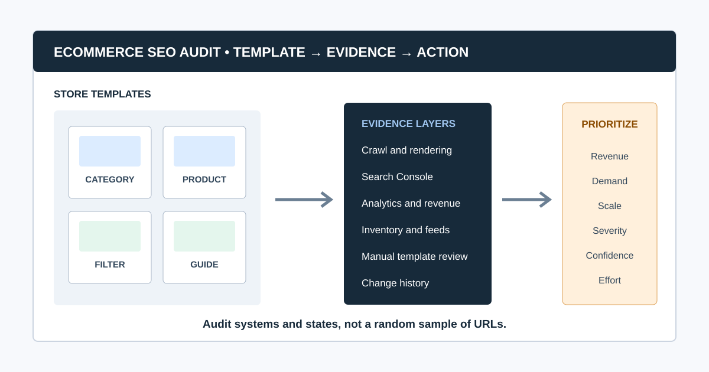
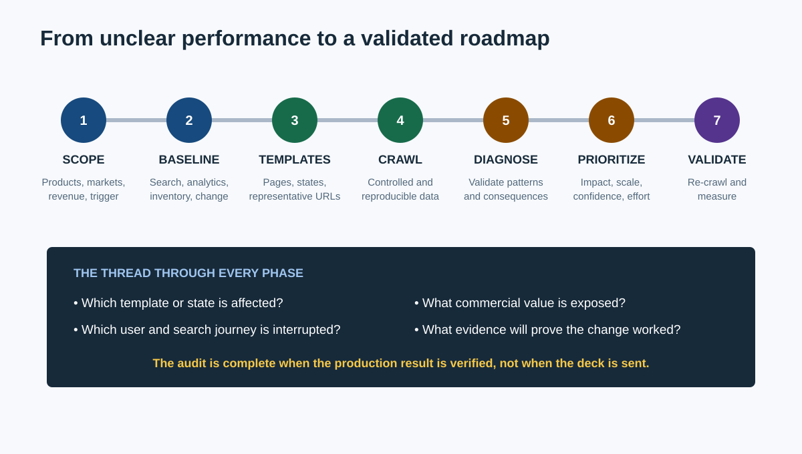
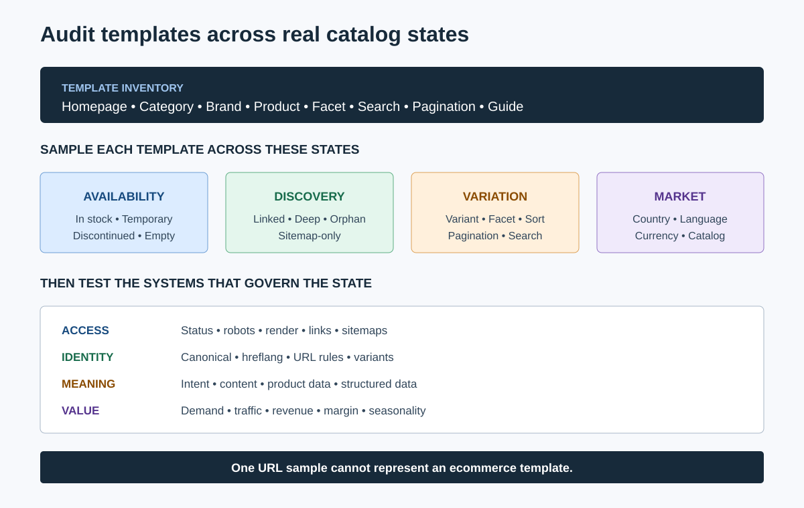
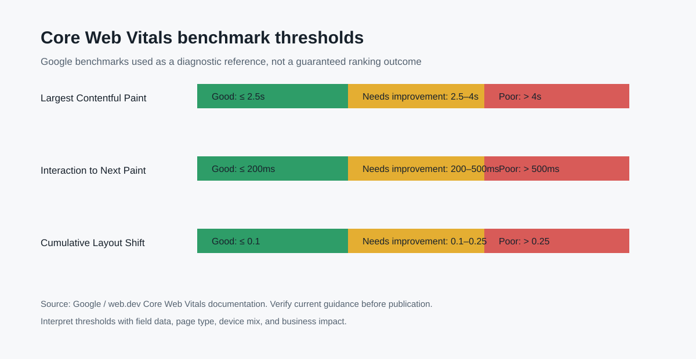

# SEO Audit for Ecommerce: A Revenue-Led Checklist



An SEO audit for ecommerce examines whether search engines can discover, understand, index, and present the product and category pages that create commercial value. It combines crawl data with Search Console, analytics, merchandising rules, inventory states, and template review, then converts the evidence into a prioritized implementation plan.

An online store is not simply a large brochure site. Filters can create millions of URL combinations, products move in and out of stock, variants compete for indexing, and one template defect can affect an entire catalog. The audit must therefore work by page type and business impact, not by a flat list of errors.

This guide moves from point A, “we know organic performance or indexation is not where it should be,” to point Z: a validated roadmap with owners, acceptance criteria, and measurement.

It also connects the store-specific checks to the wider [large website SEO](/large-website-seo/) and [SEO audit workflow](/seo-audit-workflow/) clusters, so the audit can become an ongoing operating process rather than a one-time checklist.

## Ecommerce SEO Audit at a Glance



| Phase | Main question | Output |
|---|---|---|
| 1. Scope | Which products, categories, markets, and conversions matter? | Audit brief |
| 2. Baseline | What is indexed, visible, visited, and converting now? | Evidence baseline |
| 3. Crawl and sample | What do bots and users encounter across templates? | Segmented dataset |
| 4. Diagnose | Which patterns block discovery, understanding, or experience? | Validated findings |
| 5. Prioritize | Which fixes protect or create the most commercial value? | Revenue-led backlog |
| 6. Implement | Who changes templates, content, feeds, or infrastructure? | Owned tickets |
| 7. Validate | Did production behavior and search evidence improve? | Re-crawl and measurement log |

If an agency is running the work, combine this ecommerce framework with the broader process in [how agencies perform SEO audits](/how-agencies-perform-seo-audits/).

## What Makes an Ecommerce SEO Audit Different?

An ecommerce audit must evaluate systems that continuously create and retire URLs:

- Category, subcategory, brand, product, variant, search, filter, and pagination templates
- Product availability, seasonal inventory, discontinued items, and replacements
- Faceted navigation and parameter combinations
- Product feeds, structured data, price, currency, and availability consistency
- Duplicate manufacturer descriptions and near-identical variants
- Internal linking from navigation, categories, recommendations, editorial content, and sitemaps
- JavaScript rendering and client-side navigation
- Page performance under real product media, third-party scripts, and personalization
- Multiple countries, languages, currencies, and regional catalogs

The goal is not to get every generated URL indexed. It is to make valuable landing pages discoverable and indexable while controlling low-value or duplicate crawl spaces.

### How long does an ecommerce SEO audit take?

Time depends on catalog size, template variety, markets, rendering, data access, and the decision the audit must support. Estimate the work from representative templates and evidence sources, not the published product count alone. A focused category investigation can take days; a multi-market platform audit can take weeks and require log analysis, engineering, merchandising, and analytics support.

## 1. Scope the Audit Around Commercial Priorities

Start with the store's business model and current problem. “Audit the site” is too broad to prioritize intelligently.

Document:

- Priority product families, categories, brands, and markets
- Revenue, margin, inventory, seasonality, and promotion constraints
- Primary conversions and assisted journeys
- Organic traffic or revenue change and when it began
- Recent migrations, redesigns, feed changes, platform releases, or taxonomy changes
- CMS, commerce platform, JavaScript framework, CDN, and search/filter technology
- Countries, languages, currencies, and domain strategy
- Search Console, analytics, merchant feed, backlink, log, and crawl access
- Development capacity, release windows, and template ownership

A useful scope statement is: “Identify technical and template-level issues limiting non-brand organic discovery of priority category and in-stock product pages in the US catalog before holiday code freeze.”

## 2. Build a Baseline Before Crawling

Use several evidence sources because each answers a different question.

| Evidence | Best use | Limitation |
|---|---|---|
| Website crawl | Links, responses, directives, canonicals, depth, metadata, patterns | Simulates a crawler; does not prove Google indexing or revenue impact |
| Google Search Console | Queries, clicks, impressions, page indexing, URL inspection | Sampled or delayed; requires correct property and filters |
| Analytics and ecommerce data | Landing sessions, conversions, revenue, product behavior | Attribution and tracking quality vary |
| Server logs | Search-bot requests and crawl patterns | Requires processing and identity checks |
| XML sitemaps | Intended discoverable URLs and last modification signals | Inclusion does not guarantee indexing |
| Product feed | Price, availability, identifiers, landing-page consistency | Feed health does not prove organic crawl health |
| Inventory and merchandising data | Stock state, priority, lifecycle, replacements | Often stored outside SEO tools |

Record date ranges, filters, properties, exclusions, and known tracking gaps. “No data” is not the same as “no issue.”

## 3. Create an Ecommerce Template Inventory



List every indexable and generated page type before reviewing individual URLs.

| Template | Search role | Representative samples | High-risk checks |
|---|---|---|---|
| Homepage | Brand and discovery hub | Home variants by market | Canonical, navigation, render, language targeting |
| Category/subcategory | Non-brand commercial landing page | High revenue, deep, seasonal, low inventory | Indexability, content, filters, pagination, internal links |
| Brand | Brand-category demand | Major and long-tail brands | Duplication, hierarchy, product availability |
| Product detail | Product and model demand | In stock, out of stock, variants, discontinued | Canonical, structured data, unique value, media, status |
| Faceted/filter URL | Specific attribute demand or crawl space | One-value and multi-value filters | Search demand, uniqueness, canonicals, directives, links |
| Internal search | User navigation | Popular queries and empty results | Indexability, thin pages, infinite spaces |
| Editorial/buying guide | Informational demand and product discovery | Evergreen and seasonal guides | Expertise, freshness, product links, orphaning |
| Pagination | Product discovery | Early, middle, and final pages | Crawlable links, unique URLs, canonicals |

Sample by template and state. Reviewing ten in-stock products does not reveal what the site does with discontinued products or variants.

## 4. Crawl the Store Without Falling Into Traps

Configure the crawler deliberately:

- Use the production host, canonical protocol, and intended user agent.
- Decide whether JavaScript rendering is required by comparing raw and rendered samples.
- Include priority subdomains and exclude checkout, account, cart, and destructive actions.
- Control parameters, calendars, internal search, sort orders, and filter combinations.
- Capture HTML, images, canonicals, directives, hreflang, structured data, and link relationships.
- Crawl XML sitemap URLs separately to find submitted pages absent from internal discovery.
- Save settings and crawl date so the result can be reproduced.

CrawlBeast is a pre-launch local desktop audit tool for Mac and Windows. Agencies and ecommerce teams can use it to identify patterns such as broken links, status errors, missing metadata, duplicate content, orphan pages, and canonical mismatches, then organize findings by priority. It is suited to focused local audits and multi-project workflows; distributed multi-million-page crawling is outside its stated target, so large stores should validate scale and consider enterprise or log-based tooling where required.

Our [website crawler for agencies](/website-crawler-for-agencies/) guide provides a tool trial scorecard and configuration framework.

## 5. Audit Crawlability and Indexability First

Check whether important templates are reachable and eligible before editing titles or product copy.

Treat access, indexability, canonicalization, redirects, and status responses as related [technical SEO issues](/technical-seo-issues/), then validate how the combination behaves on each template.

- Robots.txt allows intended crawling and does not block resources needed to render pages.
- Important pages return stable `200` responses.
- Redirects are intentional, direct, and destination-relevant.
- Canonicals point to the preferred equivalent and are internally consistent.
- `noindex`, `nofollow`, and `X-Robots-Tag` directives match the template strategy.
- XML sitemaps contain canonical, indexable, valuable URLs and accurate update signals.
- Important pages have crawlable `<a href>` links from the site structure.
- Orphan pages are either linked appropriately or intentionally excluded.
- Mobile and desktop versions provide equivalent primary content and signals.

Google's [Search Essentials](https://developers.google.com/search/docs/essentials) summarizes the baseline: Google must be able to access the page, the page should work, and it should contain indexable content. Use URL Inspection and page-indexing evidence for Google-specific validation.

### How do you know whether an indexation problem is technical or intentional?

Compare the URL's business role, template rules, crawl result, canonical, directives, sitemap inclusion, internal links, and Search Console status. A filter combination with no search demand may be correctly excluded; a primary category excluded by a copied `noindex` rule is a defect. The desired index set must be defined before the status can be judged.

## 6. Audit Faceted Navigation and URL Parameters

Faceted navigation can create useful landing pages and enormous duplicate crawl spaces at the same time. Review each filter type as a product decision.

For every facet or parameter, ask:

1. Is there meaningful search demand and a stable product set?
2. Can the page provide distinct intent, title, heading, copy, and internal links?
3. Should users and search engines discover it through crawlable links?
4. Does it have one consistent URL format and canonical strategy?
5. What happens when filters combine, sort, paginate, or return no products?
6. Can low-value combinations be prevented or controlled without hiding valuable pages?

Google's [ecommerce URL structure guidance](https://developers.google.com/search/docs/specialty/ecommerce/designing-a-url-structure-for-ecommerce-sites) recommends minimizing alternative URLs that return the same content and using consistent parameter ordering. Do not use canonical tags as a substitute for fixing an uncontrolled URL generator.

## 7. Audit Category and Product Pages by State

### Category pages

Check:

- Search intent and taxonomy match
- Descriptive title, H1, introduction, and supporting copy where useful
- Crawlable links to products, subcategories, related categories, and guides
- Pagination or incremental loading that exposes products through unique crawlable URLs
- Product-grid consistency across raw HTML and rendered output
- Useful empty-state behavior when inventory changes
- Avoidance of near-duplicate categories competing for the same intent

Google's [pagination guidance](https://developers.google.com/search/docs/specialty/ecommerce/pagination-and-incremental-page-loading) says pages in a sequence need unique URLs and sequential links; Googlebot generally does not click buttons or trigger JavaScript to load more content.

### Product pages

Sample at least these states:

- In stock
- Temporarily out of stock
- Discontinued with a close replacement
- Discontinued without a replacement
- Single product with multiple variants
- Product available in some markets but not others

Check identifiers, product name, description, specifications, imagery, reviews, price, availability, shipping or return information, canonical selection, structured data, breadcrumbs, related products, and links back to categories.

### What should happen to out-of-stock product pages?

Keep a temporarily unavailable product live when it still satisfies demand and is expected to return. Clearly show availability and useful alternatives. For a permanently discontinued product, preserve the page when it has continuing user value, links, or a meaningful replacement; otherwise remove internal links and use a relevant redirect only when a close equivalent exists. Avoid redirecting unrelated products to a category or homepage by default.

## 8. Validate Product Structured Data and Merchant Signals

Structured data should describe the visible page accurately. Review a sample from each product state and market.

Check:

- `Product` identity and required properties
- `Offer` price, currency, availability, and URL
- Variant relationships where implemented
- Review and rating markup reflects visible, eligible content
- Breadcrumb markup matches the site hierarchy
- Structured data updates when price or stock changes
- Product feed and page values agree
- Rich Results Test and Search Console enhancement reports show no scalable errors

Google maintains separate documentation for [product snippets](https://developers.google.com/search/docs/appearance/structured-data/product-snippet) and [merchant listings](https://developers.google.com/search/docs/appearance/structured-data/merchant-listing). Eligibility does not guarantee a rich result, and markup must not invent reviews, prices, or availability.

## 9. Audit Internal Links and Broken Commercial Paths

Internal links tell users and crawlers which products and categories matter. Evaluate:

- Main navigation and category hierarchy
- Breadcrumbs
- Category-to-product and product-to-category links
- Related products, alternatives, and accessories
- Editorial guide-to-category/product links
- Links to out-of-stock or discontinued items
- Orphan products present only in sitemaps or feeds
- Crawl depth of priority commercial pages
- Broken links and redirect chains in templates

Use the [broken link checker guide](/broken-link-checker/) to find each failed destination, trace its source pages, choose the right repair, and validate production. Prioritize broken links in navigation, high-revenue categories, and checkout-adjacent journeys before low-value historical citations.

## 10. Review Content Quality and Search Intent

Do not measure quality by word count. Review whether each page helps a shopper make the decision implied by the query.

- Category pages explain the range and make comparison easy.
- Product pages provide original specifications, use context, fit, compatibility, care, or decision support.
- Manufacturer copy is supplemented where it leaves buyers with unanswered questions.
- Similar categories and variants have distinct purposes.
- Buying guides demonstrate relevant expertise and link naturally into the catalog.
- Reviews and user-generated content are moderated and represented honestly.
- Titles and descriptions distinguish pages without formulaic stuffing.
- Content remains accurate as products, prices, and policies change.

Google's [helpful content guidance](https://developers.google.com/search/docs/fundamentals/creating-helpful-content) asks whether content provides substantial value and leaves the reader feeling they learned enough to achieve their goal. Use that test on both editorial pages and commercial templates.

## 11. Measure Performance With Field Data



Segment performance by template and device. Product galleries, consent tools, reviews, personalization, tag managers, and third-party apps can make one template behave very differently from another.

The current “good” Core Web Vitals thresholds at the 75th percentile are:

| Metric | Good threshold | Ecommerce concern |
|---|---:|---|
| Largest Contentful Paint (LCP) | 2.5 seconds or less | Slow product hero image or server response |
| Interaction to Next Paint (INP) | 200 milliseconds or less | Delayed filters, variant selectors, or add-to-cart interaction |
| Cumulative Layout Shift (CLS) | 0.1 or less | Product media, reviews, banners, or stock messages shifting layout |

These thresholds come from the official [Core Web Vitals documentation](https://web.dev/articles/vitals). Use Chrome UX Report field data where available, then use lab diagnostics to investigate causes. A lab score alone does not describe every real visitor.

## Video: A Practical SEO Audit Walkthrough

This Ahrefs tutorial demonstrates a compact audit sequence covering crawling, indexability, duplicates, Core Web Vitals, on-page elements, internal links, and content gaps. Apply the sequence by ecommerce template and stock state rather than treating the store as one uniform set of pages.

<iframe width="560" height="315" src="https://www.youtube.com/embed/DaUIMuFXABQ" title="How to do an SEO audit" loading="lazy" frameborder="0" allow="accelerometer; autoplay; clipboard-write; encrypted-media; gyroscope; picture-in-picture; web-share" allowfullscreen></iframe>

[Watch the SEO audit walkthrough on YouTube](https://www.youtube.com/watch?v=DaUIMuFXABQ).

## 12. Prioritize Findings by Revenue Risk and Confidence

Do not hand stakeholders a list sorted by tool severity. Score the pattern that creates the issue.

| Factor | Question |
|---|---|
| Commercial importance | Does it affect high-revenue, high-margin, strategic, or seasonal pages? |
| Search opportunity | Is there demonstrated query demand or existing visibility? |
| Scale | How many valuable URLs or templates are affected? |
| Severity | Does it block discovery/indexing or reduce clarity and experience? |
| Confidence | Is the cause supported by crawl, search, analytics, and manual evidence? |
| Effort and risk | How difficult is the fix and what could it break? |
| Time sensitivity | Is a launch, season, migration, or code freeze approaching? |

Example priority order:

1. Accidental `noindex` on a high-revenue category template
2. JavaScript product grid with no crawlable product links
3. Persistent `5xx` responses on in-stock product pages
4. Faceted URL explosion consuming crawl attention and creating duplicates
5. Product structured data price mismatch across a template
6. Missing descriptions on a small set of low-demand products

The first four can affect access to groups of commercial pages. The last may still matter, but it should not displace a template-level blocker without evidence.

SEO auditor [Aleyda Solis](https://www.aleydasolis.com/) describes the audit's role this way:

> “The goal ... is not the document itself but it's to be the driver of your SEO process.”

Her [SEO audits deep-dive](https://withcandour.co.uk/podcast/episode-46-seo-audits-deep-dive-with-aleyda-solis) is a useful reminder that prioritization, ownership, and follow-through are part of the deliverable.

## 13. Turn Findings Into Implementable Tickets

Each recommendation should contain:

- Pattern and affected template
- Business and search consequence
- Evidence sources and representative URLs
- Affected scale with known limitations
- Recommended behavior, not only the observed error
- Owner across SEO, engineering, content, merchandising, analytics, or infrastructure
- Acceptance criteria
- Validation method and measurement window
- Dependencies and rollback risk

Example:

```markdown
Issue: Priority category products are absent from crawlable HTML links.
Evidence: Raw HTML on 8/8 sampled category pages contains no product anchors;
rendered pages expose products only after interaction.
Recommendation: Render product links as crawlable <a href> elements in the
initial or server-rendered category output, with paginated URLs.
Owner: Frontend engineering
Acceptance criteria: Product links are present in raw HTML on representative
category and pagination pages; crawler discovers all expected sample products.
Validation: Production HTML inspection, re-crawl, URL Inspection samples,
and Search Console monitoring after release.
```

Use the [website audit report](/website-audit-report/) structure to separate executive decisions, prioritized findings, evidence, and implementation detail.

## Ecommerce SEO Audit Checklist

- Scope names priority categories, products, markets, and conversions.
- Crawl, Search Console, analytics, sitemap, feed, inventory, and change evidence are dated.
- Every generated and indexable template is inventoried.
- Representative URLs cover stock, variant, market, and pagination states.
- Crawl settings control parameters, filters, rendering, and unsafe areas.
- Important pages are reachable, indexable, canonical, and internally linked.
- Facets have explicit rules based on demand and uniqueness.
- Category and product pages satisfy their distinct search and shopping intent.
- Stock and discontinued states preserve useful journeys without irrelevant redirects.
- Structured data matches visible price, availability, reviews, and product identity.
- Broken links, redirects, orphan pages, and crawl depth are reviewed by business value.
- Performance uses field data segmented by template and device.
- Findings are prioritized by commercial importance, scale, severity, confidence, and effort.
- Tickets include owners, acceptance criteria, and validation methods.
- Production is re-crawled and search/business metrics are monitored after release.

The strongest ecommerce SEO audit connects template behavior to a shopper journey and a commercial decision. It controls unhelpful URL spaces, protects valuable category and product pages, and gives each team a testable next action. CrawlBeast can help surface and prioritize technical patterns in a focused local workflow; the evidence model and checklist above turn those findings into an ecommerce roadmap that can actually be implemented.
