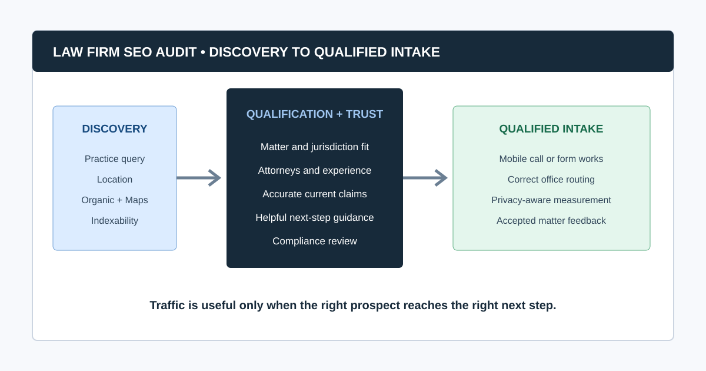
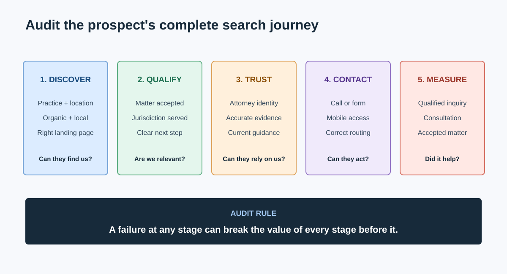
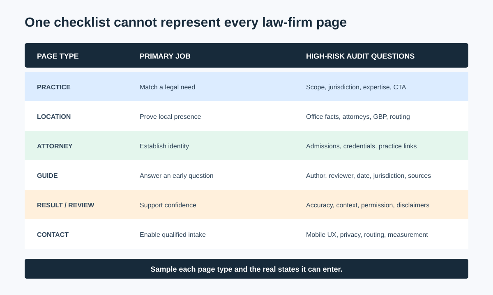
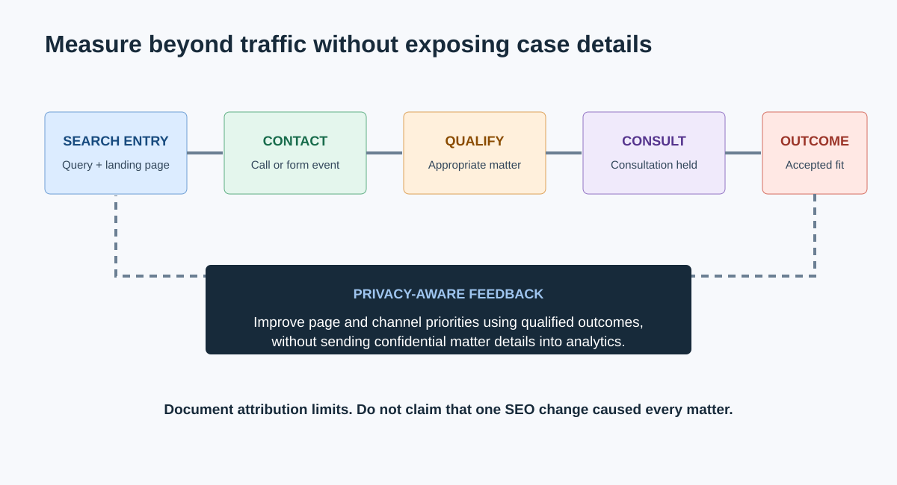

# SEO Audit for Law Firms: From Search Visibility to Qualified Calls

An SEO audit for a law firm should determine whether prospective clients can find the right practice and location page, verify the firm's relevance and credibility, understand the next step, and complete a call or consultation request without technical or informational friction.

The audit must connect four systems: technical eligibility, practice-area visibility, local presence, and intake conversion. It must also flag marketing claims for review under the rules that apply to the firm's jurisdiction. An SEO reviewer should not make that legal determination alone.

This guide takes a firm from uncertain visibility to a prioritized roadmap with evidence, owners, acceptance criteria, and measurement. It belongs to the [SEO audits by industry](/seo-audits-by-industry/) cluster and can be run within the broader [SEO audit workflow](/seo-audit-workflow/).

## Law Firm SEO Audit at a Glance

| Stage | Prospect's question | Audit evidence |
|---|---|---|
| Discovery | Can this firm help with my problem in my location? | Queries, rankings, Maps, practice/location pages |
| Qualification | Does the firm handle my matter and jurisdiction? | Page intent, service scope, office and attorney details |
| Trust | Is this information accurate and credible? | Authorship, review, credentials, citations, freshness |
| Contact | Can I call or request a consultation easily? | Mobile UX, phone links, forms, hours, routing |
| Measurement | Did organic discovery create a qualified inquiry? | Source attribution, call/form events, CRM outcomes |

If one stage fails, traffic alone will not produce the intended result.

## 1. Define the Firm's Search and Intake Scope

Document:

- Practice areas and matter types the firm accepts
- Locations, service areas, jurisdictions, languages, and office status
- Attorneys associated with each practice and location
- Priority case types and disallowed or unqualified inquiries
- Primary consultation actions, phone routing, and response expectations
- Existing Google Business Profiles and other authoritative listings
- Target markets and major competitors
- Website platform, redesigns, domain changes, and marketing history
- Search Console, analytics, call tracking, CRM, and form access
- The person responsible for advertising and ethics review

Avoid a scope such as “rank for lawyer keywords.” A stronger brief is: “Identify why the firm's Chicago employment practice pages and verified office profile are not producing qualified non-brand consultations, then prioritize fixes that can be implemented this quarter.”

### What should a law firm audit first?

First confirm that important practice and location pages are accessible, indexable, accurate, and connected to a legitimate office and intake path. Then evaluate content quality, local signals, authority, and competition. There is little value in expanding content before the pages can be crawled, understood, trusted, and converted.

## 2. Build an Evidence Baseline

| Source | What it answers | Important limitation |
|---|---|---|
| Website crawl | Technical signals, links, templates, status, metadata | Does not prove Google visibility or lead quality |
| Search Console | Queries, pages, clicks, impressions, indexing evidence | Does not identify every local/Maps interaction |
| Google Business Profile | Office information, categories, reviews, calls, local discovery | Must represent an eligible real-world business/location |
| Analytics | Landing journeys and consultation events | Tracking and consent settings affect completeness |
| Call tracking and CRM | Qualified calls, matters, and outcomes | Dynamic numbers and attribution require QA |
| Citation/listing review | Name, address, phone, and entity consistency | Quantity alone does not establish prominence or trust |
| Manual SERP review | Local pack, organic, ads, directories, competitors | Results vary by location, device, and personalization |

Record dates, properties, locations, filters, and tracking changes. Separate “no qualified leads” from “qualified leads are not measured.”

## 3. Inventory Law Firm Page Types

Review templates and representative states rather than a random set of URLs.

| Page type | Primary job | Audit focus |
|---|---|---|
| Practice area | Match a legal need and explain next steps | Intent, scope, jurisdiction, expertise, internal links, CTA |
| Sub-practice / matter | Address a specific problem | Distinct demand, duplication, useful depth, ownership |
| Location / office | Establish a real local presence | Address, phone, hours, directions, attorneys, unique local value |
| Attorney profile | Show relevant experience and identity | Credentials, admissions, practice links, authorship, freshness |
| Case result / testimonial | Support trust where permitted | Accuracy, context, required disclaimers, jurisdiction review |
| Legal guide / article | Answer an early-stage question | Author/reviewer, date, jurisdiction, sources, next-step path |
| Contact / consultation | Convert an appropriate prospect | Mobile UX, privacy, fields, routing, tracking, confirmation |
| About / recognition | Explain the firm and evidence claims | Verifiability, current awards, entity consistency |

## 4. Audit Technical Eligibility

Use a controlled crawl to review:

- `2xx`, `3xx`, `4xx`, and `5xx` responses
- Robots.txt, meta robots, and `X-Robots-Tag`
- Canonicals and duplicate URL variants
- XML sitemaps and orphan pages
- Crawl depth and internal links
- Titles, descriptions, headings, images, and alt text
- Mobile rendering and JavaScript navigation
- Structured data syntax and visible-page consistency
- HTTPS, mixed content, and redirect chains
- Core Web Vitals and template performance

CrawlBeast is a pre-launch desktop crawler for Mac and Windows designed to identify and prioritize issues such as broken links, status errors, metadata problems, duplicate content, orphan pages, and canonical mismatches. A law-firm team can use it to segment practice, attorney, and location templates locally, then validate important findings with Search Console and manual review.

Use the [website crawler for agencies](/website-crawler-for-agencies/) guide to select and test a crawler. Use the [broken link checker](/broken-link-checker/) process to trace failures back to navigation, attorney profiles, articles, or consultation paths.

## 5. Map Practice Pages to Real Search Intent

For every priority practice, compare:

- The prospective client's problem and stage of urgency
- The exact matters the firm handles
- The geography and jurisdiction represented
- The page Google currently shows for relevant queries
- Competing page types in organic and local results
- Supporting attorney, case, FAQ, and guide content
- The consultation action and qualification language

Avoid creating one thin page for every keyword permutation. A page should exist because it serves a distinct user need, service, or location with substantial original value.

### Should every practice area have a separate page?

Create a separate page when the practice has distinct search intent, substantive services, relevant experience, and a useful consultation path. Combine closely overlapping terms when separate pages would repeat the same answer. The information architecture should reflect how clients and the firm classify matters, not a keyword list alone.

## 6. Audit Local Search and Office Evidence

For each legitimate office:

- Verify the Google Business Profile owner and current status.
- Confirm name, address, phone, hours, website URL, and primary category.
- Match the profile to a useful office/location landing page.
- Confirm the office page identifies attorneys, practices, directions, access, and contact details.
- Review duplicates, practitioner profiles, relocations, suspensions, and closed locations.
- Compare authoritative citations and organization details for material inconsistencies.
- Review categories, services, photos, questions, reviews, and response process.
- Test mobile calls, directions, and appointment journeys.

Google's [Business Profile representation guidelines](https://support.google.com/business/answer/3038177) require accurate real-world business information and place conditions on virtual and co-working offices. Google also explains that [LocalBusiness structured data](https://developers.google.com/search/docs/appearance/structured-data/local-business) can describe hours and business details, but markup must match the visible page and does not replace an accurate Business Profile or legitimate office.

### Can a law firm create location pages without an office?

A firm may publish useful service-area content when it genuinely serves that market, but it should not invent an office, address, staff presence, or local proof. Google Business Profile eligibility and legal-advertising rules are separate questions. Review the firm's operating facts, Google's current guidelines, and the applicable jurisdiction before publishing location claims.

## 7. Review Trust, Accuracy, and Legal Content Quality

Legal information can materially affect a reader's decisions. Review:

- Named author and qualified legal reviewer where appropriate
- Attorney bio, admissions, credentials, and relevant experience
- Publication and substantive review dates
- Jurisdiction and factual scope
- Links to primary statutes, courts, agencies, or authoritative sources where useful
- Clear separation between general information and advice for a specific matter
- Current office, contact, attorney, and service information
- Claims about outcomes, specialization, rankings, awards, testimonials, and fees
- AI-assisted pages for factual, jurisdictional, and citation errors

Google's [helpful content guidance](https://developers.google.com/search/docs/fundamentals/creating-helpful-content) encourages clear authorship, sourcing, expertise, and a satisfying answer. It does not certify legal accuracy; the firm must provide that review.

## 8. Add an Advertising-Accuracy Gate

The ABA Model Rules are a useful US baseline, not the rulebook for every firm. [ABA Model Rule 7.1](https://www.americanbar.org/groups/professional_responsibility/publications/model_rules_of_professional_conduct/rule_7_1_communication_concerning_a_lawyer_s_services/) states:

> “A lawyer shall not make a false or misleading communication about the lawyer or the lawyer's services.”

Applicable obligations vary by jurisdiction and may include rules for specialization, testimonials, past results, comparisons, disclaimers, solicitation, trade names, record retention, or filing. Route flagged content to the firm's responsible lawyer or compliance reviewer. This article is an SEO workflow, not legal advice.

Audit high-risk claims in:

- Titles, descriptions, headings, and structured data
- Attorney biographies and admission statements
- Awards, rankings, badges, and superlatives
- Case results and testimonials
- “Specialist,” “expert,” “best,” and comparison language
- Fee, guarantee, and outcome statements
- AI-generated summaries and FAQs
- Old pages, PDFs, videos, and syndicated profiles

## 9. Audit Internal Links and Information Architecture

Prospective clients should be able to move among a legal question, relevant practice, attorney, office, and consultation page.

Check:

- Navigation reflects priority practices without becoming an exhaustive keyword menu.
- Practice pages link to relevant attorneys and offices.
- Attorney pages link back to actual practices and authored/reviewed resources.
- Guides link to the appropriate next-step page without aggressive solicitation.
- Breadcrumbs and related content expose hierarchy.
- Important pages are not orphaned or buried deeply.
- Old campaigns, attorney departures, and office moves do not leave broken paths.

Treat architecture and related [technical SEO issues](/technical-seo-issues/) as one system, not separate spreadsheet tabs.

## 10. Test the Consultation Journey

Test on mobile and desktop:

- Tap-to-call numbers and correct office routing
- Form length, labels, validation, accessibility, and error handling
- Privacy notice and consent implementation
- Confirmation page and response expectations
- Office hours and emergency/urgent matter guidance where appropriate
- Live chat or scheduling behavior
- Source attribution across calls and forms
- Spam filtering without blocking legitimate inquiries
- CRM capture of qualified versus unqualified matters

Do not send confidential case facts through analytics tools. Coordinate tracking design with privacy, security, and legal stakeholders.

### Which metrics matter after a law firm SEO audit?

Track visibility and indexing for priority practice/location pages, qualified organic calls and forms, consultation completion rate, accepted matters, and implementation progress. Rankings and traffic are diagnostic metrics; qualified inquiries and appropriate cases are closer to the business outcome. Document attribution limits rather than claiming every lead was caused by one fix.

## Video: See a Local SEO Audit in Practice

This Duda panel with local-search practitioners Ben Fisher, Steve Wiideman, and Elizabeth Rule reviews Business Profile data, local landing pages, citations, reviews, and conversion. It complements the law-firm-specific website, content, intake, and advertising checks above.

<iframe width="560" height="315" src="https://www.youtube.com/embed/gY5KvKietdc" title="Local SEO audit: four components of local SEO strategy" loading="lazy" frameborder="0" allow="accelerometer; autoplay; clipboard-write; encrypted-media; gyroscope; picture-in-picture; web-share" allowfullscreen></iframe>

[Watch the local SEO audit panel on YouTube](https://www.youtube.com/watch?v=gY5KvKietdc).

## 11. Prioritize and Assign the Findings

Score patterns by:

- Effect on access, trust, or consultation
- Priority practice and location value
- Affected template scale
- Evidence confidence
- Legal/compliance review need
- Implementation effort and risk
- Time sensitivity

Example order:

1. Priority practice pages accidentally excluded from indexing
2. Broken mobile call action on location pages
3. False, stale, or unreviewed attorney/service claim
4. Office/profile inconsistency affecting local discovery
5. Orphaned attorney and practice pages
6. Repeated structured-data mismatch
7. Low-priority metadata improvements on old articles

Present the decisions using a [website audit report](/website-audit-report/) with representative evidence, owner, desired behavior, acceptance criteria, and validation. Agencies can integrate this into their standard [client audit process](/how-agencies-perform-seo-audits/).

## Law Firm SEO Audit Checklist

- Practices, locations, jurisdictions, attorneys, and intake goals are scoped.
- Search, Business Profile, analytics, call, CRM, and crawl evidence is dated.
- Practice, location, attorney, guide, result, and contact templates are sampled.
- Important pages are accessible, indexable, canonical, and internally linked.
- Practice pages match matters the firm genuinely handles.
- Location claims and Business Profiles reflect real operating facts.
- Legal information has appropriate authorship, review, dates, jurisdiction, and sources.
- Advertising claims are routed through the applicable legal/compliance review.
- Mobile calls, forms, routing, confirmations, and attribution are tested.
- Privacy-sensitive data is excluded from inappropriate tracking.
- Findings are prioritized by client journey, business value, scale, confidence, and effort.
- Production fixes are re-crawled, manually tested, and measured.

A law-firm SEO audit is complete when it protects accurate discovery and gives an appropriate prospective client a clear path to the right firm contact. CrawlBeast can accelerate the technical evidence layer; the firm still needs local verification, legal review, intake testing, and accountable implementation to turn that evidence into trustworthy search performance.
