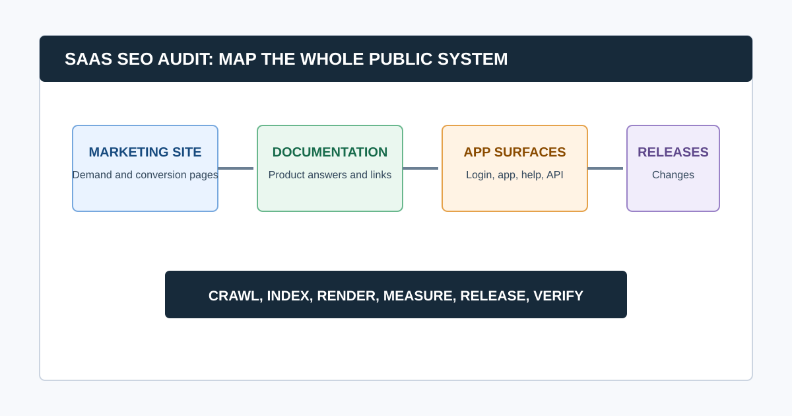

# SaaS SEO Audit: A System-by-System Checklist

A SaaS SEO audit evaluates more than a marketing homepage. It checks how search engines and buyers experience the public system around the product: commercial pages, feature and integration pages, documentation, help content, comparison pages, changelogs, templates, subdomains, and the releases that can change all of them.

The goal is to find scalable issues without confusing the public marketing site with the logged-in product. Start with business-critical public pages, establish the domain and subdomain map, validate search access, and trace each issue to the team or system that owns the output.

## SaaS Audit at a Glance

| System | What to check | Typical owner |
|---|---|---|
| Marketing site | Indexation, templates, intent, conversion paths | Marketing, web, content |
| Documentation | Discoverability, duplication, canonical rules, internal links | Product docs, developer relations |
| Help center and changelog | Indexing strategy, outdated content, support journeys | Support, product marketing |
| App and account surfaces | Intended public access, login walls, accidental indexation | Product, engineering, security |
| Integrations and programmatic pages | Template quality, parameter control, duplication | Product marketing, engineering |
| Releases and infrastructure | Redirects, rendering, headers, performance regressions | Engineering, platform, web |

## 1. Define the SaaS Search Surface

First, inventory every public hostname and content type. Do not assume `www` is the entire search estate.

- Main marketing domain and regional variants
- Docs, help center, academy, blog, changelog, status, and community subdomains
- Feature, use-case, integration, comparison, pricing, and solution pages
- Public templates, tools, directories, and programmatic collections
- Application URLs, login pages, shared workspaces, API docs, and preview environments

For each surface, decide whether it should be indexed, why it exists, who owns it, and how it should connect to commercial pages. A public documentation article can earn search demand and support users; an account dashboard normally should not compete in search results.

### Common question: What makes a SaaS SEO audit different?

A SaaS audit adds product and release context to normal technical SEO. It checks how multiple public surfaces support one buyer journey, whether documentation and marketing pages compete or reinforce each other, and whether deployments accidentally change crawlability, rendering, canonicals, or internal links.

## 2. Establish a Release-Aware Baseline

SaaS sites change often. Record recent framework changes, CMS migrations, navigation releases, documentation migrations, locale launches, pricing changes, content imports, and application releases before diagnosing a ranking or indexation change.

Capture:

- Search Console and analytics date ranges
- Sitemap and robots.txt snapshots
- Crawl configuration, crawl date, URL count, and rendering mode
- Deployments, incidents, and experiments near the change date
- Priority pages and desired conversions
- Canonical domain, redirects, and subdomain ownership

Our [technical SEO audit checklist](/technical-seo-audit-checklist/) provides the evidence standard. Use this SaaS version to identify which system created the behavior.

## 3. Audit Crawlability, Indexation, and Rendering First

For every priority template, verify the live response, robots rules, `meta robots`, canonical target, internal links, sitemap inclusion, and Search Console evidence. Then inspect rendered output where JavaScript controls content or metadata.

- [ ] Important commercial pages return the intended success response and do not redirect through unnecessary hops.
- [ ] Preview, staging, test, account, and search-result pages have an intentional public-access and indexation policy.
- [ ] Canonicals, redirects, sitemap entries, and internal links agree on the preferred URL.
- [ ] Documentation and help content use deliberate indexation rules rather than accidental defaults.
- [ ] JavaScript-rendered headings, copy, links, canonicals, and structured data are present when the page loads.
- [ ] Important CSS and JavaScript resources are accessible to Google.

Google recommends using URL Inspection to see how its crawler renders a page and reminds site owners that inaccessible resources can prevent proper understanding of a page. See its [technical SEO guidance](https://developers.google.com/search/docs/fundamentals/get-started) before assigning a rendering diagnosis.

## 4. Review Documentation, Help, and Product-Led Content

Documentation is often a SaaS company’s largest public content surface. Audit it as a product, not as a disconnected blog.

Check for:

- Duplicate or competing guides across docs, help, blog, and academy
- Thin autogenerated pages or release-note fragments with no standalone purpose
- Links from explanatory pages to relevant features, use cases, integrations, and pricing context
- Stable canonical URLs when docs platforms or versions change
- Breadcrumbs, navigation, and related-content paths that help a reader continue
- Old instructions for retired product behavior or UI
- Code samples and screenshots that match current product behavior

Avoid gating the pages people need to evaluate or use the product. Helpful public documentation can support both customer success and discovery when it answers a real task.

## 5. Audit High-Intent Commercial Templates

Review the homepage, feature pages, use-case pages, integration pages, comparisons, alternatives, pricing, demos, and implementation content. For each, ask whether the page has a distinct audience, search intent, evidence, and next step.

Look for duplicate title or copy patterns, indistinguishable integration pages, thin comparison pages, missing internal links from educational content, and pages that rank for an intent they cannot satisfy. This is especially important for SaaS sites with large solution or integration libraries.

Google’s people-first content guidance is a useful guardrail: publish pages because they help a defined audience, not only because a keyword has a scalable template.

## 6. Evaluate Architecture and Internal Linking

SaaS information architecture often separates marketing, education, docs, and help so thoroughly that users and crawlers struggle to move between them. Review:

- Whether commercial hubs link to their strongest supporting proof and implementation content
- Whether docs and help articles surface relevant product journeys without forced promotions
- Whether orphan-page candidates have traffic, backlinks, a product role, or should be consolidated
- Whether comparison and alternative pages connect to feature and category pages
- Whether old navigation, footer, and in-content links use final canonical URLs

An [agency crawler workflow](/website-crawler-for-agencies/) can identify link patterns and depth. The audit still needs a human decision about which journey deserves prominence.

## 7. Test Performance and Deployment Risk by Template

Measure performance where customers convert: homepage, pricing, demo, feature, documentation, integration, and high-traffic blog templates. Start with field data when available and use lab diagnostics to find causes. Review LCP, INP, CLS, server response, JavaScript payloads, fonts, images, embedded product tours, consent tools, and third-party analytics.

Do not set a technical performance target without a validation plan. A change that improves one lab metric but breaks a product demo, locale route, or hydration behavior is not an audit win.

### Common question: How often should a SaaS company audit SEO?

Run focused checks after architecture, CMS, docs, locale, navigation, rendering, or domain changes. Use a recurring crawl and Search Console review for stable surfaces, with cadence based on release frequency and site complexity. The purpose is to catch regressions while their change history is still clear.

## 8. Create a SaaS Ownership Map

| Finding | Likely owner | Acceptance criteria |
|---|---|---|
| Docs pages use conflicting canonical URLs | Docs platform or developer relations | One intended canonical in source and rendered HTML |
| Product template emits `noindex` after a release | Web engineering or platform | Priority URLs are indexable and confirmed in production |
| Integration pages duplicate the same copy | Product marketing and content | Each indexable page serves distinct user intent |
| Marketing navigation buries a feature hub | Web, content, or design | Priority hub receives crawlable contextual links |
| App subdomain enters a sitemap | Product or security | Sitemap contains only intended public canonical URLs |

This makes the final [website audit report](/website-audit-report/) actionable rather than a list sent to a generic engineering queue.

## Video: A Compact SEO Audit Workflow

This walkthrough is a useful orientation for the evidence flow: crawl the public site, investigate a pattern, create a recommendation, and monitor the result. Apply the SaaS surface and ownership map above before acting on the output.

<iframe width="560" height="315" src="https://www.youtube.com/embed/9-mOukMWtFQ" title="Ahrefs SEO audit template walkthrough" loading="lazy" frameborder="0" allow="accelerometer; autoplay; clipboard-write; encrypted-media; gyroscope; picture-in-picture; web-share" allowfullscreen></iframe>

[Watch the SEO audit walkthrough on YouTube](https://www.youtube.com/watch?v=9-mOukMWtFQ).

## Final SaaS SEO Audit QA

- [ ] Every public hostname and content type has an indexation decision and owner.
- [ ] Priority templates are tested in live and rendered forms.
- [ ] Crawl results are compared with Search Console and release history.
- [ ] Documentation, help, and marketing pages have distinct jobs and useful connections.
- [ ] Findings identify the system owner, not just a URL symptom.
- [ ] High-risk changes have a release, rollback, and re-crawl plan.

CrawlBeast can help teams collect local crawl evidence and group technical findings by template. Pair it with Search Console, analytics, live-page checks, and release history to decide what needs to change.

## Sources and Further Reading

- Google Search Central: [Crawling and indexing overview](https://developers.google.com/search/docs/crawling-indexing)
- Google Search Central: [Maintaining your website’s SEO](https://developers.google.com/search/docs/fundamentals/get-started)
- Google Search Central: [Creating helpful, reliable, people-first content](https://developers.google.com/search/docs/fundamentals/creating-helpful-content)
