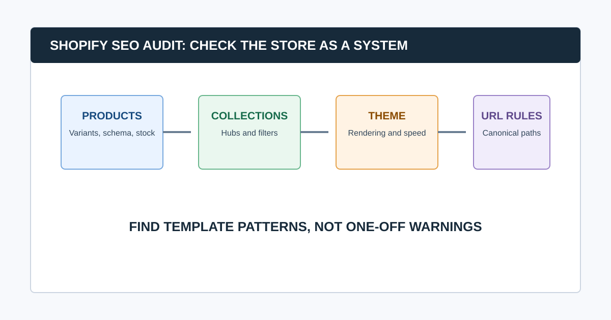

# Shopify SEO Audit: A Store-by-Store Technical Checklist

A Shopify SEO audit evaluates the live storefront, then traces issues back to the layer that creates them: product and collection data, theme code, apps, navigation, Shopify’s URL conventions, international setup, or a merchandising decision. The goal is not to “fix SEO settings” blindly. It is to preserve the right pages, reduce unwanted duplicates, make products discoverable, and give shoppers a reliable route from search to purchase.

Begin with a live crawl and data baseline. Then audit products, collections, variants, filters, themes, apps, redirects, sitemaps, performance, and structured data. Shopify generates sensible defaults for many stores, but custom themes and apps can add conflicting behavior.

## Shopify SEO Audit at a Glance

| Layer | What to inspect | Common risk |
|---|---|---|
| Products and variants | URLs, titles, availability, schema, canonical paths | Thin or duplicate variants; poor discontinued-product handling |
| Collections and filters | Hubs, navigation, faceting, pagination | Parameter and filtered URL growth |
| Theme | Rendered HTML, links, headings, performance | Missing content, duplicate markup, slow templates |
| Apps | Metadata, schema, redirects, localization, scripts | Two systems output conflicting tags or slow pages |
| Store settings | Primary domain, redirects, robots, sitemap, markets | Mismatched host, locale, or crawl rules |

## 1. Protect the Store and Define Scope

Record the production domain, markets, languages, apps, theme version, recent theme deployments, collection strategy, product feed setup, and ownership. Create a test plan before changing liquid templates, app settings, redirects, or sitemap behavior.

Scope the audit around priority collections, products, seasonal pages, markets, and conversions. A catalog migration, international expansion, theme redesign, and monthly health check will not require the same crawl or repair plan.

### Common question: Can you audit Shopify SEO without admin access?

Yes. A public crawl, live-page inspection, Search Console, sitemap, robots.txt, and performance data can reveal many storefront issues. Admin access is needed to confirm which product setting, app, theme component, or Shopify configuration owns the output. Report ownership as unconfirmed until it is verified.

## 2. Crawl the Public Store Before Reviewing Settings

Collect URLs, responses, redirects, canonicals, robots directives, titles, descriptions, headings, internal links, crawl depth, image signals, structured data types, and raw-versus-rendered output. Include product, collection, blog, policy, search, account, cart, pagination, and known filter paths where appropriate.

Validate the crawl first:

- Did the crawler use the correct primary domain and market paths?
- Were collections, products, and priority seasonal pages included?
- Did URL parameters, filters, internal search, or calendars create a crawl trap?
- Do samples of products, variants, unavailable items, filters, and redirects behave as expected?
- Did a consent tool, app, or rate limit change what the crawler saw?

CrawlBeast is a pre-launch local desktop crawler designed to surface patterns including broken links, status-code errors, missing metadata, duplicate content, orphan pages, and canonical mismatches. Use it to group evidence by Shopify template, then validate the actual theme, app, or catalog owner before recommending a change.

## 3. Audit Products, Variants, and Availability

Product SEO starts with a clear merchandise and search decision. For each product type, decide what should be indexable, which URL is canonical, how variants are represented, and what happens when stock changes.

- [ ] Important products have distinct titles, descriptions, media, and product information that help a shopper decide.
- [ ] Variant URLs and query parameters follow a deliberate canonical strategy.
- [ ] Product links use final intended URLs rather than long redirect chains.
- [ ] Out-of-stock, discontinued, replacement, and seasonal items have an intentional customer and search experience.
- [ ] Product schema matches visible product, price, availability, and review information.
- [ ] Merchant feeds, product pages, and internal links do not contradict each other.

Do not delete or noindex every unavailable product by default. The right action depends on whether it will return, has a replacement, receives traffic or links, and still helps users. Document the decision by product state.

## 4. Audit Collections, Filters, and Internal Links

Collections often act as Shopify’s most important category and search landing pages. Review whether each indexable collection has a distinct purpose, useful copy, products, metadata, and a path from navigation or contextual links.

Then inspect filters and sorting. Faceted navigation can create many URL variants that are useful to shoppers but not all useful as indexable search pages. Decide which combinations deserve a curated landing page, which should remain crawlable but not indexed, and which links should be constrained.

- [ ] Priority collections are linked from appropriate navigation and content hubs.
- [ ] Filter, sort, search, tag, and parameter URLs have an intentional crawl and indexation policy.
- [ ] Pagination does not accidentally hide or duplicate important products.
- [ ] Breadcrumbs and collection links use the preferred product and collection URLs.
- [ ] Orphan candidates are checked against product feeds, collections, sitemaps, and analytics.

For broader catalog architecture, use our [ecommerce SEO audit](/seo-audit-for-ecommerce/) guide.

## 5. Audit Shopify URL, Sitemap, and Robots Behavior

Shopify provides a default `robots.txt` file that works for most stores and can be customized through the `robots.txt.liquid` template when a store has a real need. Do not add blocks or custom rules simply because a generic checklist says so. Test every change against the intended search and customer behavior.

Check:

- [ ] The primary domain, HTTPS, and host redirects are consistent.
- [ ] Canonicals reinforce the intended product, collection, and content URLs.
- [ ] The sitemap contains the canonical, indexable pages you want surfaced.
- [ ] Redirects exist for changed handles, deleted products, migrated collections, and old campaigns where a successor is appropriate.
- [ ] Robots rules do not block resources or pages that must be crawled for Google to understand the store.
- [ ] International and market URLs use an intentional locale and canonical strategy.

Shopify’s [robots.txt documentation](https://shopify.dev/docs/storefronts/themes/seo/robots-txt) explains its generated default and the supported customization path. Google’s [sitemap guidance](https://developers.google.com/search/docs/crawling-indexing/sitemaps/build-sitemap) explains why entries should be the canonical URLs you want in results.

## 6. Check Theme, Apps, and Rendered Output

Apps and themes can change the storefront after Shopify generates its base page. On representative templates, compare source and rendered HTML. Review page titles, descriptions, headings, canonicals, robots directives, JSON-LD, navigation, breadcrumbs, image attributes, content visibility, and duplicate scripts.

Watch for:

- Two apps or a theme and app emitting the same metadata or structured data
- Theme changes that hide product or collection content behind JavaScript
- App scripts that delay the visible product content or cause layout movement
- Headings used as visual styling rather than a meaningful page structure
- Link modules that point to filtered, redirecting, or obsolete URLs

Validate structured data with Google’s Rich Results Test; do not declare it absent based only on static HTML inspection.

## 7. Test Store Performance Where Revenue Happens

Measure homepage, collection, product, cart-adjacent, and high-traffic editorial templates separately. Start with field data when available, then diagnose slow server response, images, app scripts, theme JavaScript, third-party widgets, font loading, and layout shifts.

Core Web Vitals are useful health signals, not a substitute for shopper behavior. Review whether a performance fix affects tracking, merchandising, product selection, localization, or checkout integrations before release.

### Common question: How often should Shopify SEO be audited?

Run focused checks after theme releases, app changes, catalog imports, collection restructuring, handle changes, market launches, and migrations. Use a recurring crawl and Search Console review for ongoing catalog health. Stores with frequent merchandising changes need a tighter cadence than stable catalogs.

## 8. Turn Findings Into Store-Safe Tickets

Each recommendation should name the affected template or product group, an example URL, the observed output, likely owner, desired behavior, acceptance criteria, and validation method. Avoid “fix SEO” tickets.

| Finding | Likely owner | Validation |
|---|---|---|
| Duplicate product canonical output | Theme or SEO app | Inspect source and rendered canonical on samples |
| Collection filters create excessive URLs | Theme, app, or merchandising | Re-crawl filter paths and confirm intended index rules |
| Broken links after handle changes | Content or merchandising | Test sources, targets, and redirects in production |
| Product pages load slowly | Theme, apps, or platform team | Compare field and lab data on affected template |

Use our [website audit report](/website-audit-report/) guide to make the final handoff clear.

## Video: Shopify Technical SEO Checklist

This video provides a practical Shopify-focused overview of speed, redirects, product schema, and mobile checks. Treat it as orientation, then validate every change against your store’s theme, apps, catalog rules, and customer journey.

<iframe width="560" height="315" src="https://www.youtube.com/embed/hnYwM_g7FBk" title="Shopify technical SEO checklist" loading="lazy" frameborder="0" allow="accelerometer; autoplay; clipboard-write; encrypted-media; gyroscope; picture-in-picture; web-share" allowfullscreen></iframe>

[Watch the Shopify technical SEO checklist on YouTube](https://www.youtube.com/watch?v=hnYwM_g7FBk).

## Final Shopify SEO Audit QA

- [ ] Product, variant, collection, filter, and availability decisions are documented.
- [ ] The live store is crawled and representative templates are checked in rendered form.
- [ ] Theme, app, merchandising, and platform ownership are distinguished.
- [ ] Sitemap, robots, canonicals, redirects, and internal links agree on the desired URLs.
- [ ] High-risk changes are tested and re-crawled after release.

Use CrawlBeast to collect local storefront evidence and prioritize recurring patterns. Pair it with Search Console, live-page testing, Shopify admin review, and a re-crawl so a technical finding becomes a safe store improvement.

## Sources and Further Reading

- Shopify: [Customize robots.txt](https://shopify.dev/docs/storefronts/themes/seo/robots-txt)
- Shopify: [Ecommerce SEO audit](https://www.shopify.com/uk/blog/ecommerce-seo-audit)
- Google Search Central: [Build and submit a sitemap](https://developers.google.com/search/docs/crawling-indexing/sitemaps/build-sitemap)
- Google Search Central: [Canonical URL guidance](https://developers.google.com/search/docs/crawling-indexing/consolidate-duplicate-urls)
