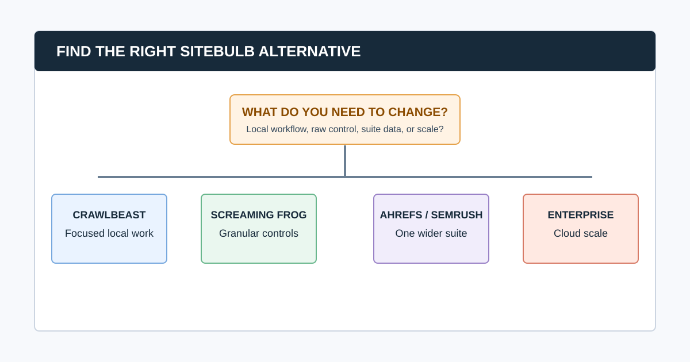

# 6 Sitebulb Alternatives for Different SEO Audit Workflows

The best Sitebulb alternative depends on what you want to change. Sitebulb is an established desktop and cloud crawler known for prioritized Hints, explanations, visualizations, and reports. It is a strong fit for guided technical audits and stakeholder communication. Look elsewhere only when another operating model better fits the work: local prioritization, granular extraction control, a wider SEO suite, or enterprise-scale cloud analysis.

Consider CrawlBeast for a focused local crawl-to-action workflow, Screaming Frog for granular desktop control, Ahrefs or Semrush when a broader SEO suite matters, and JetOctopus or Lumar for complex cloud technical programs. The right answer is the product that removes your actual workflow friction without losing the evidence you depend on.

> **Editorial disclosure:** CrawlBeast is our pre-launch product. We include it because it is relevant to teams seeking a local, prioritized agency workflow. We do not claim independent testing, customer results, or feature parity with Sitebulb. Confirm all current vendor capabilities, limits, and pricing before making a decision.

## Quick Comparison

| Alternative | Best for | Why evaluate it | Test before switching |
|---|---|---|---|
| CrawlBeast | Focused local agency workflow | Priority issues and multi-project review | Current release coverage, exports, rendering, and resource use |
| Screaming Frog SEO Spider | Technical specialists | Granular settings, custom extraction, and exports | Team workflow, reporting time, and shared knowledge |
| Ahrefs Site Audit | Research-led SEO teams | Audits inside a wider SEO suite | Crawl allowances, research needs, and full plan cost |
| Semrush Site Audit | Campaign-led teams | Audit work alongside reporting and marketing tools | Project limits, reporting overlap, and issue workflow |
| JetOctopus | Large-site technical programs | Cloud crawl, logs, and Search Console analysis | Data joins, scale, onboarding, and access controls |
| Lumar | Enterprise governance | Monitoring, integrations, and website intelligence | Implementation, permissions, and total cost |

This is not a feature-parity benchmark. Run the same representative crawl and report exercise before deciding that any alternative “finds more” or “works faster.”

## Why Teams Look for a Sitebulb Alternative

The reason should be concrete:

- “We want a lighter local workflow for recurring client reviews.”
- “We need more granular custom extraction or desktop crawl control.”
- “We already pay for an SEO suite and want audit work in the same platform.”
- “Several teams need cloud collaboration, log data, and continuous monitoring.”
- “We need a different commercial model or deployment arrangement.”

Sitebulb remains a sensible choice if its guided Hints, visualizations, audit education, reports, and desktop or cloud options solve the job. Its current product information describes both deployment models and a broad technical audit feature set. The honest alternative page helps a reader decide when that is still the best fit.

## 1. CrawlBeast: For a Focused Local Crawl-to-Action Workflow

CrawlBeast is a pre-launch desktop application for Mac and Windows. It is being designed for agencies, marketers, and developers who need local crawling, a modern multi-project view, and prioritized technical findings instead of a dense raw-data workflow.

It is relevant when the real friction is the time between a completed crawl and a useful action list. CrawlBeast is intended to identify patterns including broken links, status-code errors, missing metadata, duplicate content, orphan pages, and canonical mismatches.

**Best for:** Agencies and consultants seeking a focused local technical review workflow.

**Do not assume:** It is a replacement for every mature Sitebulb report, cloud workflow, or advanced audit feature. Validate current capability, evidence, exports, and scale against a real client requirement.

Read the direct comparison in [CrawlBeast vs Sitebulb](/crawlbeast-vs-sitebulb/).

## 2. Screaming Frog SEO Spider: For Granular Desktop Control

[Screaming Frog SEO Spider](https://www.screamingfrog.co.uk/seo-spider/) is a well-established desktop crawler for SEOs who need extensive configuration, custom extraction, JavaScript rendering, and detailed exports. It can be a better alternative for a technical specialist who wants to investigate the raw data rather than start with guided explanations.

**Best for:** Technical SEOs who need flexible, repeatable desktop investigations.

**Test before switching:** Saved configurations, custom extraction, rendering, storage, exports, and the time it takes the team to turn raw output into a client or developer handoff. Screaming Frog may add manual interpretation work that Sitebulb’s Hints and visual reporting reduce.

## 3. Ahrefs Site Audit: For Teams That Need a Wider SEO Suite

[Ahrefs Site Audit](https://ahrefs.com/site-audit) is useful when technical health needs to sit alongside keyword, backlink, rank, competitor, and historical research. It may reduce context switching for teams that already work inside Ahrefs.

**Best for:** SEO teams whose audit decisions regularly require wider research data.

**Test before switching:** Project and crawl allowances, issue customization, reporting, shared workflow, and the total subscription cost for real users and sites. For a balanced category comparison, see [CrawlBeast vs Ahrefs](/crawlbeast-vs-ahrefs/).

## 4. Semrush Site Audit: For Campaign and Reporting Workflows

[Semrush Site Audit](https://www.semrush.com/features/site-audit/) is part of Semrush’s larger marketing platform. It can suit a team that already uses Semrush campaigns, position tracking, research, or client reporting and wants technical checks in the same project environment.

**Best for:** Agencies that want a campaign-level SEO stack rather than a dedicated crawler alone.

**Test before switching:** Crawl and project allowances, schedule, issue depth, reporting requirements, and overlap with tools you already pay for.

## 5. JetOctopus: For Large-Site Crawling, Logs, and Search Console Data

[JetOctopus](https://jetoctopus.com/) is a cloud technical SEO platform worth evaluating when large website crawling, log data, Search Console analysis, indexability, and segmentation are ongoing work. It is generally a different operating model from a local desktop audit.

**Best for:** Technical agencies and teams working with complex ecommerce, publisher, marketplace, or enterprise sites.

**Test before switching:** Crawl scale, log ingestion, Search Console joins, segmentation, onboarding, access controls, and commercial fit.

## 6. Lumar: For Enterprise Monitoring and Governance

[Lumar](https://www.lumar.io/) is an enterprise platform for teams that need broad monitoring, integrations, governance, and collaboration around website quality. It can be appropriate where technical SEO must work across engineering, accessibility, and digital-experience programs.

**Best for:** Enterprise organizations with formal monitoring and governance needs.

**Test before switching:** Implementation, integrations, permissions, support, data requirements, and total cost. It is usually more platform than a small team needs for periodic audit work.

### Common question: Is there a free Sitebulb alternative?

Some tools offer free tiers or trials, but the useful question is which required workflow they cover. Evaluate the permitted crawl size, saved configurations, rendering, exports, team use, and data retention. A free tier can be excellent for learning or small checks, yet unsuitable for a recurring agency process.

### Common question: Should I move away from Sitebulb or add another tool?

Add another tool when Sitebulb already solves presentation and audit guidance but a separate need remains, such as keyword research, log analysis, or a very granular local investigation. Move only when an alternative improves the complete workflow on representative sites without losing evidence, team usability, or required output.

## How to Run a Fair Alternative Trial

1. Write down the workflow friction and non-negotiable requirements.
2. Select a small brochure site, a JavaScript or ecommerce site, and a site with known redirects or migration history.
3. Use equivalent scope, rendering, exclusions, speed, and expected URL count.
4. Seed known conditions and record whether each tool finds them with enough evidence to act.
5. Have the same reviewer create three stakeholder findings and two developer tickets.
6. Compare configuration effort, coverage, false positives, explanations, exports, collaboration, and cost.
7. Choose the tool that improves the whole path from crawl to verified fix.

Use our [technical SEO audit checklist](/technical-seo-audit-checklist/) to define trial conditions and our [website audit report guide](/website-audit-report/) to evaluate the final handoff.

## Video: Keep the Evidence Workflow Intact

This walkthrough demonstrates the core crawler habits worth preserving regardless of tool: set scope, inspect URL-level evidence, filter a pattern, document the decision, and re-crawl after implementation.

<iframe width="560" height="315" src="https://www.youtube.com/embed/F14DTimTUDI" title="How to crawl a site with Screaming Frog SEO Spider" loading="lazy" frameborder="0" allow="accelerometer; autoplay; clipboard-write; encrypted-media; gyroscope; picture-in-picture; web-share" allowfullscreen></iframe>

[Watch the crawler walkthrough on YouTube](https://www.youtube.com/watch?v=F14DTimTUDI).

## The Bottom Line

Sitebulb is still a strong choice for guided, visual technical audits. CrawlBeast may fit teams seeking a focused local prioritization workflow; Screaming Frog suits granular desktop investigation; Ahrefs and Semrush suit broader SEO stacks; JetOctopus and Lumar suit complex cloud technical programs.

Choose based on the job, not the longest feature list. Keep the evidence, ownership, and re-crawl standard constant while you test each option.

## Sources and Further Reading

- Sitebulb: [Website crawler for better SEO audits](https://sitebulb.com/)
- Screaming Frog: [SEO Spider](https://www.screamingfrog.co.uk/seo-spider/)
- Ahrefs: [Site Audit](https://ahrefs.com/site-audit)
- Semrush: [Site Audit](https://www.semrush.com/features/site-audit/)
