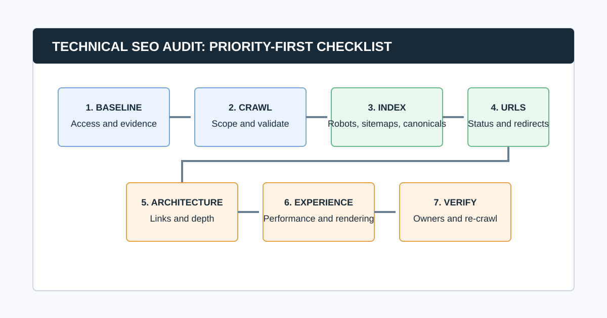
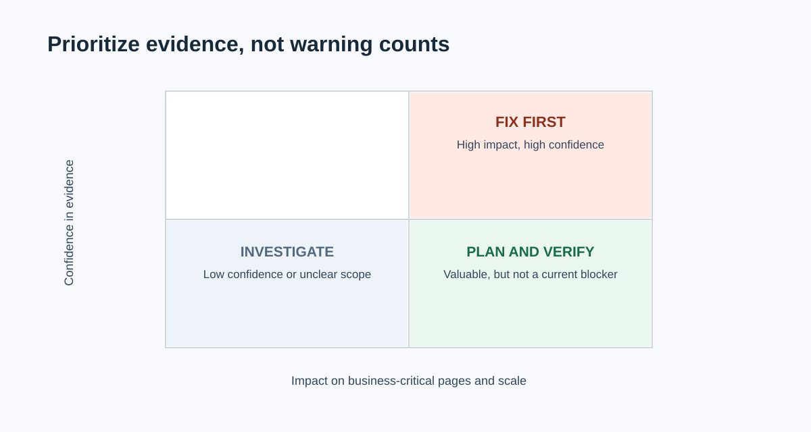

# Technical SEO Audit Checklist: Prioritize, Fix, and Verify

A technical SEO audit checks whether search engines and users can reach, understand, and use the pages that matter. The useful outcome is not a long warning list. It is a prioritized, evidence-backed repair plan: what is wrong, which URLs or templates it affects, why it matters, who owns the fix, and how you will verify it in production.

Start with crawlability and indexability before polishing page-level details. Then work through URL behavior, internal linking, rendering, performance, structured data, and validation. Google's [Search Essentials](https://developers.google.com/search/docs/essentials) are an important baseline, but a pass against a checklist never guarantees crawling, indexing, or ranking. Use the checklist to investigate and prove each recommendation.

This guide is designed for an audit that takes a reader from first access through a verified fix. Agencies can pair it with our complete guide to [how agencies perform SEO audits](/how-agencies-perform-seo-audits/); in-house teams can use the same evidence and ownership model.

## Technical SEO Audit Checklist at a Glance

| Phase | Goal | Output |
|---|---|---|
| 1. Scope and baseline | Define the decision and collect dated evidence | Audit brief and access log |
| 2. Crawl and validate | Gather reproducible URL, link, directive, and response data | Trusted crawl dataset |
| 3. Crawlability and indexability | Find blockers to discovery and eligibility | Indexed-page decision map |
| 4. URLs and duplication | Resolve status, redirects, canonical, and sitemap conflicts | Canonical URL plan |
| 5. Architecture and content delivery | Ensure important pages are reachable and understandable | Internal-link and template findings |
| 6. Experience and markup | Diagnose performance, rendering, mobile, and structured-data issues | Tested improvement backlog |
| 7. Prioritize and verify | Assign work, release safely, and prove the result | Re-crawl and validation record |

## Before You Crawl: Define the Audit Question

Do not start with “check everything.” Define the business decision. A traffic-drop investigation, migration review, quarterly health check, and ecommerce indexation audit need different scopes and evidence.

Record:

- Domain, subdomains, protocols, staging environments, and excluded paths
- Business-critical templates, folders, countries, languages, and conversions
- Recent releases, migrations, redesigns, outages, or traffic changes
- Access to Search Console, analytics, sitemaps, CMS, logs, and deployment history
- Crawl configuration: user agent, rendering, speed, authentication, URL cap, inclusions, and exclusions
- Audit owner, implementation owners, deadline, and definition of done

### Common question: What should you check first in a technical SEO audit?

Check whether important pages can be reached and are eligible for indexing before reviewing titles, images, or minor warnings. Start with robots rules, status codes, redirects, `noindex`, canonical consistency, sitemaps, and internal links to priority pages. It avoids optimizing pages that search engines cannot reliably discover or select.

## 1. Build a Reliable Baseline

Gather evidence from more than one source. A crawler shows the URLs and responses it can reach under a given configuration. Search Console shows Google's first-party property data. Analytics and conversion data show whether a page matters to the business. None is a complete diagnosis alone.

| Question | Starting evidence | Limitation to state |
|---|---|---|
| Can a crawler reach the URL? | Crawl response, link path, and rendered output | It does not prove Google indexed the URL |
| Does Google surface the page? | Search Console indexing and performance data | It does not prove a single root cause |
| Is the page important? | Conversions, revenue, leads, and business context | It does not prove technical eligibility |
| Is performance a problem for users? | CrUX field data and diagnostic tools | It does not prove performance caused a ranking change |
| Is a problem scalable? | Template, folder, and affected-URL analysis | It does not prove implementation effort |

Keep the crawl date, Search Console date range, property, filters, access limitations, and crawler settings together. “Not reviewed” is not the same as “passed.”

## 2. Crawl the Site, Then Validate the Crawl

Use a crawler to collect URLs, status codes, redirect targets, titles, headings, canonicals, robots directives, links, crawl depth, image signals, structured data, and raw-versus-rendered output when the site uses JavaScript. A [website crawler for agencies](/website-crawler-for-agencies/) can make the collection repeatable; it cannot replace human diagnosis.

Before analyzing any warning, validate the dataset:

- Did the crawler include the correct protocol, host, subdomains, folders, and authenticated areas?
- Did robots behavior, rate limits, security systems, cookies, location, or user agent distort the result?
- Was rendering appropriate for a JavaScript site?
- Did URL parameters, calendars, faceted navigation, or search pages create a crawl trap?
- Do sample priority, redirected, blocked, and rendered pages behave as expected?
- Were sitemap URLs or other known URL lists included where useful?

CrawlBeast is a pre-launch local desktop application for Mac and Windows designed to identify and prioritize patterns such as broken links, status-code errors, metadata problems, duplicate content, orphan pages, and canonical mismatches. Use it to collect and group crawl evidence, then validate high-impact findings with live-page checks and first-party data.

## 3. Check Crawlability and Indexability

For each business-critical URL or template, ask: can it be discovered, fetched, rendered, indexed, and selected as the version you intend? Work through the following checklist.

- [ ] Important pages return a successful response and do not rely on an unexpected redirect.
- [ ] Robots.txt does not accidentally block critical pages or resources needed to understand them.
- [ ] `meta robots` and `X-Robots-Tag` directives match the intended index strategy.
- [ ] Important pages are internally linked with crawlable HTML links.
- [ ] Canonical pages are accessible and not blocked or noindexed.
- [ ] XML sitemaps contain the canonical, indexable URLs you want crawled.
- [ ] Search Console evidence is reviewed for major indexation patterns and manual actions.
- [ ] Raw and rendered HTML are compared where JavaScript controls content, links, metadata, or canonicals.

Google states that robots.txt is for crawl management, not canonicalization. For duplicate URLs, its [canonicalization guidance](https://developers.google.com/search/docs/crawling-indexing/consolidate-duplicate-urls) recommends consistent signals: redirects, `rel="canonical"`, sitemap inclusion, and internal links should point to the same preferred URL.

### Common question: Does a successful crawl mean the page is indexed?

No. A successful crawl only shows that your crawler reached the URL under its settings. Google may choose not to crawl, index, or show that URL for many reasons. Compare crawl findings with Search Console and inspect the live page before making an indexation claim.

## 4. Audit URL Statuses, Redirects, Canonicals, and Sitemaps

This phase resolves the technical contradictions that confuse both users and search engines.

### Status codes and redirects

- [ ] Fix internal links to 4xx and 5xx pages, starting with links from priority templates.
- [ ] Replace redirecting internal links with the final canonical destination where practical.
- [ ] Investigate redirect chains, loops, soft-404 behavior, and inconsistent HTTP/HTTPS or host variants.
- [ ] Confirm intentional removals use a useful replacement or an appropriate status, not a generic homepage redirect.
- [ ] Check that server, CDN, and application layers agree about the final response.

For a focused workflow, use our [broken link checker](/broken-link-checker/) guide. Treat a status code as evidence, not the entire recommendation: a 404 can be correct for permanently removed content, while a 200 response can still serve a thin or duplicate page.

### Canonicals and duplicate paths

- [ ] Every intended canonical page has a self-referential canonical where appropriate.
- [ ] Duplicate, parameter, filtered, print, pagination, or tracking variants use a deliberate strategy.
- [ ] Canonical targets return the expected response, are indexable, and are not redirected to another conflicting URL.
- [ ] Internal links, sitemaps, hreflang, redirects, and canonical tags reinforce the same preferred URL.
- [ ] Canonicals appear in the HTML source and are not changed unpredictably by client-side JavaScript.

Google describes redirects and `rel="canonical"` as strong canonical signals, sitemap inclusion as weaker, and stresses that signals work best when they align. Do not use robots.txt to choose a canonical URL.

### XML sitemaps

- [ ] Sitemap files load, follow the XML protocol, and are submitted or discoverable as intended.
- [ ] Entries are canonical, indexable, successful URLs rather than redirects, errors, or noindexed pages.
- [ ] Sitemap segments map to a useful content or site area so failures can be diagnosed.
- [ ] `lastmod` is used only when it reflects a meaningful update.
- [ ] Sitemap data is compared with the crawl and Search Console rather than treated as a guarantee of indexing.

Read Google's [sitemap overview](https://developers.google.com/search/docs/crawling-indexing/sitemaps/overview) for the current protocol and use cases.

## 5. Audit Internal Links and Site Architecture

Internal links make important pages discoverable and provide context about which pages matter. Review the architecture around priority products, services, categories, locations, and content hubs.

- [ ] Priority pages are reachable through normal crawlable navigation or contextual links.
- [ ] Important URLs are not excessively deep without a deliberate reason.
- [ ] Orphan-page candidates are checked against sitemaps, analytics, CMS records, and external URL sources.
- [ ] Navigation, breadcrumbs, pagination, and footer links point to final canonical URLs.
- [ ] Anchor text gives users useful context and does not rely on vague repeated labels.
- [ ] Faceted navigation, internal search, filters, and parameters have a deliberate crawl and indexation strategy.
- [ ] Template-level internal-link patterns are tested on mobile and rendered output as well as source HTML.

Audit patterns, not isolated URLs. If a category template links to every filtered variant, diagnose the template and the URL policy; do not file 5,000 identical tickets.

## 6. Review Rendering, Mobile, Performance, and Structured Data

### JavaScript and mobile delivery

- [ ] Key content, links, canonical tags, metadata, and structured data are present in a form Google can process.
- [ ] Rendered output is compared with source HTML for representative templates.
- [ ] Mobile navigation exposes the same important journeys and links as the intended desktop experience.
- [ ] Lazy-loaded images and content load when needed and do not hide meaningful page content.
- [ ] Error states, consent tools, login walls, and interstitials do not block critical content unexpectedly.

### Core Web Vitals and page experience

- [ ] Check field data first where it exists, then use lab tools to diagnose causes.
- [ ] Review Largest Contentful Paint, Interaction to Next Paint, and Cumulative Layout Shift by template and device.
- [ ] Investigate slow server response, render-blocking resources, images, fonts, third-party scripts, and layout shifts.
- [ ] Avoid treating a single synthetic score as proof of user experience or a direct explanation for ranking movement.

Google's current [Web Vitals guidance](https://web.dev/articles/vitals) defines the Core Web Vitals as LCP, INP, and CLS. The useful audit output connects a user-visible problem on a priority template to a measurable cause and a tested repair.

### Structured data

- [ ] Identify the structured-data types present on representative templates.
- [ ] Validate syntax and eligibility using Google's Rich Results Test where a supported feature is relevant.
- [ ] Ensure markup matches visible page content and is not duplicated or contradictory.
- [ ] Check breadcrumbs, products, articles, organizations, and other types only where they accurately describe the page.
- [ ] Treat valid markup as eligibility for a feature, not a promise of a rich result.

Google's [structured data introduction](https://developers.google.com/search/docs/appearance/structured-data/intro-structured-data) explains that markup helps Google understand page information and can make a page eligible for enhanced appearances when requirements are met.

## 7. Prioritize Findings Before You Create Tickets

Do not prioritize by the number of warnings. A high-volume metadata warning on low-value archive pages may matter less than one incorrect `noindex` on a revenue-critical template.

Score each finding using:

| Factor | Question |
|---|---|
| Impact | Does this block discovery, indexation, conversion, revenue, or a priority search journey? |
| Scale | How many important URLs or templates are affected? |
| Confidence | Is the behavior confirmed by reproducible crawl, live-page, and first-party evidence? |
| Effort and risk | What is the engineering, CMS, content, and regression cost? |
| Urgency | Is there a migration, outage, launch, or time-sensitive commercial reason to act now? |

### Common question: How often should you run a technical SEO audit?

Run a focused check after major releases, migrations, template changes, and incidents. For stable sites, use a recurring cadence based on publishing velocity, site size, and risk. A monthly or quarterly crawl can be sensible, but the right frequency is the one that catches meaningful changes before they become expensive and leaves time to validate repairs.

## Video: A Compact SEO Audit Walkthrough

This Ahrefs walkthrough shows a practical sequence from crawl through technical, content, link, and monitoring checks. Use it for orientation, then follow the evidence and ownership standards in this checklist rather than treating any tool's output as the final diagnosis.

<iframe width="560" height="315" src="https://www.youtube.com/embed/9-mOukMWtFQ" title="Ahrefs SEO audit template walkthrough" loading="lazy" frameborder="0" allow="accelerometer; autoplay; clipboard-write; encrypted-media; gyroscope; picture-in-picture; web-share" allowfullscreen></iframe>

[Watch the SEO audit walkthrough on YouTube](https://www.youtube.com/watch?v=9-mOukMWtFQ).

## 8. Turn Findings Into Verified Repairs

For every prioritized item, create a ticket or report entry with:

- The problem and why it matters to this site
- Affected URL examples, template or folder, scale, crawl date, and source evidence
- The recommendation and a safe implementation approach
- The implementation owner and approval owner
- Acceptance criteria in observable terms
- The validation method: live URL test, Search Console check, re-crawl, monitoring period, or all of these
- Rollback considerations for high-risk changes

Use our [website audit report](/website-audit-report/) guide to package the work for stakeholders. For CMS and site-type specifics, continue with the [WordPress SEO audit](/wordpress-seo-audit/) or [ecommerce SEO audit](/seo-audit-for-ecommerce/) guides.

## Final Technical SEO Audit QA

- [ ] Scope, access, dates, and crawl settings are recorded.
- [ ] High-impact crawl findings are confirmed on representative live URLs.
- [ ] Crawl results are compared with Search Console, analytics, and sitemap data where relevant.
- [ ] Findings are grouped by template or pattern, not presented as a raw warning dump.
- [ ] Every recommendation has evidence, impact, owner, acceptance criteria, and a validation method.
- [ ] Unsafe production changes have a staging, rollout, or rollback plan.
- [ ] The same configuration is used for the re-crawl.
- [ ] The final report distinguishes confirmed fixes, remaining risks, and items not evaluated.

## The Bottom Line

A technical SEO audit is a decision system, not a diagnostic scavenger hunt. Start with the pages and outcomes that matter, collect reproducible evidence, resolve access and indexation blockers first, and turn the remaining findings into owned work with a clear definition of done.

Use CrawlBeast to collect local crawl evidence and prioritize technical patterns, then complete the loop with Search Console, live-page validation, implementation ownership, and a re-crawl. That is how a checklist becomes a reliable operating process instead of another document that sits untouched after the audit.

## Sources and Further Reading

- Google Search Central: [Google Search Essentials](https://developers.google.com/search/docs/essentials)
- Google Search Central: [Canonical URL guidance](https://developers.google.com/search/docs/crawling-indexing/consolidate-duplicate-urls)
- Google Search Central: [Robots.txt introduction](https://developers.google.com/search/docs/crawling-indexing/robots/intro)
- Google Search Central: [Sitemaps overview](https://developers.google.com/search/docs/crawling-indexing/sitemaps/overview)
- web.dev: [Web Vitals](https://web.dev/articles/vitals)
- Google Search Central: [Introduction to structured data](https://developers.google.com/search/docs/appearance/structured-data/intro-structured-data)
