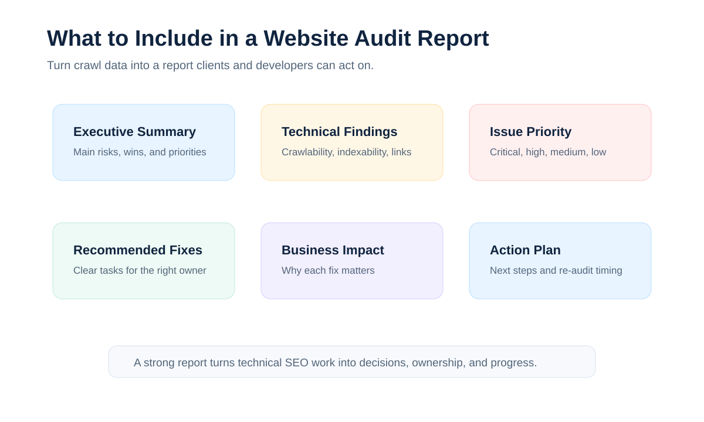

# Website Audit Report: What to Include for Clients

A website audit report is a client-ready document that explains what is wrong with a website, why those issues matter, and what should be fixed next. For agencies, the report is just as important as the crawl itself because it turns technical SEO work into clear business action.

The search intent for "website audit report" is informational with template intent. Searchers usually want to know what sections to include, how to structure findings, and how to make a report useful for clients, developers, and internal marketing teams.

This guide explains what a strong website audit report should include. For the broader reporting cluster, see our guide to [SEO audit reporting](/seo-audit-reporting/). If you need a reusable format, pair this with an [SEO audit report template](/seo-audit-report-template/).

### Common question: What should a website audit report include?

A client-ready report should include the scope and data date, an executive summary, evidence-backed findings, priority levels, affected URLs or templates, recommended fixes, owners, acceptance criteria, and a validation plan. Add performance, content, accessibility, or conversion sections only when they are in scope and supported by evidence.

## What Is a Website Audit Report?

A website audit report summarizes the health of a website and provides recommendations for improving SEO performance, crawlability, indexability, user experience, and technical quality.

For agencies, a report has two jobs:

1. Help the client understand the biggest SEO risks and opportunities.
2. Give developers, content teams, and SEO teams enough detail to fix the problems.

The best reports avoid two extremes. They are not vague executive summaries with no implementation detail, and they are not overwhelming technical exports with no prioritization.

## Website Audit Report Sections

| Section | Purpose |
|---|---|
| Executive summary | Show the most important findings and business impact |
| Audit scope | Clarify what was reviewed and what was excluded |
| Website health overview | Summarize site quality and priority issue counts |
| Technical SEO findings | Explain crawlability, indexability, status code, canonical, and sitemap issues |
| On-page SEO findings | Review titles, descriptions, headings, content, and internal links |
| Priority recommendations | Rank fixes by impact and effort |
| Implementation plan | Assign owners and next steps |
| Validation plan | Explain how fixes will be checked after implementation |

## 1. Executive Summary

The executive summary should give clients the short version before they see the details.

This section should answer:

- What is the overall condition of the website?
- What are the biggest SEO risks?
- What fixes should happen first?
- What business outcome could improve if the fixes are completed?
- What does the agency recommend for the next 30 to 90 days?

Keep the executive summary plain and direct. A client should be able to read it without understanding crawl depth, canonical tags, or indexation directives.

## 2. Audit Scope

The audit scope protects the agency and the client from confusion.

Include:

- Domain and subdomains audited
- Crawl date
- Crawl limits or exclusions
- Tools used
- Data sources reviewed
- Whether staging, international, ecommerce, or blog sections were included
- Known limitations

For example, if the audit reviewed only the main website and not a separate help center, say that clearly. If JavaScript rendering was not included, mention it. Good scope notes make the report more trustworthy.

## 3. Website Health Overview

A website health overview gives clients a quick sense of scale.

You can include:

- Total URLs crawled
- Indexable vs non-indexable URLs
- Number of critical issues
- Number of high, medium, and low priority issues
- Broken links found
- Redirect issues found
- Duplicate metadata counts
- Sitemap and robots.txt status

This is where CrawlBeast can help agencies convert crawl data into a clearer reporting workflow. Instead of manually pulling numbers from separate files, teams can use CrawlBeast to collect technical SEO findings and shape them into report-ready insights.

### Use statistics as evidence, not decoration

Include counts and percentages when they help the client understand scale: for example, the number of affected URLs, the share of indexable pages with duplicate titles, or the percentage of sitemap entries returning redirects. Every number should show its source, crawl date, URL scope, and calculation method. Never fill a chart with invented benchmarks or use a health score whose formula the client cannot inspect.

For performance reports, use field data where available and explain the device mix and coverage. Google's [Core Web Vitals guidance](https://web.dev/articles/vitals) defines the current benchmark thresholds; the [Core Web Vitals benchmark visual](images/seo-audit-core-web-vitals-benchmarks.svg) can be reused when the report includes performance findings.

## 4. Technical SEO Findings

Technical SEO findings are the core of most website audit reports.

This section should not just list issues. It should explain what each issue means, why it matters, where it appears, and what fix is recommended.

Common findings include:

- Broken internal links
- 404 and 5xx errors
- Redirect chains
- Incorrect canonical tags
- Noindex conflicts
- Robots.txt blocking important pages
- XML sitemap issues
- Duplicate title tags
- Duplicate meta descriptions
- Missing H1 tags
- Crawl depth problems
- Orphan pages

For a broader issue library, link the report to your [technical SEO issues](/technical-seo-issues/) hub so clients and team members can understand each issue in more depth.

## 5. On-Page SEO Findings

On-page findings help clients understand how individual pages and templates can perform better in search.

Review:

- Page titles
- Meta descriptions
- H1 and heading structure
- Thin or duplicate content
- Internal links
- Image alt text
- URL structure
- Content alignment with search intent

This section should group problems by pattern when possible. For example, "All service pages use the same meta description" is more useful than listing 40 separate URLs without explanation.

## 6. Priority Recommendations

The recommendation section is where the audit becomes useful.

Each recommendation should include:

- Issue
- Why it matters
- Affected URLs or templates
- Priority level
- Recommended fix
- Owner
- Effort estimate

Agencies should avoid marking everything as critical. A good priority system helps clients make decisions.

Example priority levels:

| Priority | Meaning |
|---|---|
| Critical | Blocks crawling, indexing, traffic, or key conversion pages |
| High | Affects important templates or many valuable URLs |
| Medium | Should be fixed, but does not block the highest-value pages |
| Low | Cleanup or best-practice improvement |

For recurring client communication, this section can feed directly into a [client SEO report](/client-seo-report/) or monthly implementation tracker.

### Recommended finding format

Use the same compact structure for every important issue:

| Field | Example |
|---|---|
| Finding | Canonical tags on product pages point to category URLs |
| Evidence | 184 of 1,240 product URLs in the crawl |
| Why it matters | Search engines may consolidate signals away from the intended pages |
| Recommendation | Generate self-referencing canonicals for indexable product URLs |
| Owner | Developer |
| Priority | High |
| Acceptance criteria | Re-crawl confirms the intended canonical on all in-scope templates |

This format makes the report useful to executives, SEOs, and developers without forcing every reader through the raw export.

## 7. Implementation Plan

A website audit report should make next steps obvious.

Include a simple action plan:

| Task | Owner | Priority | Notes |
|---|---|---|---|
| Fix redirect chains on service pages | Developer | High | Update internal links to final URLs |
| Rewrite duplicate title tags on product pages | Content team | High | Use unique category and product attributes |
| Remove noindex from priority landing pages | Developer or CMS owner | Critical | Confirm pages should be indexable first |
| Update XML sitemap | SEO or developer | Medium | Include only canonical indexable URLs |

This keeps the report from becoming a passive document. The client knows what needs approval, and the agency knows what to track.

## 8. Validation and Follow-Up

After fixes are implemented, the agency should validate the changes.

Validation usually includes:

- Re-crawling affected sections
- Checking whether errors disappeared
- Confirming important pages are crawlable and indexable
- Reviewing Google Search Console after Google recrawls the site
- Updating the client on completed fixes

This connects the report back to the broader [SEO audit workflow](/seo-audit-workflow/) and helps agencies show progress over time.

### Common question: How long should a website audit report be?

Long enough to support the decisions and implementation, but not so long that the priorities disappear. A short executive report with a linked technical appendix is often better than one giant document. The right length depends on site size, audit scope, number of templates, and the people who must approve or implement the work.

## Website Audit Report vs Technical SEO Report

A website audit report is usually broader than a [technical SEO report](/technical-seo-report/).

A technical SEO report focuses mainly on crawlability, indexability, site architecture, metadata, canonicals, status codes, redirects, structured data, and similar technical issues.

A website audit report may include those technical findings plus on-page SEO, content quality, user experience notes, conversion issues, and business recommendations.

For agencies, the right format depends on the client. A technical SEO retainer may need a detailed technical report. A small business client may need a simpler website audit report with plain-language priorities.

## How Agencies Create Website Audit Reports

Most agencies follow a process similar to this:

1. Confirm the audit scope
2. Crawl the website
3. Review technical and on-page findings
4. Prioritize issues by impact
5. Create a client-friendly report
6. Assign recommendations to owners
7. Re-crawl after implementation

For the full process, see our guide on [how agencies perform SEO audits](/how-agencies-perform-seo-audits/).

Tools like CrawlBeast help agencies with the crawling and technical issue detection part of this process. That matters because a report is only as strong as the audit data behind it.

## Common Website Audit Report Mistakes

### Too Much Data, Not Enough Meaning

Clients do not need every raw crawl row. They need the most important findings, explained in a way they can approve.

### No Prioritization

If every issue has the same priority, the client does not know where to begin.

### No Ownership

Recommendations should say who needs to act: developer, content team, SEO team, or client.

### No Follow-Up Plan

Reports should include a validation plan so the agency can confirm fixes and show progress.

### Weak Internal Linking Between SEO Assets

If your site has related guides, reports, templates, and software pages, connect them. A report-focused article should naturally link to the [SEO audit tool for agencies](/seo-audit-tool-for-agencies/) page, workflow pages, reporting templates, and related issue guides.

## Questions Clients Usually Ask

### What is the difference between a website audit and an SEO audit?

A website audit can cover broader concerns such as usability, accessibility, security, analytics, and conversion paths. An SEO audit focuses on discoverability, crawlability, indexability, search appearance, content alignment, internal links, performance, and authority. Define the scope so the client knows which questions the report does and does not answer.

### Should every issue found by a crawler appear in the main report?

No. Include findings that affect the agreed scope, explain a meaningful risk or opportunity, or help the client make a decision. Put low-impact observations and complete URL exports in an appendix or backlog. Filtering is part of the agency's value.

### Can AI generate a website audit report?

AI can help group similar rows, summarize evidence, and draft plain-language explanations. It should not invent counts, infer business impact without context, or publish recommendations without human verification. Follow Google's [generative AI content guidance](https://developers.google.com/search/docs/fundamentals/using-gen-ai-content) and preserve the underlying evidence for review.

For a visual explanation of crawling, indexing, and Search Console topics, use a relevant current video from the [Google Search Central YouTube channel](https://www.youtube.com/@GoogleSearchCentral). Add a specific embed only when it supports the surrounding section and is still accurate.

## Final Recommendation

A strong website audit report makes technical SEO understandable and actionable. It should include an executive summary, scope, health overview, technical findings, on-page findings, prioritized recommendations, an implementation plan, and a validation process.

CrawlBeast helps agencies create better website audit reports by supporting technical website crawling, issue detection, and repeatable audit workflows. Use it with a clear reporting structure, and your client reports become easier to explain, approve, and act on.

## Sources and Editorial Notes

- [Google Search Essentials](https://developers.google.com/search/docs/essentials)
- [Creating helpful, reliable, people-first content](https://developers.google.com/search/docs/fundamentals/creating-helpful-content)
- [Google's guidance on generative AI content](https://developers.google.com/search/docs/fundamentals/using-gen-ai-content)
- [Google Search visual elements gallery](https://developers.google.com/search/docs/appearance/visual-elements-gallery)
- [Core Web Vitals](https://web.dev/articles/vitals)
