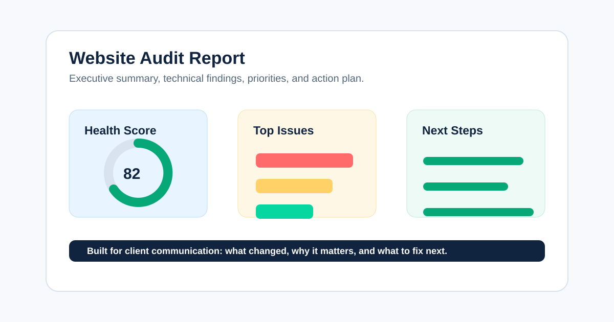
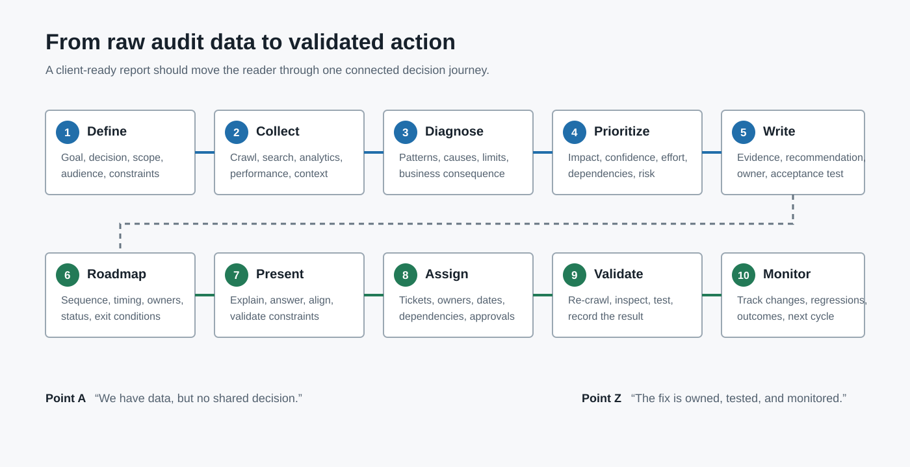

# Website Audit Report: Template, Examples, and Client Delivery Guide



A website audit report is a decision document that turns website evidence into prioritized actions. It should tell the reader what was reviewed, what matters most, why it matters, who should fix it, and how the team will confirm the fix worked.

That is what people searching for a “website audit report” usually need: not another list of checks, but a usable structure they can take from raw crawl data to an approved implementation plan.

This guide takes you through the complete journey. By the end, you will have:

- A report structure you can copy
- A repeatable format for every finding
- A practical prioritization model
- Examples of executive and technical writing
- A client-presentation and handoff checklist
- A validation process for proving the work was completed

If you need the broader process before writing the deliverable, see [how agencies perform SEO audits](/how-agencies-perform-seo-audits/). For recurring client communication after the audit, use the [SEO audit reporting](/seo-audit-reporting/) guide.

## What Should a Website Audit Report Include?

A client-ready website audit report should include:

1. Audit objective, scope, date, tools, data sources, and limitations
2. Executive summary with the most important decisions
3. Website baseline and evidence overview
4. Technical, content, performance, and other in-scope findings
5. Prioritized recommendations with affected URLs or templates
6. Owners, effort, dependencies, and acceptance criteria
7. A 30-, 60-, or 90-day implementation roadmap
8. A validation and monitoring plan
9. An appendix containing supporting exports and methodology

The report should move from **context to evidence to action**. Readers should not have to translate a crawler export into business decisions themselves.



## Before You Write: Define the Decision the Report Must Support

Start with the reason the audit exists. A report written for a migration approval should look different from one investigating a traffic drop or preparing a quarterly roadmap.

Write one sentence:

> This report will help [stakeholder] decide [decision] by showing [evidence and priorities].

Examples:

- This report will help the marketing director approve the next quarter's technical SEO roadmap.
- This report will help the development team prevent crawl and indexation regressions before migration.
- This report will help the founder understand why priority service pages have lost organic visibility.

This first sentence is a filter. If a finding does not support the decision, place it in the appendix or backlog rather than letting it bury the main story.

Patrick Stox, Product Advisor at Ahrefs, gives useful client-audit advice:

> “If clients are coming to you asking for an audit, they already have a pain point. Talk to them.”

The practical lesson is simple: begin with the client's pain point, not the tool's default issue list. [Read the original advice in Ahrefs' SEO audit template guide](https://ahrefs.com/blog/seo-audit-template/).

## Step 1: Collect Evidence and Record Its Limits

Before drafting conclusions, create an evidence register. A crawler shows what it discovered under its configuration; it does not prove every page is indexed, receives traffic, or contributes to conversions.

| Evidence source | What it helps establish | Limitation to record |
|---|---|---|
| Website crawl | Responses, links, directives, metadata, canonicals, depth, and patterns | Crawl settings, rendering, authentication, exclusions, and crawl date |
| Google Search Console | Search performance, indexing signals, sitemaps, and manual actions | Sampled or delayed data and property access |
| Analytics | Landing-page behavior, conversions, and business value | Tracking quality, attribution, consent, and date range |
| PageSpeed Insights / CrUX | Field performance and Core Web Vitals where data exists | Coverage, device segment, and origin- vs URL-level data |
| XML sitemaps and robots.txt | Declared discovery and crawl controls | Files show directives, not guaranteed indexing |
| Backlink platform | Link discovery, referring domains, and authority context | Vendor indexes and metrics differ |
| Client interviews and release log | Goals, constraints, incidents, and implementation history | Stakeholder memory and incomplete documentation |

At the start of the report, state:

- Domain, subdomains, protocols, markets, and devices reviewed
- Audit and data date ranges
- Crawl configuration and URL limits
- Included and excluded site sections
- Access you received and data you could not inspect
- Recent migrations, redesigns, releases, or tracking changes
- Whether recommendations cover SEO only or also content, UX, accessibility, analytics, and conversion

Transparent limits increase trust. “Not evaluated” is different from “no issue found.”

## Step 2: Choose the Right Report Format

The best report is usually a small system of connected deliverables, not one enormous PDF.

| Deliverable | Audience | Purpose |
|---|---|---|
| One-page executive summary | Founder, CMO, marketing lead | Decisions, risk, opportunity, investment, and next steps |
| Prioritized recommendations | SEO lead, project manager, department heads | Shared roadmap, sequencing, ownership, and status |
| Detailed finding pages | SEO, developers, content, analytics | Evidence, affected patterns, fix instructions, and acceptance tests |
| URL-level appendix | Implementers and analysts | Complete affected URL lists and exports |
| Presentation or recorded walkthrough | Mixed stakeholders | Alignment, questions, constraints, and approval |

A small-business audit may combine these into one document. A complex client may need separate views for executives, developers, and content teams. Keep one source of truth for statuses and owners so the documents do not drift.

### Website audit report vs. technical SEO report

A [technical SEO report](/technical-seo-report/) focuses on crawlability, indexability, rendering, site architecture, status codes, directives, canonicals, structured data, and performance.

A website audit report can be broader. Depending on scope, it may also cover content quality, search intent, accessibility, analytics, conversion paths, security, or competitor context. Name the report accurately so stakeholders do not assume an SEO-only review covered areas it did not evaluate.

## Step 3: Write the Executive Summary Last

Place the executive summary first, but write it after the evidence and recommendations are complete. It should be the clearest version of the report, not a vague introduction.

Answer five questions:

1. Why was the audit conducted?
2. What is the overall diagnosis?
3. Which three to five findings matter most?
4. What should happen in the next 30 to 90 days?
5. What result or risk will the plan address?

### Weak executive summary

> The audit identified several technical and on-page SEO opportunities. We recommend resolving the critical issues and continuing to monitor performance.

This could describe almost any website. It gives the client no decision.

### Stronger executive summary

> The audit found that the site's main service pages are crawlable, but two template-level problems limit their search visibility: incorrect canonicals across the service directory and internal links that resolve through redirects. Fix the canonical template first, update navigation links second, and re-crawl the directory before beginning page-level metadata work.

The stronger version identifies the affected area, sequence, and next validation step. If you cannot connect a finding to evidence, consequence, or action, it is not ready for the executive summary.

## Step 4: Build a Baseline Without Creating False Precision

The website health overview helps readers understand scale. Include only numbers that change the interpretation or priority.

Useful baseline measures can include:

- URLs crawled and in-scope templates
- Indexable and non-indexable URL counts
- Priority landing pages receiving impressions, clicks, or conversions
- Critical, high, medium, and low findings
- Broken internal links and affected destinations
- Sitemap entries returning non-200 responses
- Duplicate metadata patterns by template
- Core Web Vitals field-data status
- Open, resolved, and regressed findings from a previous audit

Every statistic should show its source, date, scope, and calculation. Label tool scores as tool-specific indicators, not objective measures of SEO success.

For performance reporting, use field data where available. Google's [Core Web Vitals guidance](https://web.dev/articles/vitals) provides current thresholds, and this [Core Web Vitals benchmark visual](images/seo-audit-core-web-vitals-benchmarks.svg) can support a performance section. Explain what the numbers mean for the audited templates instead of dropping a generic chart into the report.

## Step 5: Document Every Finding in One Repeatable Format

Each important finding should work as a self-contained brief. A developer should understand what to change; a manager should understand why it deserves resources.

### Copyable finding template

```markdown
## [Finding title written as a specific problem]

**Priority:** [Critical / High / Medium / Low]
**Affected area:** [Template, folder, or representative URLs]
**Owner:** [Development / Content / SEO / Analytics / Client]
**Effort:** [Small / Medium / Large, with assumptions]

### What we found
[Direct description of the observed condition.]

### Evidence
[Counts, percentages, screenshots, crawl filters, queries, and example URLs.]

### Why it matters
[Likely search, user, measurement, or business consequence. Separate fact from hypothesis.]

### Recommended action
[Specific implementation instructions.]

### Dependencies and risks
[Platform constraints, approvals, sequencing, or possible side effects.]

### Acceptance criteria
[The test that proves the recommendation was implemented correctly.]
```

### Example finding

| Field | Illustrative example |
|---|---|
| Finding | Product canonicals point to category URLs |
| Evidence | 184 of 1,240 in-scope product URLs in the dated crawl |
| Why it matters | Search engines may consolidate signals away from intended product pages |
| Recommendation | Generate self-referencing canonicals for indexable product URLs |
| Owner | Development |
| Priority | High |
| Dependency | Confirm faceted and discontinued-product rules first |
| Acceptance criteria | Re-crawl shows the intended canonical on every in-scope product template |

The numbers above are illustrative. Replace them with verified client data and link the affected URL export.

For a larger issue library, connect findings to the [technical SEO issues](/technical-seo-issues/) hub rather than repeating a full textbook explanation inside every report.

## Step 6: Organize Findings Around the Client's Site

Do not force every client into the same generic order. Lead with the highest-priority problem, then group supporting findings in a structure the implementation teams understand.

Common workstreams include:

### Crawlability and indexability

Cover robots.txt, noindex directives, responses, canonicals, sitemaps, rendering, discovery, and Google indexing evidence. Distinguish what the crawl observed from what Search Console reports.

### Site architecture and internal linking

Show orphan pages, crawl depth, redirecting internal links, navigation gaps, and weak connections between hubs and priority pages. Use diagrams or annotated crawl paths when relationships are difficult to understand.

### Templates and on-page signals

Group title, meta description, heading, canonical, structured-data, and duplication issues by template. A template-level recommendation is usually more useful than dozens of repeated page notes.

### Content and search intent

Identify overlapping pages, outdated content, missing decision information, thin sections, and pages attracting the wrong intent. Apply Google's [people-first content guidance](https://developers.google.com/search/docs/fundamentals/creating-helpful-content) when evaluating usefulness and originality.

### Performance and user experience

Show field data, affected templates, likely causes, business context, and the validation method. Do not imply that passing a lab test guarantees rankings or conversions.

### Authority and competitive context

Add backlink, brand, and competitor analysis only when it supports the audit objective. Keep third-party metrics transparent and avoid treating proprietary authority scores as Google metrics.

## Step 7: Prioritize What Gets Implemented

Prioritization is where a report becomes strategy. Consider:

- Business importance of the affected pages
- Search and user impact
- Number and type of affected URLs
- Confidence in the diagnosis
- Implementation effort and platform constraints
- Dependencies and release windows
- Risk of making the change
- Whether the recommendation unlocks later work

Aleyda Solís frames the outcome well:

> “The actual goal of the SEO audit is ... to be the driver of your SEO process.”

Her broader guidance emphasizes context, business importance, implementation difficulty, resources, and stakeholder validation. [Listen to the SEO audits deep dive with Aleyda Solís](https://withcandour.co.uk/podcast/episode-46-seo-audits-deep-dive-with-aleyda-solis).

Use a simple impact-effort view:

| Priority | Typical decision |
|---|---|
| Critical | Resolve an active blocker or severe risk immediately |
| High | Schedule high-impact, high-confidence work in the next feasible sprint |
| Medium | Implement after blockers or alongside related template work |
| Low | Keep as cleanup, monitor, or reconsider when constraints change |

Do not copy tool severity blindly. Validate the priority with the client because a technically simple recommendation may be difficult in their CMS, governance process, or release schedule.

## Step 8: Turn Recommendations Into a Roadmap

The roadmap should bridge the audit document and project management.

| Timeframe | Objective | Example work | Exit condition |
|---|---|---|---|
| Days 0–30 | Remove blockers and validate measurement | Indexation directives, broken priority paths, analytics defects | Critical fixes verified in production |
| Days 31–60 | Correct scalable template and architecture problems | Canonicals, metadata patterns, internal links, sitemap logic | In-scope templates pass acceptance tests |
| Days 61–90 | Improve content and opportunity areas | Intent alignment, content consolidation, supporting hubs | Updated pages published and baseline monitoring active |
| Ongoing | Prevent regression and measure change | Scheduled crawls, Search Console review, issue log | New and regressed findings assigned |

Add an owner, due date, dependency, status, and validation method to every approved task. For recurring client updates, move the roadmap into the [client SEO report](/client-seo-report/) rather than resending the full audit every month.

## Step 9: Present the Report, Do Not Just Email It

Walk stakeholders through the report live or with a recorded presentation. Start with the decision and top priorities, not the crawl methodology.

Recommended presentation flow:

1. Restate the audit goal and scope.
2. Explain the overall diagnosis in plain language.
3. Review the three to five highest-priority findings.
4. Show one piece of evidence for each.
5. Confirm business and technical constraints.
6. Agree on priority, owner, and timing.
7. Define the first validation checkpoint.
8. Record decisions and unresolved questions.

Different teams may need different views. Executives need impact and investment; developers need implementation detail and acceptance criteria; content teams need page patterns and examples.

### Related video: SEO audit template walkthrough

This Ahrefs walkthrough complements the written process by demonstrating how an audit template is used from crawl through checklist and follow-up.

<iframe
  width="560"
  height="315"
  src="https://www.youtube.com/embed/9-mOukMWtFQ"
  title="Ahrefs SEO audit template video walkthrough"
  frameborder="0"
  allow="accelerometer; autoplay; clipboard-write; encrypted-media; gyroscope; picture-in-picture; web-share"
  allowfullscreen>
</iframe>

[Watch the SEO audit template walkthrough on YouTube](https://www.youtube.com/watch?v=9-mOukMWtFQ).

The video uses Ahrefs, but the reporting principle is tool-independent: collect reliable evidence, focus on meaningful issues, follow a repeatable structure, and continue monitoring after implementation.

## Step 10: Validate Every Completed Fix

An approved recommendation is not a completed recommendation. Re-crawl and inspect production after implementation.

Validation can include:

- Re-crawling the affected URLs or templates
- Testing response, directive, canonical, and internal-link changes
- Confirming sitemap output
- Inspecting rendered HTML where JavaScript is involved
- Checking analytics and conversion events
- Reviewing Search Console after recrawling or reprocessing
- Comparing field performance after enough data accumulates
- Recording partial fixes, regressions, and unexpected side effects

Keep the original evidence, implementation date, validation result, and reviewer in the issue log. This creates a defensible history and makes the next audit faster.

## How CrawlBeast Fits Into the Reporting Journey

CrawlBeast supports the evidence and prioritization stages of a technical website audit. Agencies can use its local, privacy-first desktop workflow to crawl client sites, review technical issues, manage multiple projects, and turn high-priority findings into clearer developer and client handoffs.

The tool does not replace business context, Search Console, analytics, stakeholder interviews, or human judgment. Its role is to reduce the time spent sorting crawl data so the agency can spend more time validating, explaining, and sequencing the work.

If you are still choosing the collection layer, compare approaches in the [SEO audit tool for agencies](/seo-audit-tool-for-agencies/) guide. Then connect it to a documented [SEO audit workflow](/seo-audit-workflow/) so the same baseline is applied across clients.

## Website Audit Report Quality Checklist

Before delivery, confirm:

- The opening matches the real informational and template-seeking intent.
- The report takes the reader from audit objective to validated implementation.
- Scope, dates, evidence sources, exclusions, and limitations are visible.
- The executive summary contains decisions, not generic observations.
- Every major finding includes evidence, consequence, action, owner, and acceptance criteria.
- Statistics show source, date, scope, and method.
- Facts, hypotheses, vendor metrics, and recommendations are clearly separated.
- Recommendations are prioritized by client context, not only tool severity.
- The client receives a roadmap and a first next action.
- Expert quotes add a decision principle and link to the original source.
- The video directly supports the surrounding step and does not replace written instructions.
- Visuals help the reader understand a process, dataset, or decision.
- Internal links help the reader continue the task.
- CrawlBeast is included where it helps, without overstating what crawl data proves.
- The validation plan defines how the team will know each fix worked.

## Common Questions

### How long should a website audit report be?

Long enough to support decisions and implementation, but no longer. A concise executive summary, prioritized action table, detailed finding pages, and linked appendix often work better than one large document. Site size, scope, templates, and stakeholder needs determine the final length.

### Should every crawler issue appear in the report?

No. Include findings that affect the agreed objective, create meaningful risk or opportunity, or support a decision. Put low-impact observations and complete URL exports in the appendix or backlog. Filtering and prioritization are part of the auditor's value.

### Can AI generate a website audit report?

AI can help group rows, summarize verified evidence, and draft explanations. It should not invent counts, infer business impact without context, or publish recommendations without human review. Follow Google's [generative AI content guidance](https://developers.google.com/search/docs/fundamentals/using-gen-ai-content) and keep the source evidence available.

### What format should a website audit report use?

Use the format that fits the audience and workflow. Google Docs or Word suit narrative findings, Sheets or project tools suit status tracking, Slides suit stakeholder presentations, and PDF suits a fixed final copy. Many agencies use more than one connected format.

### How often should the report be updated?

Treat the audit as a baseline and update the recommendation tracker as work progresses. Run new checks after major releases, migrations, or incidents, and schedule monitoring according to the site's change rate and risk.

## Final Recommendation

A useful website audit report does more than describe a website. It takes the client from uncertainty to an agreed plan: define the decision, collect bounded evidence, explain the diagnosis, prioritize the work, assign owners, present the recommendations, and validate every completed fix.

Use CrawlBeast to make the technical evidence layer faster and more consistent, then apply the template and quality checklist above to turn those findings into work clients can understand, approve, and complete.

## Sources and Further Reading

- [Ahrefs: Free SEO Audit Template with Video Walkthrough](https://ahrefs.com/blog/seo-audit-template/)
- [Aleyda Solís on actionable SEO audits](https://withcandour.co.uk/podcast/episode-46-seo-audits-deep-dive-with-aleyda-solis)
- [Google Search Essentials](https://developers.google.com/search/docs/essentials)
- [Creating helpful, reliable, people-first content](https://developers.google.com/search/docs/fundamentals/creating-helpful-content)
- [Google's guidance on generative AI content](https://developers.google.com/search/docs/fundamentals/using-gen-ai-content)
- [Google Search visual elements gallery](https://developers.google.com/search/docs/appearance/visual-elements-gallery)
- [Core Web Vitals](https://web.dev/articles/vitals)
