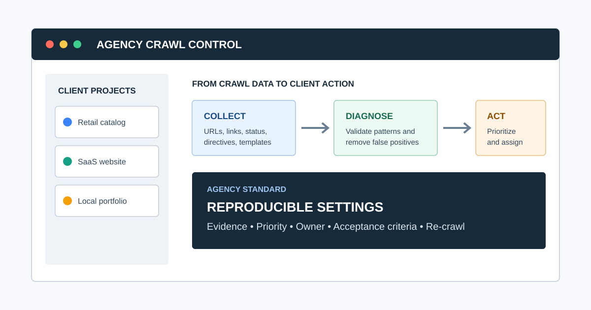
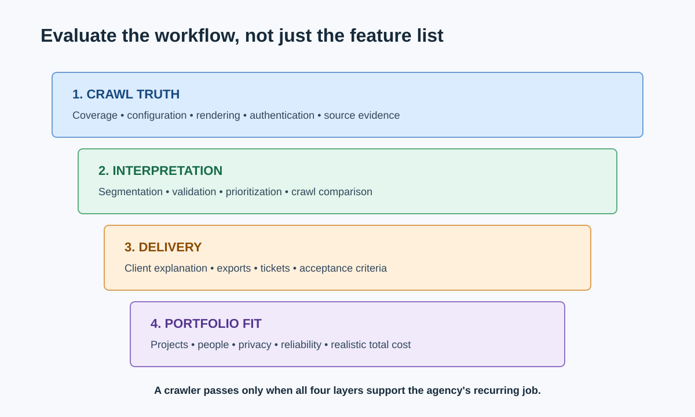
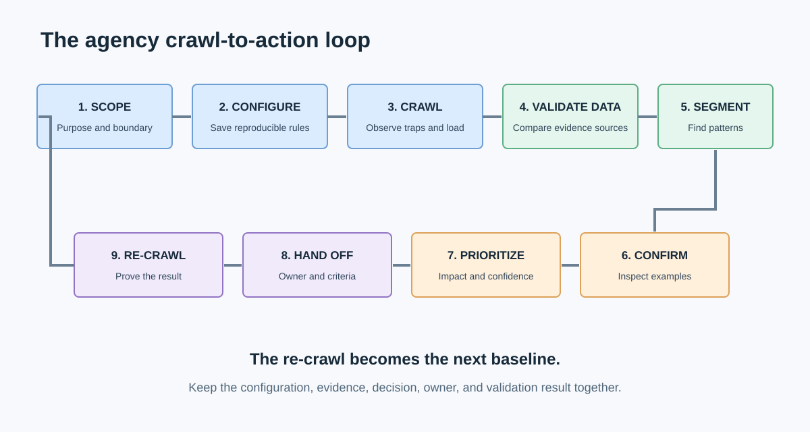

# Website Crawler for Agencies: How to Choose and Test One



A website crawler for agencies should do more than collect URLs. It should let a team crawl different client sites consistently, preserve the evidence behind each finding, prioritize issues, and turn the results into work that a client or developer can approve.

The best choice depends on the job. A technical specialist investigating JavaScript rendering needs different controls from an account team running monthly health checks across 30 local-business sites. This guide takes you from vague feature comparison to a tested agency crawler standard.

By the end, you will have:

- A requirements brief based on client work, not a generic feature list
- A shortlist of suitable desktop, cloud, and enterprise crawlers
- A representative-site trial protocol
- A scoring model for coverage, usability, reporting, and cost
- A repeatable crawl-to-report operating process

For the broader category, start with [website crawling](/website-crawling/). If you are comparing complete audit platforms rather than crawler capabilities, see the [best SEO audit tools for agencies](/best-seo-audit-tool-for-agencies/).

## What Is a Website Crawler for Agencies?

An agency website crawler is software that follows links across a client website and records technical and on-page signals at scale. Typical crawl data includes URLs, status codes, redirect targets, internal links, crawl depth, canonicals, indexability directives, titles, descriptions, headings, images, and structured data.

Agency use adds another layer. The crawler must also support repeatability across clients, reusable configurations, project separation, exports or reports, crawl comparisons, and a practical handoff from detected issue to assigned fix.

### Is a crawler the same as an SEO audit tool?

No. A crawler is an evidence-collection system; an audit is a reasoned diagnosis that can combine crawl data with Google Search Console, analytics, log files, business goals, and human review. Some products combine crawling, prioritization, monitoring, and reporting, but a crawl alone does not prove why traffic changed or what the business should fix first.

This distinction matters because agencies sell decisions, not rows in an export. Our guide to [how agencies perform SEO audits](/how-agencies-perform-seo-audits/) shows where the crawler belongs in the complete process.

## Start With the Agency Job, Not the Longest Feature List

Before evaluating products, write down the recurring work the crawler must support. SEO expert [Patrick Stox](https://patrickstox.com/) offers a concise tool-selection principle:

> “Start with the job.”

That advice comes from his article on [how he chooses SEO tools](https://patrickstox.com/tools/). For an agency, the “job” might be a new-business snapshot, a migration validation, a monthly technical health check, or a deep enterprise investigation. Each requires different crawl limits, controls, evidence, and output.

Use this one-page requirements brief:

```markdown
# Agency Crawler Requirements

Primary jobs:
Typical client site sizes:
Largest realistic site:
Site types and platforms:
JavaScript rendering required:
Authentication or staging access required:
Must-have checks:
Required integrations:
Reporting and export needs:
Number of users and projects:
Data-residency or privacy requirements:
Monitoring frequency:
Budget and pricing preference:
Definition of a successful trial:
```

## Which Capabilities Matter Most to an Agency?



Evaluate capabilities in the order they affect client delivery.

| Capability | Why it matters | Trial question |
|---|---|---|
| Crawl control | Prevents incomplete, unsafe, or irrelevant crawls | Can the team include, exclude, throttle, authenticate, and save settings? |
| Rendering | Reveals links and content created by JavaScript | Can raw and rendered HTML be compared on a JavaScript-heavy client site? |
| Technical coverage | Determines what the crawler can detect | Does it capture responses, redirects, canonicals, directives, metadata, links, and structured data? |
| Source evidence | Makes findings reproducible | Can a reviewer see the affected URL, source page, observed value, and crawl date? |
| Segmentation | Turns site-wide noise into template patterns | Can the team filter by folder, template, indexability, status, depth, or custom field? |
| Prioritization | Helps the agency decide what to fix first | Can severity be adjusted using business importance and affected scale? |
| Comparison | Supports validation and monitoring | Can the agency compare pre-fix and post-fix crawls? |
| Reporting and export | Reduces manual translation | Can findings become client summaries and developer-ready tickets? |
| Project operations | Supports many accounts without mix-ups | Are configurations, crawl histories, access, and projects clearly separated? |
| Cost model | Determines portfolio economics | Does pricing grow by user, project, URL, crawl credit, machine, or data volume? |

Do not treat every detected warning as an SEO defect. Google notes that successful `2xx` responses only make content eligible for processing; they do not guarantee indexing. Likewise, crawler access does not prove Googlebot access. Validate important findings with first-party tools and Google's [Search Essentials](https://developers.google.com/search/docs/essentials).

## Desktop, Cloud, or Enterprise Crawler?

The deployment model changes cost, collaboration, privacy, scheduling, and scale.

| Model | Usually best for | Advantages | Trade-offs to test |
|---|---|---|---|
| Local desktop | Consultants and small-to-mid-sized agencies | Local data, direct control, use of local hardware, predictable on-demand work | Machine resources, unattended scheduling, team sharing |
| Cloud SaaS | Distributed teams and recurring monitoring | Scheduling, shared access, alerts, browser access | Crawl credits, project limits, data location, recurring cost |
| Enterprise platform | Large, complex, governed web programs | Scale, log integrations, monitoring, permissions, support | Procurement, implementation, training, total cost |
| Hybrid stack | Agencies with mixed client needs | Specialized crawler plus broader research and reporting tools | Duplicate data, handoffs, configuration drift |

The right answer can be a stack. A desktop crawler may handle detailed investigations while Google Search Console supplies first-party search evidence and a reporting platform handles client dashboards.

## Agency Website Crawler Shortlist

The following tools represent different operating models. Product capabilities and pricing change, so verify current details on each vendor's site and run the same trial before choosing.

| Tool | Operating model | Strongest agency fit | What to validate |
|---|---|---|---|
| CrawlBeast | Local desktop audit crawler | Multi-project agencies wanting prioritized crawl findings in a modern local workflow | Current release coverage, exports, resource use, and client fit |
| [Screaming Frog SEO Spider](https://www.screamingfrog.co.uk/seo-spider/) | Desktop crawler | Specialists needing granular configuration, extraction, and exports | Learning curve, shared workflows, and interpretation time |
| [Sitebulb](https://sitebulb.com/) | Desktop and cloud | Teams valuing visual explanations and prioritized hints | Desktop/cloud plan fit, audit size, and reporting workflow |
| [Semrush Site Audit](https://www.semrush.com/features/site-audit/) | Cloud suite module | Agencies already running campaigns in Semrush | Project allowances, crawl limits, and suite overlap |
| [Ahrefs Site Audit](https://ahrefs.com/site-audit) | Cloud suite module | Teams connecting technical audits with search and link research | Allowances, custom checks, and monitoring depth |
| [JetOctopus](https://jetoctopus.com/) | Cloud technical SEO platform | Large sites needing crawl, log, and Search Console analysis | Data joins, segmentation, onboarding, and cost |
| [Lumar](https://www.lumar.io/) | Enterprise website intelligence | Governed enterprise programs with monitoring requirements | Implementation effort, integrations, permissions, and procurement |

This is not a universal ranking. The point is to build a plausible shortlist for your requirements. A more detailed category comparison appears in our [agency SEO audit tool guide](/best-seo-audit-tool-for-agencies/).

### Where does CrawlBeast fit?

CrawlBeast is a pre-launch desktop application for Mac and Windows, designed for agencies, marketers, and developers who want local crawling, multiple client projects, and clearer issue prioritization. It checks technical problems such as broken links, status-code errors, missing metadata, duplicate content, orphan pages, and canonical mismatches.

It belongs on a shortlist when privacy-first local processing, a modern dashboard, and a focused crawl-to-action workflow matter. It is not positioned as a distributed solution for multi-million-page enterprise crawling. Because the product is still in development, agencies should test the available release against their own must-have checks rather than assume roadmap features are present.

## How Should an Agency Test a Website Crawler?

Test every shortlisted crawler against the same small portfolio, settings, and expected outputs. A homepage-only demo says little about real client work.

Choose three representative properties:

1. A small brochure or local-business site with known broken links and metadata issues
2. A JavaScript-heavy or ecommerce site with filters, canonicals, and duplicate URL paths
3. A staging or migration sample with redirects, blocked areas, and an expected URL list

Seed each test with known conditions, then record whether the crawler discovers them and provides enough evidence to act. Do not create defects on a live client site; use staging, a controlled sample, or previously verified issues.

### Agency crawler trial scorecard

Score each area from 1 to 5 and attach notes. Weight the score according to the agency brief.

| Area | Suggested weight | Evidence to capture |
|---|---:|---|
| Crawl completeness and accuracy | 25% | Known URLs and conditions found, false positives, exclusions |
| Configuration and rendering | 15% | Setup time, reusable profiles, raw/rendered differences |
| Diagnosis and prioritization | 20% | Pattern grouping, severity controls, source evidence |
| Reporting and handoff | 15% | Export quality, screenshots, ticket fields, client readability |
| Portfolio operations | 10% | Project separation, history, access, naming, comparison |
| Performance and reliability | 10% | Crawl time, resource use, interruption recovery |
| Commercial fit | 5% | Total cost under realistic users, projects, and URLs |

The weighted score is a decision aid, not mathematical truth. Keep written disqualifiers beside it. A tool that cannot access a client's authenticated staging environment should not win because it has attractive reports.

## A Repeatable Crawl-to-Action Workflow



1. **Scope the crawl.** Define the property, purpose, included areas, exclusions, authentication, rendering, user agent, speed, and maximum URLs.
2. **Save the configuration.** Name it by use case and version so another team member can reproduce it.
3. **Run and observe.** Watch for server strain, traps, parameter explosions, unexpected subdomains, and blocked resources.
4. **Validate the dataset.** Compare the crawl with XML sitemaps, Search Console samples, known templates, and priority URLs.
5. **Segment patterns.** Group findings by template, folder, status, indexability, depth, and business importance.
6. **Confirm examples manually.** Inspect representative URLs and rule out intentional behavior or tool limitations.
7. **Prioritize decisions.** Combine impact, affected scale, confidence, effort, and business criticality.
8. **Create the handoff.** State the issue, evidence, recommendation, owner, acceptance criteria, and validation method.
9. **Re-crawl after release.** Confirm the expected change in production and check for side effects.

For the reporting layer, use the structure in our [website audit report guide](/website-audit-report/). For the broader operating model, see the [SEO audit workflow](/seo-audit-workflow/).

## Video: See a Full Website Crawl in Practice

This walkthrough by technical SEO consultant Olga Zarr demonstrates crawl configuration, report interpretation, status codes, canonicals, sitemaps, JavaScript rendering, and exports. Use it to understand the working surface of a crawler before applying the trial scorecard.

<iframe width="560" height="315" src="https://www.youtube.com/embed/F14DTimTUDI" title="How to crawl a site with Screaming Frog SEO Spider" loading="lazy" frameborder="0" allow="accelerometer; autoplay; clipboard-write; encrypted-media; gyroscope; picture-in-picture; web-share" allowfullscreen></iframe>

[Watch the website crawling tutorial on YouTube](https://www.youtube.com/watch?v=F14DTimTUDI).

## Common Questions Agencies Ask Before Choosing

### How many URLs should an agency crawler handle?

It should comfortably handle the largest site you realistically serve, including non-HTML resources and duplicate URL paths the crawler may discover. Test with a representative site rather than using the client's published page count; parameters, pagination, media, and redirects can make the crawl space much larger.

### Should an agency use one crawler for every client?

Use one standard crawler when it covers most recurring work and improves training, consistency, and templates. Keep specialist tools for requirements the standard cannot satisfy, such as large-scale log analysis, advanced JavaScript investigations, or enterprise monitoring. Document when the exception applies.

### Can a crawler replace Google Search Console?

No. A crawler shows what it discovered under a chosen configuration. Search Console shows Google-specific search and indexing evidence for a verified property. Use both when deciding whether a crawl finding affects visibility.

### How often should agencies crawl client websites?

Match frequency to change risk. Crawl after migrations and major releases, more often for frequently changing ecommerce or publisher sites, and on an agreed cadence for stable properties. The trigger and comparison baseline matter more than an arbitrary weekly schedule.

## Final Selection Checklist

Choose the crawler only when you can answer yes to the following:

- It completes the agency's priority jobs on representative sites.
- Its crawl settings can be saved, explained, and reproduced.
- It captures enough source evidence to validate findings.
- It handles the required rendering, authentication, and site scale.
- It groups issues into patterns rather than only isolated URLs.
- It supports clear client and developer handoffs.
- Its project, user, privacy, and pricing model fits the portfolio.
- The team can re-crawl and prove that implemented fixes worked.
- Known limitations and specialist-tool exceptions are documented.

The best website crawler for an agency is the one that survives this test and shortens the path from client question to verified action. CrawlBeast is one option for agencies that want a local, privacy-first, multi-project workflow with prioritized technical findings. Trial it alongside the strongest alternative for your requirements, then standardize the configuration, evidence, and handoff that produced the better result.
