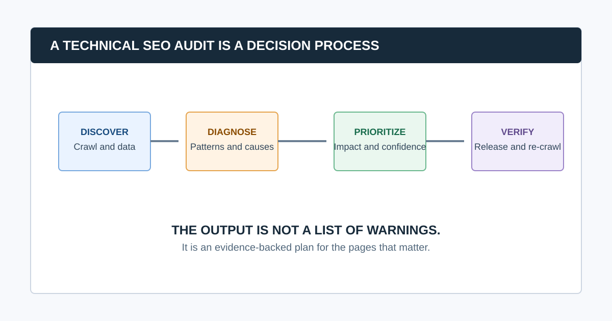

# What Is a Technical SEO Audit? Process, Scope, and Output

A technical SEO audit is a structured review of how search engines and users access, crawl, render, understand, and use a website. It examines technical signals such as responses, redirects, robots rules, sitemaps, canonicals, indexability, internal links, rendering, performance, mobile behavior, and structured data. Its output should be a prioritized, evidence-backed repair plan, not a raw list of warnings.

The audit helps answer a practical question: “What technical conditions are preventing our important pages from being discovered, selected, understood, or used as intended?” It does not guarantee rankings, explain every traffic change, or replace content, product, conversion, link, and market analysis.

## What Does a Technical SEO Audit Include?

| Area | What the audit checks | What it helps diagnose |
|---|---|---|
| Crawlability | Robots rules, responses, URL discovery, crawl paths | Whether a crawler can access important pages |
| Indexability | `noindex`, canonical, sitemap, Search Console evidence | Whether pages are eligible and consistently signaled |
| URL behavior | Redirects, errors, duplicate paths, parameters | Confusing or wasteful URL patterns |
| Architecture | Internal links, depth, navigation, orphan candidates | Whether priority pages can be reached and understood |
| Rendering | Source versus rendered HTML and resources | JavaScript or client-side delivery problems |
| Performance | Field data and diagnostics for priority templates | User-visible delays and layout instability |
| Structured data | Eligibility, validity, and consistency with visible content | Search-enhancement implementation issues |
| Validation | Owners, release checks, re-crawls, monitoring | Whether a fix actually reached production |

Google’s [Search Essentials](https://developers.google.com/search/docs/essentials) describe technical requirements and best practices for eligibility in Search, while making clear that meeting them does not guarantee crawling, indexing, or serving. A technical audit uses that reality to investigate the specific site instead of promising a universal outcome.

## What Is the Difference Between a Technical SEO Audit and a Full SEO Audit?

A technical SEO audit focuses on the website conditions that affect discovery, rendering, indexation, and technical usability. A full SEO audit may add keyword research, intent fit, content quality, backlinks, competitive analysis, conversions, analytics, local SEO, and product strategy.

The categories overlap. A broken internal link is technical, but its business priority depends on where it appears. A technically indexable page may still fail because it does not answer the searcher’s question. Good teams keep the distinction clear so each workstream has the right evidence and owner.

## The Technical SEO Audit Process

### 1. Define the audit question and scope

Start with a business decision, such as diagnosing a traffic drop, validating a migration, preparing a launch, or running a quarterly health check. Record the domain, subdomains, markets, priority templates, conversions, recent changes, access, exclusions, crawl settings, owners, and deadline.

### 2. Establish a dated evidence baseline

Combine crawler data with Search Console, analytics, sitemaps, robots.txt, release history, logs where relevant, and representative live-page checks. A crawler sees one configured view of the site; Search Console provides first-party Google property data; analytics adds business context. Keep dates and limitations with each source.

### 3. Crawl the intended public site

A crawler can collect URL responses, links, metadata, headings, directives, canonicals, crawl depth, and other page signals at scale. Validate the crawl before interpreting it: confirm host, protocol, scope, authentication, rendering, rate limits, URL caps, exclusions, and expected page count.

See our guide to choosing a [website crawler for agencies](/website-crawler-for-agencies/) for a reproducible trial and configuration standard.

### 4. Diagnose technical patterns

Group findings by template, folder, feature, deployment, or system owner. For example, “all filtered collection URLs declare conflicting canonicals” is more useful than 1,500 rows that repeat the same URL-level symptom. Inspect representative examples in source and rendered form before diagnosing cause.

### 5. Prioritize the fixes

Prioritize by impact on critical pages, scale, confidence in the evidence, implementation effort and risk, and urgency. A one-page `noindex` defect on a high-converting template may outrank many minor metadata warnings. Our [technical SEO audit checklist](/technical-seo-audit-checklist/) includes a practical priority model.

### 6. Create owned implementation work

Every recommendation should name the issue, evidence, affected pattern, business impact, owner, recommended behavior, acceptance criteria, and validation method. The audit should make it easier for a developer, CMS owner, or content team to act, not make them decipher an export.

### 7. Validate production results

Test the live URL, inspect headers and rendered output where relevant, re-crawl the affected area, and monitor Search Console over a suitable period. Mark each item fixed, changed, deferred, or unverified. This is the point at which an audit becomes an operating process.

## What Should You Check First?

Check whether important pages can be found, fetched, and remain eligible for indexing before focusing on page-level refinements. A practical order is:

1. Access and crawl scope: hosts, status codes, robots rules, blocked resources, and rendering.
2. Indexation signals: `noindex`, canonicals, redirects, sitemaps, and Search Console evidence.
3. Architecture: internal links, depth, orphan candidates, navigation, and parameter policies.
4. Template and content delivery: titles, headings, images, mobile output, and JavaScript behavior.
5. Performance and structured data: field data, diagnostics, valid markup, and user experience.
6. Ownership and verification: tickets, acceptance criteria, releases, and re-crawls.

### Common question: How long does a technical SEO audit take?

It depends on site size, templates, access, technology, markets, data sources, and implementation depth. A focused small-site audit can take days; a complex enterprise, ecommerce, migration, or international audit may take weeks. Estimate from the questions to answer and the number of systems to validate, not only the URL count.

### Common question: Can a technical SEO audit improve rankings?

It can remove technical obstacles that stop important pages from being discovered, rendered, indexed, or used effectively. It cannot guarantee rankings because search results also depend on content usefulness, search intent, competition, links, and many other signals. Treat audit fixes as evidence-led risk reduction, not a ranking promise.

### Common question: Do I need a crawler for a technical SEO audit?

A crawler is the efficient collection layer for many URL, link, status, metadata, and directive checks. It is not the audit itself. Use it with Search Console, analytics, live-page inspection, and human diagnosis. CrawlBeast is a pre-launch local desktop crawler designed to surface and prioritize recurring technical patterns across projects.

## Video: See the Audit Journey in Practice

This walkthrough demonstrates a compact audit sequence from crawling through prioritization and monitoring. Use it to understand the process, then adapt scope, evidence, and ownership to the actual website.

<iframe width="560" height="315" src="https://www.youtube.com/embed/9-mOukMWtFQ" title="Ahrefs SEO audit template walkthrough" loading="lazy" frameborder="0" allow="accelerometer; autoplay; clipboard-write; encrypted-media; gyroscope; picture-in-picture; web-share" allowfullscreen></iframe>

[Watch the SEO audit walkthrough on YouTube](https://www.youtube.com/watch?v=9-mOukMWtFQ).

## What a Good Technical SEO Audit Delivers

A useful deliverable includes:

- A clear scope, audit question, and known limitations
- A dated evidence set and documented crawl configuration
- Findings grouped by patterns and owners, not only URL rows
- A prioritized roadmap that explains impact, confidence, effort, and risk
- Developer- or owner-ready recommendations with acceptance criteria
- A validation record that shows what changed in production

For a reporting structure, use our [website audit report](/website-audit-report/) guide. To avoid the most common process failures, read [common SEO audit mistakes](/common-seo-audit-mistakes/).

## The Bottom Line

A technical SEO audit is not a hunt for the highest number of warnings. It is a controlled process for collecting technical evidence, identifying the patterns that affect important pages, deciding what deserves action, and proving that the repair worked.

Use CrawlBeast to collect local crawl data and make priority patterns visible, then bring in Search Console, live-page validation, the system owner, and a re-crawl. That is how an audit turns into a reliable path from issue to verified outcome.

## Sources and Further Reading

- Google Search Central: [Google Search Essentials](https://developers.google.com/search/docs/essentials)
- Google Search Central: [Crawling and indexing overview](https://developers.google.com/search/docs/crawling-indexing)
- Google Search Central: [Maintaining your website’s SEO](https://developers.google.com/search/docs/fundamentals/get-started)
- Google Search Central: [Structured data introduction](https://developers.google.com/search/docs/appearance/structured-data/intro-structured-data)
