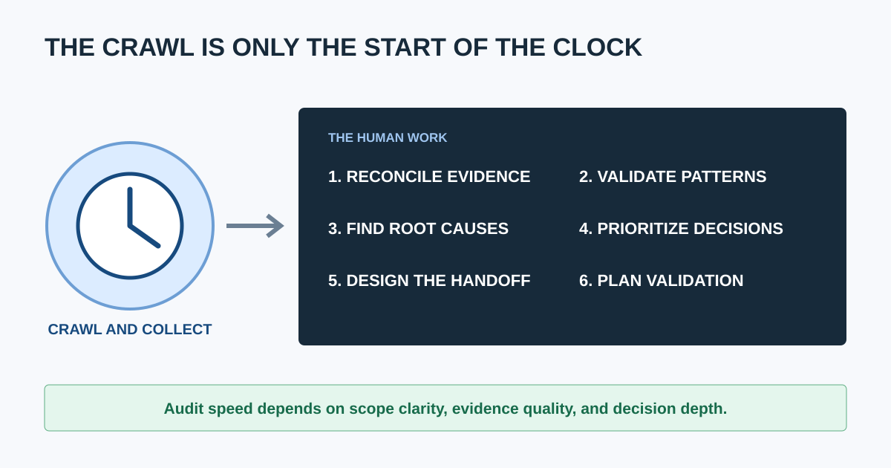
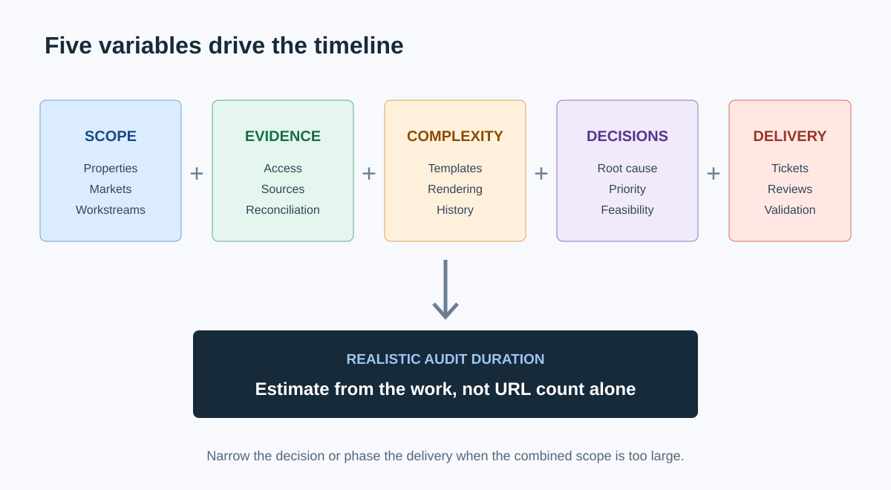
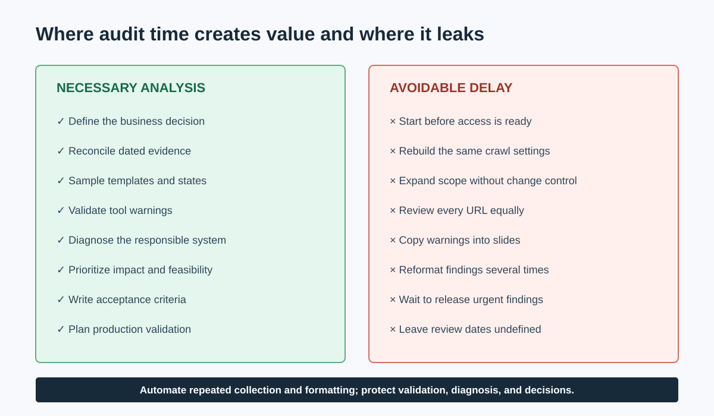

# Why SEO Audits Take So Long (and How to Speed Them Up)

SEO audits take a long time because a trustworthy audit is not one crawl or one exported checklist. The auditor must define the business question, collect compatible evidence, account for different page templates, validate patterns, investigate causes, prioritize by impact and effort, explain the recommendation, and agree on how the fix will be verified.

The crawl may finish in minutes or hours. Deciding what the crawl means can take much longer.

This guide helps clients and agencies separate useful depth from avoidable delay. It also provides a scope model you can use before work begins. For the complete operating sequence, see the [SEO audit workflow](/seo-audit-workflow/) and [how agencies perform SEO audits](/how-agencies-perform-seo-audits/).

## The Short Answer: What Determines SEO Audit Time?

Audit duration is mainly a function of five variables:

| Variable | What makes it grow |
|---|---|
| Scope | More goals, markets, domains, templates, channels, and workstreams |
| Evidence | More data sources, access delays, date ranges, and reconciliation |
| Complexity | JavaScript, parameters, international targeting, migrations, large catalogs, and custom platforms |
| Decision depth | Root-cause analysis, business prioritization, feasibility, and stakeholder alignment |
| Delivery | Examples, tickets, owners, acceptance criteria, presentations, and validation planning |

A focused audit of one suspected indexation problem should be faster than a complete review of a multi-market ecommerce platform. If both are sold with the same checklist, the scope has not been defined well enough.

### How long should an SEO audit take?

There is no defensible universal duration. A bounded diagnostic can take a few working days, while a full audit of a complex site can require several weeks. Estimate from the number of properties, templates, markets, evidence sources, workstreams, and stakeholders, then add time for access, review, and clarification. Site URL count alone is a weak estimator.

## A Crawl Is Fast; an Audit Requires Judgment

A crawler can quickly collect status codes, titles, canonicals, internal links, headings, directives, and other observable signals. It cannot independently establish:

- Why the client commissioned the audit
- Whether a behavior is intentional or defective
- Which pages create business value
- Whether Google indexed or used a URL
- What changed before traffic moved
- Which team owns the underlying system
- Whether the recommended fix is feasible
- What another change might break
- How success should be measured after release

That is why a [website crawler for agencies](/website-crawler-for-agencies/) is evidence infrastructure, not the finished service. The strongest tools reduce collection and sorting work; they do not remove the need for validation and decisions.

## Where the Time Actually Goes

### 1. Scope must be negotiated

“Audit our SEO” can mean a technical health check, traffic-drop investigation, migration review, content audit, local search review, backlink analysis, international audit, or all of them. Time is lost when the project starts before the decision and exclusions are clear.

A good brief identifies:

- The trigger and business decision
- Included properties, templates, markets, and workstreams
- Priority conversions and pages
- Required evidence and access
- Known changes and incidents
- Constraints, stakeholders, deliverables, and deadline
- Explicit exclusions

### 2. Access arrives slowly or incompletely

Search Console, analytics, log files, CMS access, release history, sitemaps, staging, and product data often belong to different people. Waiting for the right property or discovering that analytics broke during a migration creates delay without adding insight.

Prevent this with an access checklist and a deadline before the analysis window begins. Record any missing source as a limitation instead of quietly treating it as a pass.

### 3. Data sources disagree

A crawler may discover a URL that is absent from a sitemap. Search Console may report a canonical different from the declared canonical. Analytics may show conversions on pages with little organic visibility. These are not necessarily errors in the tools; they observe different systems.

The auditor must reconcile dates, URL variants, properties, filters, sampling, rendering, and definitions before drawing a conclusion. This is valuable time because it prevents false causation.

### 4. Large sites contain systems, not just pages

Reviewing every URL manually is usually impossible and unnecessary. The auditor must identify page types and states, sample them intelligently, then test whether a pattern scales.

An [ecommerce SEO audit](/seo-audit-for-ecommerce/), for example, may need separate samples for categories, products, filters, pagination, stock states, markets, and JavaScript behavior. One product page cannot represent that system.

### 5. Tool warnings need validation

Audit tools intentionally flag broad conditions. A canonical difference, long title, noindexed page, redirect, or low word count may be correct in context. Someone must inspect representative URLs, source and rendered output, directives, internal links, and business intent before reporting a defect.

This validation is where expertise saves the client from an impressive-looking list of unnecessary work.

### 6. Root causes cross team boundaries

The visible issue may be “duplicate pages,” while the cause is a faceted-navigation rule, CMS template, product-feed setting, or deployment process. A useful recommendation identifies the system and owner that can prevent recurrence, not only the affected URLs.

### 7. Prioritization is a separate analysis

Tool severity is not business priority. Auditors must combine:

- Search and user impact
- Affected scale
- Commercial importance
- Confidence in the diagnosis
- Implementation effort and risk
- Dependencies and timing

This step takes time because the same technical pattern can be urgent on a revenue template and negligible on an intentionally archived area.

### 8. The report must survive handoff

A recommendation becomes useful when a client or developer can implement and test it. That requires evidence, representative examples, desired behavior, ownership, acceptance criteria, dependencies, and a validation method. Our [website audit report guide](/website-audit-report/) shows how to structure that handoff.

SEO auditor [Aleyda Solis](https://www.aleydasolis.com/) summarizes the standard:

> “The goal ... is not the document itself but it's to be the driver of your SEO process.”

Her [SEO audits deep-dive](https://withcandour.co.uk/podcast/episode-46-seo-audits-deep-dive-with-aleyda-solis) explains why context, prioritization, and implementation shape the audit. A fast document that nobody can act on has not shortened the real process.

## Necessary Work Versus Avoidable Delay

| Time spent on | Usually valuable? | Better operating rule |
|---|:---:|---|
| Confirming scope and success criteria | Yes | Finish before crawling |
| Reconciling crawl, search, and business evidence | Yes | Preserve dates and limitations |
| Manually validating scalable patterns | Yes | Sample by template and state |
| Writing acceptance criteria | Yes | Include them in every priority ticket |
| Waiting for basic access after kickoff | No | Use a pre-kickoff access gate |
| Rebuilding the same crawl settings | No | Save versioned configurations |
| Copying raw tool warnings into slides | No | Automate exports; spend time on decisions |
| Reviewing all URLs with equal depth | Usually no | Segment and risk-sample |
| Reformatting the same finding for several audiences | No | Use one source record with tailored views |
| Expanding scope without changing the deadline | No | Use change control |

## Use a Scope Estimator Before Promising a Date

Score the project from 1 (simple) to 3 (complex) for each dimension.

| Dimension | 1 | 2 | 3 |
|---|---|---|---|
| Properties | One domain | Several subdomains | Many domains/markets |
| Templates | Few stable types | Several dynamic types | Many states and generators |
| Rendering | Mostly HTML | Some JavaScript | App-like/client-rendered |
| Evidence | Crawl + one first-party source | Several clean sources | Logs, feeds, migrations, conflicting data |
| Workstreams | Focused technical question | Technical + content | Technical, content, local, links, international, performance |
| Stakeholders | One decision-maker | Several reviewers | Multiple teams and dependencies |
| Delivery | Findings memo | Prioritized report | Tickets, workshops, executive view, validation plan |

Do not turn the total into a fake universal number of hours. Use it to compare projects. A project scoring near the complex end needs narrower scope, more specialists, a phased delivery, or a later date.

### What information speeds up an SEO audit most?

The fastest inputs are a clear audit trigger, priority templates and conversions, correct Search Console and analytics access, a dated release/migration history, XML sitemaps, known platform constraints, and named implementation owners. These reduce detective work and prevent analysis of areas the client cannot or does not need to change.

## How to Speed Up SEO Audits Without Cutting Quality

1. **Split triage from the full audit.** Answer the urgent question first, then expand only where evidence points.
2. **Use a standard intake.** Capture goals, properties, changes, access, owners, and constraints before kickoff.
3. **Save crawl profiles.** Maintain versioned configurations for common platforms and audit types.
4. **Build a template inventory.** Sample systems and states instead of browsing random URLs.
5. **Automate collection, not judgment.** Automate exports, joins, deduplication, and recurring checks while keeping validation human-led.
6. **Use one finding record.** Store issue, evidence, recommendation, priority, owner, and validation together, then create audience-specific views.
7. **Set confidence levels.** Separate confirmed defects, hypotheses, and items not evaluated.
8. **Deliver in waves.** Release critical validated findings before every lower-priority workstream is complete.
9. **Agree on review windows.** Put client questions and sign-off dates into the project plan.
10. **Re-crawl against acceptance criteria.** Validate the agreed result instead of repeating the entire analysis from scratch.

CrawlBeast is a pre-launch local desktop crawler for Mac and Windows designed to organize multiple projects and prioritize technical findings such as broken links, status errors, metadata problems, duplicates, orphan pages, and canonical mismatches. It can reduce collection and initial sorting work where its current coverage fits the site. It should not be presented as a replacement for Search Console, analytics, business context, or manual verification.

For tool selection, compare it with the options in [best SEO audit tools for agencies](/best-seo-audit-tool-for-agencies/). For one narrow workflow that can often be standardized, see the [broken link checker process](/broken-link-checker/).

## Video: Why a Quick Audit Is Triage, Not the Whole Engagement

This Ahrefs walkthrough demonstrates a compact audit across crawlability, indexability, duplicates, performance, on-page elements, links, and content gaps. It is useful as a triage model. A client-ready audit adds scoping, reconciliation, business prioritization, ownership, and validation around those checks.

<iframe width="560" height="315" src="https://www.youtube.com/embed/DaUIMuFXABQ" title="How to do an SEO audit in under 20 minutes" loading="lazy" frameborder="0" allow="accelerometer; autoplay; clipboard-write; encrypted-media; gyroscope; picture-in-picture; web-share" allowfullscreen></iframe>

[Watch the quick SEO audit walkthrough on YouTube](https://www.youtube.com/watch?v=DaUIMuFXABQ).

## When Is an SEO Audit Taking Too Long?

Delay becomes a warning sign when the team cannot state what has been completed, what is blocked, what evidence remains, and when the next decision will arrive. Other red flags include repeatedly changing scope, analyzing low-value pages before urgent blockers, copying tool output without validation, and holding critical findings until a large final presentation is polished.

A long audit can be justified. An opaque one cannot.

## Final Timeline Checklist

- The business question and exclusions are written.
- Access is complete or limitations are documented.
- Properties, templates, states, markets, and workstreams are inventoried.
- Crawl and evidence settings are reproducible.
- Delivery is phased around priority decisions.
- Confirmed findings are separated from hypotheses.
- Review dates and stakeholder responsibilities are agreed.
- Every priority recommendation has acceptance criteria.
- Production validation is included in the timeline.

SEO audits take time when they convert incomplete evidence into defensible action. They take too long when access, scope, configuration, review, and reporting are allowed to drift. Standardize the repeatable parts, protect the judgment-heavy parts, and measure completion by validated decisions rather than the number of pages in the report.
