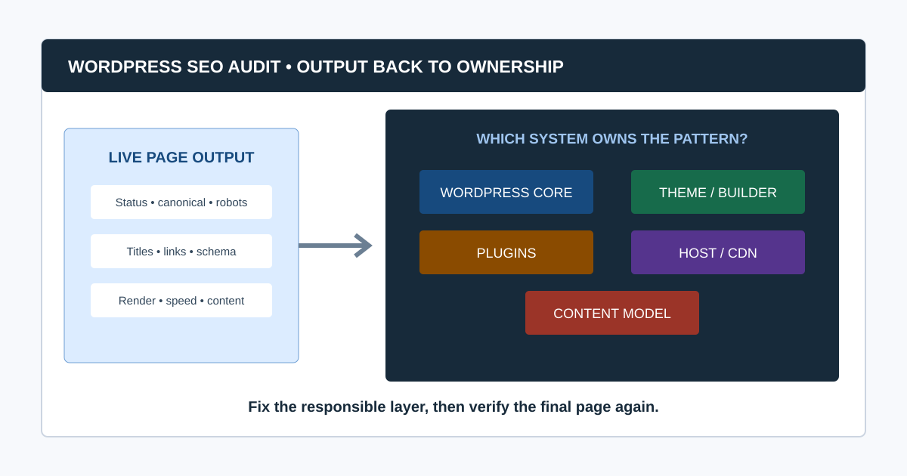
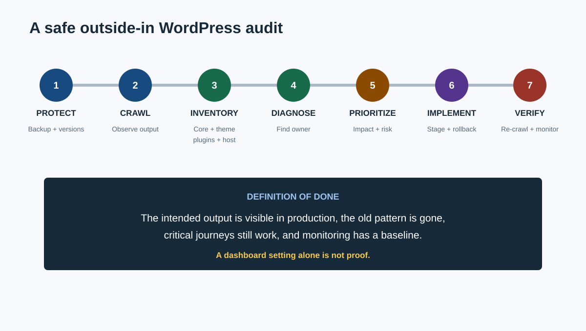
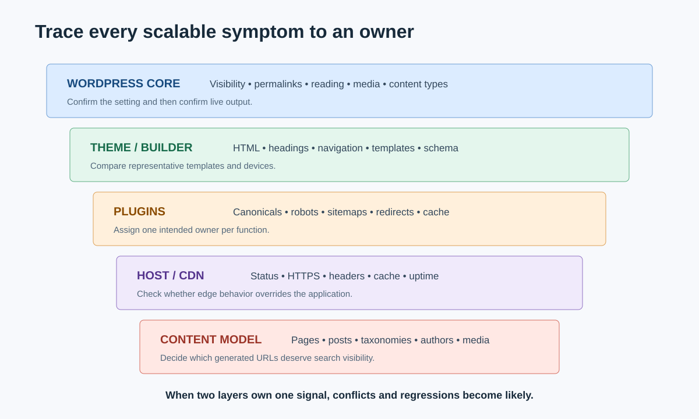

# WordPress SEO Audit: A System-by-System Checklist

A WordPress SEO audit evaluates what the live site exposes to users and search engines, then traces each pattern back to the system that owns it: WordPress core settings, the active theme, plugins, hosting and caching, or editorial configuration.

That ownership step is what makes the audit useful. Installing another SEO plugin rarely fixes a conflict between two existing plugins, a theme template, a permalink migration, or an indexability setting.

This guide takes you from a safe baseline and external crawl through WordPress diagnosis, prioritization, implementation, and re-crawl. It sits in the [SEO audits by CMS](/seo-audits-by-cms/) cluster and complements the broader [SEO audit workflow](/seo-audit-workflow/).

## WordPress SEO Audit at a Glance

| Phase | Action | Output |
|---|---|---|
| 1. Protect | Back up, record versions, and avoid untested production changes | Recovery point |
| 2. Observe outside-in | Crawl and inspect what users and bots receive | Baseline dataset |
| 3. Inventory WordPress | Record core, theme, plugins, settings, content types, hosting | Ownership map |
| 4. Diagnose patterns | Connect symptoms to templates and responsible systems | Validated findings |
| 5. Prioritize | Score impact, scale, confidence, effort, and regression risk | Implementation backlog |
| 6. Implement safely | Change staging or controlled production with rollback | Released fix |
| 7. Verify | Re-crawl, inspect output, and monitor Search Console | Validation record |

## Before You Begin: Protect the Site

Do not test plugin combinations, permalink structures, database cleanup, or caching changes on production without a recovery and validation plan.

Record:

- Full site and database backup status
- Staging environment and whether it mirrors production
- WordPress, PHP, theme, and plugin versions
- Active and inactive plugins
- Hosting, CDN, cache, image optimization, and security layers
- Recent updates, migrations, redesigns, and incidents
- Search Console and analytics access
- Current robots.txt, sitemap, canonical, and permalink behavior
- Release owner and rollback process

The official [WordPress Site Health screen](https://wordpress.org/documentation/article/site-health-screen/) exposes version, HTTPS, permalink, search-engine visibility, plugin, theme, server, database, and filesystem information. It is useful context, but it is not a complete SEO audit.

### Can you audit WordPress without administrator access?

Yes. Start with a public crawl, rendered-page inspection, robots.txt, sitemaps, Search Console, performance data, and representative templates. Administrator access is needed to confirm which setting, plugin, theme, or content field creates the output. Report ownership as unconfirmed until that access is available.

## 1. Check Search Visibility and Indexability

In WordPress, go to **Settings > Reading** and confirm whether “Discourage search engines from indexing this site” is enabled. The official [Reading Settings documentation](https://wordpress.org/documentation/article/settings-reading-screen/) notes that this setting requests search engines not to index the site; it still allows ordinary visitors and should not be treated as access control.

Then check the live output:

- Robots.txt response and rules
- Page-level `meta robots`
- `X-Robots-Tag` headers on HTML, PDFs, and media
- HTTP status and redirects
- Canonical URL
- XML sitemap inclusion
- Internal crawlable links
- Search Console indexing evidence

Do not assume the dashboard setting is the only source. SEO plugins, maintenance plugins, hosting controls, headers, and custom code can add competing directives.

### Why is my WordPress site not appearing in Google?

Common causes include a new or weakly linked site, the Reading visibility setting, `noindex` from a plugin or template, robots restrictions, incorrect canonicals, server errors, migration mistakes, thin or duplicate pages, and pages that Google has not selected for indexing. Check the live URL and Search Console evidence before changing settings.

## 2. Crawl the Live WordPress Output

Crawl the public site before studying the admin interface. Capture:

- URLs, status codes, redirects, and final destinations
- Indexability and canonicals
- Titles, descriptions, H1s, headings, and word patterns
- Internal links, crawl depth, breadcrumbs, and orphan candidates
- Images, alt text, dimensions, and response size
- Structured data types and errors
- Pagination, feeds, search pages, attachment pages, and parameters
- Raw versus rendered HTML where JavaScript changes content or links

CrawlBeast is a pre-launch local desktop application for Mac and Windows that can identify and prioritize broken links, status errors, metadata problems, duplicate content, orphan pages, and canonical mismatches. Use it to group WordPress findings by URL pattern and template, then confirm which core, theme, plugin, hosting, or editorial layer owns the output.

The [website crawler for agencies](/website-crawler-for-agencies/) guide explains how to test crawl coverage. For failed URLs and migration residue, follow the complete [broken link checker](/broken-link-checker/) workflow.

## 3. Build a WordPress Ownership Map

| Layer | Common SEO outputs | Questions to ask |
|---|---|---|
| Core settings | Visibility, permalinks, reading, discussion, media behavior | Is the setting intentional and reflected in live output? |
| Theme/templates | HTML structure, headings, links, breadcrumbs, archives, schema | Does every template expose consistent useful markup? |
| SEO plugin | Titles, descriptions, canonicals, robots, sitemaps, schema | Is one plugin the clear owner of each function? |
| Other plugins | Redirects, pagination, filters, caching, localization, forms | Do they override or duplicate SEO output? |
| Hosting/CDN | Status, HTTPS, cache, compression, headers, uptime | Is edge behavior different from WordPress configuration? |
| Editorial model | Posts, pages, taxonomies, authors, media, custom fields | Which content types should be indexable and maintained? |

For every scalable issue, record both the visible symptom and the likely owner. “Duplicate canonical tags” is the symptom; “theme and SEO plugin both print a canonical” is the repairable diagnosis.

## 4. Audit Permalinks and URL History

WordPress describes permalinks as permanent URLs and warns against changing them casually. Review:

- Current structure and whether it supports stable, understandable URLs
- Post, page, category, tag, author, date, and custom post type patterns
- Trailing slash consistency
- HTTP/HTTPS and www/non-www redirects
- Old permalink structures and redirect coverage
- Slug changes, deleted pages, attachment URLs, and imported content
- Category and tag base decisions
- Redirect chains created by repeated migrations

The official [WordPress permalink documentation](https://wordpress.org/documentation/article/customize-permalinks/) explains the available structures. If URLs must change, create a one-to-one redirect map, update internal links, publish a clean sitemap, and validate with a pre/post crawl. Do not switch structure simply because a plugin labels another option “better.”

## 5. Decide Which WordPress Archives Should Be Indexed

WordPress can generate posts, pages, categories, tags, authors, dates, media attachments, search results, pagination, feeds, and custom post type archives. Not every generated URL deserves indexing.

For each type, ask:

1. Does it serve a distinct search and user need?
2. Does it contain original organization, context, and useful internal links?
3. Is it maintained as content changes?
4. Does it compete with another archive or landing page?
5. Should it be linked, included in a sitemap, canonical, noindexed, redirected, or removed?

### Should WordPress category and tag pages be indexed?

Index an archive when it is a useful, maintained landing page with distinct purpose, supporting copy, and relevant posts. Noindex, consolidate, or avoid creating archives that duplicate another taxonomy or contain too little value. Make the decision by taxonomy role, not a universal plugin preset.

## 6. Audit SEO Plugin Configuration and Overlap

An SEO plugin can simplify metadata, canonicals, sitemaps, robots directives, breadcrumbs, and structured data. It can also conflict with themes and other plugins.

Check:

- Only one system owns title and meta-description templates.
- Only one intended canonical appears.
- Robots directives match the content-type strategy.
- XML sitemaps include the intended canonical URLs.
- Breadcrumb output matches visible navigation.
- Structured data is not duplicated or contradictory.
- Open Graph and social metadata are complete and consistent.
- Redirect functionality does not overlap with server or another plugin.
- Defaults for new content types are reviewed before publication.
- Deactivation would not silently remove essential behavior.

Do not treat a plugin's green score as evidence that the page is helpful, indexed, or strategically necessary.

## 7. Validate Sitemaps, Canonicals, and Duplicate Paths

Compare the sitemap with the crawl and intended index set.

- Sitemap URLs return `200`, are indexable, and declare themselves canonical.
- Redirected, missing, noindexed, and duplicate URLs are excluded.
- All important posts, pages, products, and custom types are represented.
- Pagination, parameters, feeds, and internal search are handled intentionally.
- Canonical tags use the preferred protocol, host, path, and slash format.
- Pagination and translated versions have appropriate self-reference and links.
- Search Console sitemap and canonical evidence is reviewed.

Canonical tags are hints, not commands. Resolve conflicting internal links, redirects, sitemaps, and canonicals instead of asking Google to interpret a mixed system.

## 8. Review Theme Templates and Content Structure

Sample:

- Homepage
- Standard page and landing page
- Blog post
- Category and tag archive
- Author archive
- Search and 404 pages
- Custom post types
- Product/category templates when WooCommerce is installed
- Mobile navigation, footer, breadcrumbs, and pagination

Check one descriptive H1, logical headings, main-content order, crawlable links, visible author/date where useful, accessible navigation, image alternatives, and no hidden duplicate content. Review both source and rendered HTML when a page builder or theme uses JavaScript heavily.

For WooCommerce or a large catalog, extend the review with the template and stock-state sampling in our [ecommerce SEO audit](/seo-audit-for-ecommerce/).

## 9. Audit WordPress Content Quality

Export or crawl content inventory data, then group by content type, topic, traffic, conversions, links, freshness, and indexability.

Look for:

- Thin or placeholder pages created by themes and demos
- Duplicate imports or near-identical landing pages
- Outdated posts with continuing impressions
- Cannibalizing posts and pages targeting the same need
- Orphan content
- Broken citations, images, downloads, and embeds
- Missing or unclear authorship
- AI-assisted content without factual and editorial review
- Pages kept solely because they once received traffic

Google's [helpful content guidance](https://developers.google.com/search/docs/fundamentals/creating-helpful-content) asks whether content provides original value and leaves the reader satisfied. Update, consolidate, redirect, noindex, or remove content based on user purpose and evidence, not word count alone.

## 10. Measure Performance by Template

WordPress performance problems often come from combinations: theme assets, page builders, plugins, fonts, images, database queries, third-party scripts, cache variation, and hosting.

Review field data and diagnostics for representative templates. The current “good” Core Web Vitals thresholds at the 75th percentile are LCP at 2.5 seconds or less, INP at 200 milliseconds or less, and CLS at 0.1 or less, according to [web.dev's Web Vitals guidance](https://web.dev/articles/vitals).

Test changes in staging and production. A cache plugin can improve one test while breaking logged-in behavior, personalization, forms, or script loading.

## 11. Check Structured Data From the Final Page

Themes, SEO plugins, review plugins, recipe plugins, event tools, and WooCommerce can all emit schema.

- Inventory every structured-data type on representative templates.
- Identify which component outputs each block.
- Remove duplicate or conflicting organization, article, breadcrumb, product, and review entities.
- Confirm markup describes visible content.
- Validate with Schema.org tooling and Google's Rich Results Test where eligible.
- Do not add ratings, authors, prices, or business details that the page does not support.

Structured data can improve machine understanding and rich-result eligibility; it does not guarantee a rich result or repair weak content.

## 12. Inspect Security and Spam Symptoms That Affect Search

An SEO audit is not a security audit, but it should escalate signs such as:

- Unknown indexed URLs, doorway pages, or foreign-language spam
- Unexpected redirects or injected links
- Modified titles/descriptions in search results
- Outdated vulnerable core, theme, or plugin versions
- Suspicious administrator users or files
- Search Console security or manual-action notices
- Large crawl spaces created by hacked parameters

Do not attempt ad hoc cleanup without backups and qualified security support. Preserve evidence, contain access, and coordinate recovery, then re-audit search output.

## Video: A WordPress SEO Audit Walkthrough

This WordPress-focused walkthrough demonstrates a 12-point website audit. Use it as a visual orientation, then apply the ownership map above so each finding is traced to WordPress core, the theme, a plugin, hosting, or editorial configuration.

<iframe width="560" height="315" src="https://www.youtube.com/embed/wJdww_5as-I" title="Website SEO audit checklist for WordPress sites" loading="lazy" frameborder="0" allow="accelerometer; autoplay; clipboard-write; encrypted-media; gyroscope; picture-in-picture; web-share" allowfullscreen></iframe>

[Watch the WordPress SEO audit walkthrough on YouTube](https://www.youtube.com/watch?v=wJdww_5as-I).

## 13. Prioritize, Implement, and Verify

Prioritize by impact, affected templates, confidence, effort, regression risk, and business importance.

Example order:

1. Production site or priority templates accidentally discouraged/noindexed
2. Server errors, hacked output, or broken canonical system
3. Permalink migration without complete redirects
4. Duplicate directives or schema from plugin/theme conflicts
5. Important orphan pages and broken internal paths
6. Template performance failures
7. Low-value archive and metadata cleanup

Each ticket should name the observed output, responsible layer, representative URLs, desired behavior, owner, rollback, acceptance criteria, and validation. Use the [website audit report](/website-audit-report/) structure for client delivery and the [agency audit process](/how-agencies-perform-seo-audits/) when several teams are involved.

After implementation:

1. Clear relevant application, host, CDN, and browser caches.
2. Inspect raw and rendered output on representative URLs.
3. Re-crawl affected templates and compare with the baseline.
4. Test redirects, canonicals, sitemaps, links, schema, and forms.
5. Use URL Inspection for important Google-specific examples.
6. Monitor indexing, performance, conversions, and regressions.

## WordPress SEO Audit Checklist

- Backups, staging, versions, and rollback are confirmed.
- Search visibility is checked in settings and live output.
- The public site is crawled before admin diagnosis.
- Core, theme, plugins, hosting, and editorial ownership are mapped.
- Permalinks and historical redirects are reviewed safely.
- Every taxonomy, archive, media, and custom type has an indexation decision.
- One system owns each canonical, directive, sitemap, metadata, and schema function.
- Important pages are linked, canonical, indexable, and included appropriately in sitemaps.
- Theme and builder output is tested across templates and devices.
- Content is evaluated by purpose, evidence, freshness, and performance.
- Core Web Vitals use field data and template-level diagnostics.
- Security/spam symptoms are escalated appropriately.
- Fixes include owners, acceptance criteria, rollback, re-crawl, and monitoring.

A strong WordPress SEO audit works from output back to ownership. CrawlBeast can accelerate the outside-in crawl and initial prioritization; WordPress Site Health, Search Console, manual inspection, and controlled implementation explain why the pattern exists and whether the fix worked.
