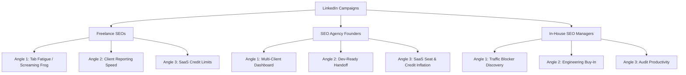

# 🚀 CrawlBeast B2B LinkedIn Campaign Playbook

This outbound LinkedIn campaign playbook is designed to generate early trial downloads and conversation starters for **CrawlBeast** using warm or cold signals (such as those from `linkednav.com`).

It strictly implements the copywriting standards of the LinkedIn outreach skill: peer-to-peer positioning, low-friction interest-based CTAs, and a hard **300-character cap** on connection request notes.

---

## 🎯 Campaign Strategy & Persona Mapping

We target freelance SEOs, agency founders, and in-house SEO managers, using outcome-based messaging focused on time savings, priority-issue filtering, and cost control.

---

## 📧 Campaign 1: The Freelance SEO

### Sequence 1.1: The "Tab Fatigue" (Screaming Frog) Angle
*Signal: `post_like` on a post discussing Screaming Frog's dense spreadsheet UI.*

#### 1. Connection Request Note (Touch 1) — Max 300 Chars
* **Subject line:** `connection note`
> Hi [Name], noticed you liked my post on Screaming Frog's tab overload. Most freelancers spend hours sorting rows of raw data. We built CrawlBeast to auto-prioritize the highest-impact issues so you rank clients faster. 5 projects are free. Open to checking out the free version?

#### 2. Follow-Up Message (Touch 2) — After Acceptance
* **Subject line:** `prioritised audits`
> Thanks for connecting, [Name].
> 
> Beyond the UI, we found that 80% of client ranking drops are caused by just a few high-priority issues (like broken canonicals or redirect loops).
> 
> CrawlBeast pulls those to the top of your dashboard instantly so you can build a client roadmap in minutes.
> 
> I can share the link to our free tier (5 projects/1,000 pages) if you'd like to test it on your next audit?

#### 3. Breakup Message (Touch 3)
* **Subject line:** `audit workflow`
> Hey [Name], assuming your auditing workflow is set for now. 
> 
> If you ever want to save time prioritizing client fixes without digging through spreadsheet tabs, feel free to grab a free download at crawlbeast.com. 
> 
> All the best with the client audits.

---

### Sequence 1.2: The "Client Reporting Speed" Angle
*Signal: `profile_view` by a freelance SEO consultant.*

#### 1. Connection Request Note (Touch 1) — Max 300 Chars
* **Subject line:** `connection note`
> Hi [Name], thanks for stopping by my profile. Saw you're doing freelance SEO. Most consultants waste hours translating raw crawl spreadsheets into client recommendations. We built a desktop app that auto-generates prioritized, client-ready roadmaps. Worth checking out?

#### 2. Follow-Up Message (Touch 2) — After Acceptance
* **Subject line:** `client roadmaps`
> Hey [Name],
> 
> Clients just want to see what is broken and how it affects their rankings, not look at 10,000 rows of Screaming Frog data. 
> 
> CrawlBeast filters out the minor noise and gives you a clean checklist of the top fixes.
> 
> Would it be useful to test it on your next client onboarding? (Up to 5 sites are free).

#### 3. Breakup Message (Touch 3)
* **Subject line:** `client audits`
> Hey [Name], closing the loop here. If client reporting ever becomes a bottleneck, you can download CrawlBeast for free at crawlbeast.com. 
> 
> Good luck with your client projects this quarter.

---

### Sequence 1.3: The "SaaS Credit Limits" Angle
*Signal: `pain_point_post` about running out of Semrush/Ahrefs monthly crawl credits.*

#### 1. Connection Request Note (Touch 1) — Max 300 Chars
* **Subject line:** `connection note`
> Hi [Name], saw your post about hitting SaaS crawl credit limits. Buying extra credits gets expensive fast when managing multiple client sites. We built a local desktop app with a free tier for 5 projects/1,000 pages so you can audit without billing limits. Worth exploring?

#### 2. Follow-Up Message (Touch 2) — After Acceptance
* **Subject line:** `unlimited audits`
> Hey [Name],
> 
> Because CrawlBeast runs locally using your machine's hardware, we don't charge for cloud credits.
> 
> You get a modern, prioritized dashboard for all your freelance clients without the subscription pressure.
> 
> I can drop the free download link if you'd like to try it?

#### 3. Breakup Message (Touch 3)
* **Subject line:** `free audit tool`
> Hey [Name], assuming you have your audit tool budget sorted. 
> 
> If you ever want to run on-demand crawls without credit limits, we're at crawlbeast.com. 
> 
> Cheers.

---

## 📧 Campaign 2: The SEO Agency Founder

### Sequence 2.1: The "Multi-Client Health Dashboard" Angle
*Signal: `company_follower` on your company page by an agency owner.*

#### 1. Connection Request Note (Touch 1) — Max 300 Chars
* **Subject line:** `connection note`
> Hi [Name], thanks for the follow. If you're managing 10+ client sites, keeping track of technical health usually means jumping between clunky sheets. We built a single dashboard that prioritizes critical ranking blockers across all projects in one view. Worth a quick look?

#### 2. Follow-Up Message (Touch 2) — After Acceptance
* **Subject line:** `site health monitoring`
> Hey [Name],
> 
> We found that agencies lose clients when technical errors (like redirect loops or broken canonicals) go unnoticed for weeks.
> 
> CrawlBeast acts as a central hub, giving your team a prioritized SEO health score for all clients in one screen.
> 
> You can set up 5 client sites for free. Would a quick preview link be useful?

#### 3. Breakup Message (Touch 3)
* **Subject line:** `agency site health`
> Hey [Name], I'll stop checking in. If you ever need a simpler way to track multiple site audits in one dashboard to protect client retention, you can download CrawlBeast at crawlbeast.com. 
> 
> Good luck with scaling the agency.

---

### Sequence 2.2: The "Dev-Ready Hand-off" Angle
*Signal: `hiring_adjacent_role` (agency hiring SEO specialists or account managers).*

#### 1. Connection Request Note (Touch 1) — Max 300 Chars
* **Subject line:** `connection note`
> Hi [Name], saw you're expanding your SEO team. Congrats. Most agency teams waste hours explaining spreadsheet audits to client developers. We built a tool that turns crawls into prioritized, dev-ready roadmaps to get fixes shipped faster and protect client retention. Worth a look?

#### 2. Follow-Up Message (Touch 2) — After Acceptance
* **Subject line:** `developer handoff`
> Hey [Name],
> 
> Getting client developers to execute is usually the biggest bottleneck in technical SEO. 
> 
> CrawlBeast translates raw technical issues into plain-language tasks, showing developers exactly what to fix first to improve rankings.
> 
> Our free tier allows up to 5 projects. Would it be helpful to see how it works?

#### 3. Breakup Message (Touch 3)
* **Subject line:** `client dev handoff`
> Hey [Name], closing the loop. If dev hand-off ever becomes a bottleneck for your team's client work, you can find our templates and desktop tool at crawlbeast.com. 
> 
> All the best.

---

### Sequence 2.3: The "SaaS Seat & Credit Inflation" Angle
*Signal: `post_comment` on a competitor's pricing update post.*

#### 1. Connection Request Note (Touch 1) — Max 300 Chars
* **Subject line:** `connection note`
> Hi [Name], saw your comment on tool price increases. Paying SaaS seat licenses and crawl credit markups gets expensive as you scale clients. We built a local desktop app with flat pricing and a free tier for 5 projects/1,000 pages so you can protect your margins. Worth exploring?

#### 2. Follow-Up Message (Touch 2) — After Acceptance
* **Subject line:** `protecting agency margins`
> Hey [Name],
> 
> Most agency founders we talk to are tired of paying Ahrefs/Semrush extra monthly fees just to run standard technical audits.
> 
> Since CrawlBeast runs locally, you audit client sites without cloud markup, allowing flat-rate cost predictability.
> 
> Open to checking out the free version?

#### 3. Breakup Message (Touch 3)
* **Subject line:** `agency audit tool`
> Hey [Name], assuming you're set with your agency's software budget. 
> 
> If you ever want to lower your technical SEO tool costs, you can get a free download at crawlbeast.com. 
> 
> Cheers.

---

## 📧 Campaign 3: The In-House SEO / Manager

### Sequence 3.1: The "Traffic Blocker Discovery" Angle
*Signal: `job_change` (started a new role as SEO Manager or Director).*

#### 1. Connection Request Note (Touch 1) — Max 300 Chars
* **Subject line:** `connection note`
> Congrats on the new role, [Name]. If you're auditing your new site, digging through Screaming Frog tabs to find traffic blockers is a headache. We built a desktop app that auto-prioritizes the highest-impact issues so you know what's blocking rankings fast. Worth a quick look?

#### 2. Follow-Up Message (Touch 2) — After Acceptance
* **Subject line:** `traffic blocker alerts`
> Hey [Name],
> 
> When subdirectory traffic drops, the bottleneck is usually sorting through thousands of rows of minor data to find the root cause.
> 
> CrawlBeast pulls redirect loops, broken canonicals, and indexing errors to the top of your dashboard instantly.
> 
> You can crawl up to 1,000 pages across 5 sites for free. Worth testing?

#### 3. Breakup Message (Touch 3)
* **Subject line:** `audit workflow`
> Hey [Name], assuming you have the new site audit handled. 
> 
> If you ever need to diagnose traffic drops faster without spreadsheet clutter, we're at crawlbeast.com. 
> 
> All the best in the new role.

---

### Sequence 3.2: The "Engineering Buy-in" Angle
*Signal: `poll_vote` on a poll asking "What is your biggest blocker to SEO execution?".*

#### 1. Connection Request Note (Touch 1) — Max 300 Chars
* **Subject line:** `connection note`
> Hi [Name], noticed you voted "dev implementation" as your biggest SEO blocker. Handing devs a spreadsheet with 10k rows usually means it gets pushed to the bottom of the backlog. We turn crawls into clean, prioritized dev-ready lists to make engineering buy-in easy. Worth exploring?

#### 2. Follow-Up Message (Touch 2) — After Acceptance
* **Subject line:** `prioritizing fixes`
> Hey [Name],
> 
> Developers ignore raw crawls because they don't have time to parse them. 
> 
> CrawlBeast filters out the unimportant crawl data and gives you a prioritized, dev-friendly action plan to get fixes shipped.
> 
> Up to 5 projects are completely free. Open to testing it?

#### 3. Breakup Message (Touch 3)
* **Subject line:** `dev implementation`
> Hey [Name], assuming dev buy-in isn't an issue right now. 
> 
> If you ever want to turn crawls into prioritized dev tickets faster, you can grab CrawlBeast for free at crawlbeast.com. 
> 
> Good luck with your growth goals.

---

### Sequence 3.3: The "Audit Productivity" Angle
*Signal: `pain_point_post` complaining about how long it takes to run monthly manual site audits.*

#### 1. Connection Request Note (Touch 1) — Max 300 Chars
* **Subject line:** `connection note`
> Hi [Name], saw your post on audit fatigue. Most in-house teams spend 3-4 hours per site just translating technical crawls into action plans. We built a desktop app that automates that sorting, surfacing top-priority issues instantly in a clean dashboard. Worth a quick test?

#### 2. Follow-Up Message (Touch 2) — After Acceptance
* **Subject line:** `audit productivity`
> Hey [Name],
> 
> CrawlBeast replaces slow manual sorting by generating a prioritized action checklist the moment the crawl finishes.
> 
> It saves about 3 hours per audit, and you can crawl up to 5 sites for free.
> 
> Open to checking out the free version?

#### 3. Breakup Message (Touch 3)
* **Subject line:** `seo workflow`
> Hey [Name], closing the loop here. 
> 
> If you ever want to save a few hours on your monthly technical audits, you can download CrawlBeast for free at crawlbeast.com. 
> 
> All the best.
