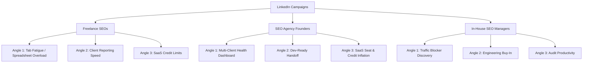

# 🚀 CrawlBeast B2B LinkedIn Campaign Playbook

This outbound LinkedIn campaign playbook is designed to generate early trial downloads and conversation starters for **CrawlBeast** using warm or cold signals (such as those from `linkednav.com`).

It strictly implements the copywriting standards of the LinkedIn outreach skill: peer-to-peer positioning, low-friction interest-based CTAs, and a hard **300-character cap** on connection request notes.

---

## 🎯 Campaign Strategy & Persona Mapping

We target freelance SEOs, agency founders, and in-house SEO managers, using outcome-based messaging focused on time savings, priority-issue filtering, and cost control.

---

## 📧 Campaign 1: The Freelance SEO

### Sequence 1.1: The "Tab Fatigue" (Audit Overload) Angle
*Signal: `post_like` on a post discussing the dense UI of traditional crawl spreadsheets.*

#### 1. Connection Request Note (Touch 1) — Max 300 Chars
* **Subject line:** `connection note`
> Hi [Name], I'm Ashit. Saw you're doing freelance SEO. I built a desktop crawler called CrawlBeast to fix the tab fatigue of traditional audit tools by auto-prioritizing the most critical issues. We have a free tier (5 sites/1,000 pages). Open to trying it?

#### 2. Follow-Up Message (Touch 2) — After Acceptance
* **Subject line:** `prioritised audits`
> Hi [Name],
> 
> Thanks for connecting. 
> 
> Most freelance SEOs spend hours digging through thousands of spreadsheet rows just to identify what's actually blocking client rankings. We built CrawlBeast to pull issues like redirect loops or broken canonicals to the top of your dashboard instantly.
> 
> Would you like to try it for your next audit?

#### 3. Breakup Message (Touch 3)
* **Subject line:** `audit workflow`
> Hi [Name],
> 
> Just wanted to check in. If you're open to testing a simpler way to run audits without getting lost in data tabs, you can download the free desktop app at crawlbeast.com. 
> 
> Best of luck with your freelance projects!

---

### Sequence 1.2: The "Client Reporting Speed" Angle
*Signal: `profile_view` by a freelance SEO consultant.*

#### 1. Connection Request Note (Touch 1) — Max 300 Chars
* **Subject line:** `connection note`
> Hi [Name], I'm Ashit. Saw you're doing freelance SEO. I built a desktop crawler called CrawlBeast to help consultants turn crawls into prioritized, client-ready roadmaps quickly without sorting clunky spreadsheets. We have a free tier (5 sites). Open to trying it?

#### 2. Follow-Up Message (Touch 2) — After Acceptance
* **Subject line:** `client roadmaps`
> Hi [Name],
> 
> Thanks for connecting.
> 
> We've found that clients just want to see what is broken and how it affects their search rankings, not parse massive spreadsheets. CrawlBeast filters out the unimportant noise and highlights your top recommendations.
> 
> Would you like to try it on your next onboarding?

#### 3. Breakup Message (Touch 3)
* **Subject line:** `client audits`
> Hi [Name],
> 
> No worries if now isn't the right time. If you ever want to speed up how you report audits to clients, the free version is available at crawlbeast.com.
> 
> Have a great week!

---

### Sequence 1.3: The "SaaS Credit Limits" Angle
*Signal: `pain_point_post` about running out of monthly crawl credits in cloud tools.*

#### 1. Connection Request Note (Touch 1) — Max 300 Chars
* **Subject line:** `connection note`
> Hi [Name], I'm Ashit. Saw you're doing freelance SEO. I built a desktop crawler called CrawlBeast to help consultants audit sites locally without dealing with monthly cloud credit limits. Our free tier covers 5 projects/1,000 pages. Open to trying it?

#### 2. Follow-Up Message (Touch 2) — After Acceptance
* **Subject line:** `unlimited audits`
> Hi [Name],
> 
> Thanks for connecting.
> 
> Since CrawlBeast runs locally on your machine, you can run audits on-demand without worrying about extra billing or credit markups common in cloud SaaS tools.
> 
> Would you like to try it for your client sites?

#### 3. Breakup Message (Touch 3)
* **Subject line:** `free audit tool`
> Hi [Name],
> 
> Assuming your audit tools are all set for now. If you ever want to run on-demand client crawls without SaaS credit constraints, feel free to try it at crawlbeast.com.
> 
> Best,

---

## 📧 Campaign 2: The SEO Agency Founder

### Sequence 2.1: The "Multi-Client Health Dashboard" Angle
*Signal: `company_follower` on your company page by an agency owner.*

#### 1. Connection Request Note (Touch 1) — Max 300 Chars
* **Subject line:** `connection note`
> Hi [Name], I'm Ashit. Saw you're running an SEO agency. I built a desktop crawler called CrawlBeast to track multiple client sites in a single dashboard that prioritizes critical ranking blockers, rather than jumping between clunky sheets. Free for 5 projects. Open to trying it?

#### 2. Follow-Up Message (Touch 2) — After Acceptance
* **Subject line:** `site health monitoring`
> Hi [Name],
> 
> Thanks for connecting.
> 
> When you're managing dozens of client sites, keeping track of technical health is difficult. Technical errors like redirect loops can go unnoticed for weeks, hurting retention. We built CrawlBeast to aggregate everything into a single, prioritized health view.
> 
> Would you like to try it with your team?

#### 3. Breakup Message (Touch 3)
* **Subject line:** `agency site health`
> Hi [Name],
> 
> Closing the loop here. If you ever want to simplify how your team monitors client technical health across multiple sites, you can grab a free download at crawlbeast.com.
> 
> All the best with scaling the agency.

---

### Sequence 2.2: The "Dev-Ready Hand-off" Angle
*Signal: `hiring_adjacent_role` (agency hiring SEO specialists).*

#### 1. Connection Request Note (Touch 1) — Max 300 Chars
* **Subject line:** `connection note`
> Hi [Name], I'm Ashit. Saw you're running an SEO agency. I built a desktop crawler called CrawlBeast to help teams turn crawls into prioritized, dev-ready lists. It translates technical errors into plain tasks so developers implement fixes faster. Free for 5 projects. Open to trying it?

#### 2. Follow-Up Message (Touch 2) — After Acceptance
* **Subject line:** `developer handoff`
> Hi [Name],
> 
> Thanks for connecting.
> 
> Getting client developers to execute is usually the biggest agency bottleneck. Handing them raw crawl spreadsheets often leads to delays. CrawlBeast translates those issues into clear, prioritized checklists so developers know exactly what to fix.
> 
> Would you like to try it for your team's audits?

#### 3. Breakup Message (Touch 3)
* **Subject line:** `client dev handoff`
> Hi [Name],
> 
> No worries if your audit processes are locked in. If dev hand-off ever becomes a blocker for getting client recommendations shipped, we're at crawlbeast.com.
> 
> Cheers,

---

### Sequence 2.3: The "SaaS Seat & Credit Inflation" Angle
*Signal: `post_comment` on a competitor's pricing update post.*

#### 1. Connection Request Note (Touch 1) — Max 300 Chars
* **Subject line:** `connection note`
> Hi [Name], I'm Ashit. Saw you're running an SEO agency. I built a desktop crawler called CrawlBeast to help agencies avoid expensive monthly SaaS seat licenses and crawl credit markups. Since it runs locally, you get cost predictability. Free for 5 projects. Open to trying it?

#### 2. Follow-Up Message (Touch 2) — After Acceptance
* **Subject line:** `protecting agency margins`
> Hi [Name],
> 
> Thanks for connecting.
> 
> Most agency founders are tired of paying extra monthly fees for additional team seats or extra crawl credits. Because CrawlBeast runs on your own hardware, we don't charge SaaS cloud markups.
> 
> Would you like to try it for your team?

#### 3. Breakup Message (Touch 3)
* **Subject line:** `agency audit tool`
> Hi [Name],
> 
> Assuming you're set with your tool stack. If you ever want to lower your agency's recurring software costs for technical audits, feel free to try it at crawlbeast.com.
> 
> Best,

---

## 📧 Campaign 3: The In-House SEO / Manager

### Sequence 3.1: The "Traffic Blocker Discovery" Angle
*Signal: `job_change` (started a new role as SEO Manager).*

#### 1. Connection Request Note (Touch 1) — Max 300 Chars
* **Subject line:** `connection note`
> Hi [Name], I'm Ashit. Saw you're managing SEO in-house. I built a desktop crawler called CrawlBeast to help in-house teams detect major traffic blockers (like redirect loops or broken canonicals) instantly, without digging through clunky spreadsheets. Free for 5 sites. Open to trying it?

#### 2. Follow-Up Message (Touch 2) — After Acceptance
* **Subject line:** `traffic blocker alerts`
> Hi [Name],
> 
> Thanks for connecting.
> 
> When you experience a sudden traffic drop, finding the root cause quickly is essential. CrawlBeast runs a local crawl and auto-prioritizes the highest-impact technical blockers right at the top of your dashboard.
> 
> Would you like to try it on your site?

#### 3. Breakup Message (Touch 3)
* **Subject line:** `audit workflow`
> Hi [Name],
> 
> Closing the loop here. If you ever need to diagnose ranking drops or audit your site without the typical spreadsheet clutter, you can download it for free at crawlbeast.com.
> 
> All the best with your search growth goals.

---

### Sequence 3.2: The "Engineering Buy-In" Angle
*Signal: `poll_vote` on a poll asking "What is your biggest blocker to SEO execution?".*

#### 1. Connection Request Note (Touch 1) — Max 300 Chars
* **Subject line:** `connection note`
> Hi [Name], I'm Ashit. Saw you're managing SEO in-house. I built a desktop crawler called CrawlBeast to turn crawls into prioritized, dev-ready lists. This translates technical errors into plain tasks so you can get engineering buy-in and get fixes shipped. Free for 5 sites. Open to trying it?

#### 2. Follow-Up Message (Touch 2) — After Acceptance
* **Subject line:** `prioritizing fixes`
> Hi [Name],
> 
> Thanks for connecting.
> 
> Getting developers to prioritize SEO fixes is a common challenge. Giving them raw crawl lists usually gets them pushed to the bottom of the backlog. CrawlBeast formats crawls into a prioritized checklist that engineers can understand and execute.
> 
> Would you like to try it?

#### 3. Breakup Message (Touch 3)
* **Subject line:** `dev implementation`
> Hi [Name],
> 
> Assuming your dev workflows are running smoothly. If you ever want to speed up your engineering hand-offs for site fixes, you can grab CrawlBeast for free at crawlbeast.com.
> 
> Have a great week!

---

### Sequence 3.3: The "Audit Productivity" Angle
*Signal: `pain_point_post` complaining about how long it takes to run monthly manual site audits.*

#### 1. Connection Request Note (Touch 1) — Max 300 Chars
* **Subject line:** `connection note`
> Hi [Name], I'm Ashit. Saw you're managing SEO in-house. I built a desktop crawler called CrawlBeast to help teams save time on monthly audits by auto-prioritizing crawl data into an actionable checklist the moment it finishes. Free tier for 5 projects. Open to trying it?

#### 2. Follow-Up Message (Touch 2) — After Acceptance
* **Subject line:** `audit productivity`
> Hi [Name],
> 
> Thanks for connecting.
> 
> Most in-house SEOs spend hours manual-sorting crawl data just to decide what to fix first. CrawlBeast automates this prioritization, saving hours of manual audit preparation.
> 
> Would you like to try it for your site audits?

#### 3. Breakup Message (Touch 3)
* **Subject line:** `seo workflow`
> Hi [Name],
> 
> No worries. If you ever want to optimize your monthly technical audit workflow and save a few hours of manual sorting, you can download CrawlBeast for free at crawlbeast.com.
> 
> Cheers,
