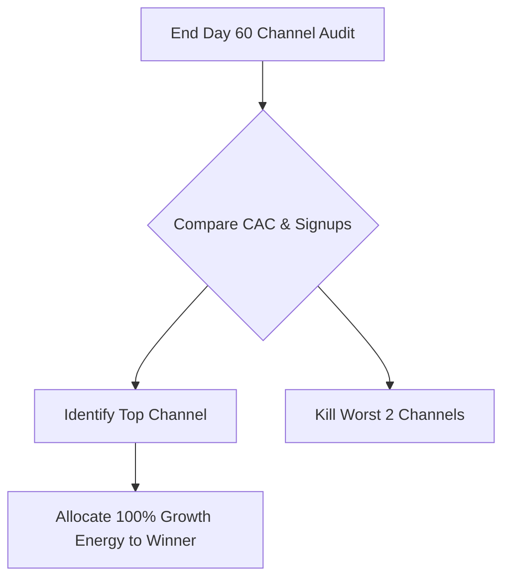

# CrawlBeast - 60-Day Concurrent Channel Test Plan

## 1. Trigger
Executed by the **Growth Strategist** to systematically identify and double down on the single highest-ROI marketing channel for CrawlBeast.

## 2. Channels Under Test (60 Days)
We test three distinct acquisition channels concurrently:

| Channel | Execution Metric | Conversion Target | Tracking Method |
|---|---|---|---|
| **LinkedIn Build-in-Public** | 1 daily journey post | 20+ signup trials/wk | Stripe attribution links |
| **X (Twitter) Threads** | 2 technical threads/wk | 10+ signup trials/wk | UTM tags in threads |
| **Warm DM Outreach** | 15 DMs/day to competitor engagers | 5+ signup trials/wk | Direct message logs |

---

## 3. The 60-Day Decision Gate
At Day 60, compare the Customer Acquisition Cost (CAC) and trial-to-paid conversions:

### Action Items:
- **Pass (Scale)**: Whichever channel drives the lowest CAC and highest retention is declared the winner.
- **Fail (Kill)**: Stop all cold/warm DM outreach if it has a conversion rate of $<1\%$. Stop X threads if CTR is $<0.5\%$. Redirect all hours to the winner.
